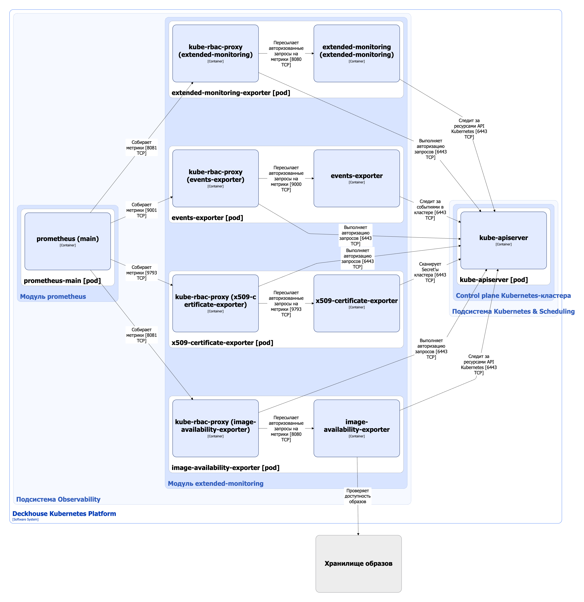

Модуль [`extended-monitoring`](/modules/extended-monitoring/) расширяет возможности мониторинга кластера за счёт дополнительных экспортеров Prometheus, которые позволяют выявлять потенциальные проблемы до того, как они скажутся на работе сервисов.

Возможности модуля:

* расширенный сбор метрик;
* мониторинг контейнерных образов;
* сбор событий в кластере;
* контроль сертификатов.

Подробнее с настройками и примерами использования модуля можно ознакомиться [в разделе документации модуля](/modules/extended-monitoring/configuration.html).

## Архитектура модуля


Для упрощения схемы приняты следующие допущения:

* На схеме контейнеры разных подов показаны как взаимодействующие напрямую. Фактически обмен выполняется через соответствующие сервисы Kubernetes (внутренние балансировщики). Названия сервисов не указываются, если они очевидны из контекста. В остальных случаях название сервиса приводится над стрелкой.
* Поды могут быть запущены в нескольких репликах, однако на схеме каждый под показан в единственном экземпляре.


Архитектура модуля [`extended-monitoring`](/modules/extended-monitoring/) на уровне 2 модели C4 и его взаимодействия с другими компонентами Deckhouse Kubernetes Platform (DKP) изображены на следующей диаграмме:

## Компоненты модуля

Модуль состоит из следующих компонентов:

1. **Extended-monitoring-exporter** — экспортер Prometheus, собирает дополнительные метрики, а также включает готовые алерты и дашборды, которые позволяют быстрее обнаруживать и диагностировать инциденты:

   * собирает и экспортирует метрики по свободному месту и inode на узлах, а также по объектам с лейблом extended-monitoring.deckhouse.io/enabled="" в пространстве имён;
   * автоматически формирует алерты при достижении пороговых значений.

   Состоит из следующих контейнеров:

   * **extended-monitoring-exporter** — основной контейнер. Является разработкой компании «Флант»;
   * **kube-rbac-proxy** — сайдкар-контейнер с авторизующим прокси на основе Kubernetes RBAC для организации защищенного доступа к метрикам экспортера. Является [Open Source-проектом](https://github.com/brancz/kube-rbac-proxy).

1. **Image-availability-exporter** — экспортер Prometheus, который осуществляет мониторинг контейнерных образов, а именно:

   * добавляет метрики и отправляет алерты о недоступности образов в хранилищах образов контейнеров для всех типов рабочей нагрузки (Deployments, StatefulSets, DaemonSets, CronJobs);
   * помогает заранее узнать о возможных проблемах с запуском или обновлением подов.

   Состоит из следующих контейнеров:

    * **image-availability-exporter** — основной контейнер. Является разработкой компании «Флант»;
    * **kube-rbac-proxy** — сайдкар-контейнер, обеспечивающий авторизованный доступа к метрикам экспортера. Подробно описан выше.

1. **Events-exporter** — экспортер Prometheus, который собирает события Kubernetes и отображает их в виде метрик, что позволяет отслеживать динамику изменений и быстрее реагировать на инциденты.

   Состоит из следующих контейнеров:

   * **events-exporter** — основной контейнер. Является разработкой компании «Флант»;
   * **kube-rbac-proxy** — сайдкар-контейнер, обеспечивающий авторизованный доступа к метрикам экспортера. Подробно описан выше.

1. **X509-certificate-exporter** — экспортер Prometheus, который обеспечивает контроль сертификатов:

   * сканирует Secret’ы кластера и генерирует метрики об истечении срока действия x509-сертификатов;
   * позволяет не пропускать критические моменты и вовремя обновлять сертификаты, избегая простоя приложений из-за просроченных сертификатов.

   Состоит из следующих контейнеров:

   * **x509-certificate-exporter** — основной контейнер. Является [Open Source-проектом](https://github.com/enix/x509-certificate-exporter);
   * **kube-rbac-proxy** — сайдкар-контейнер, обеспечивающий авторизованный доступа к метрикам экспортера. Подробно описан выше.

## Взаимодействия модуля

Модуль взаимодействует со следующими компонентами:

1. **Kube-apiserver**:

   * следит за ресурсами API Kubernetes;
   * следит за событиями в кластере (ресурсами Events);
   * сканирует Secret’ы кластера;
   * выполняет авторизацию запросов на метрики.

1. **Хранилище образов** — проверяет доступность образов.

С модулем взаимодействуют следующие внешние компоненты:

1. **Prometheus-main** — собирает метрики с экспортеров модуля.
