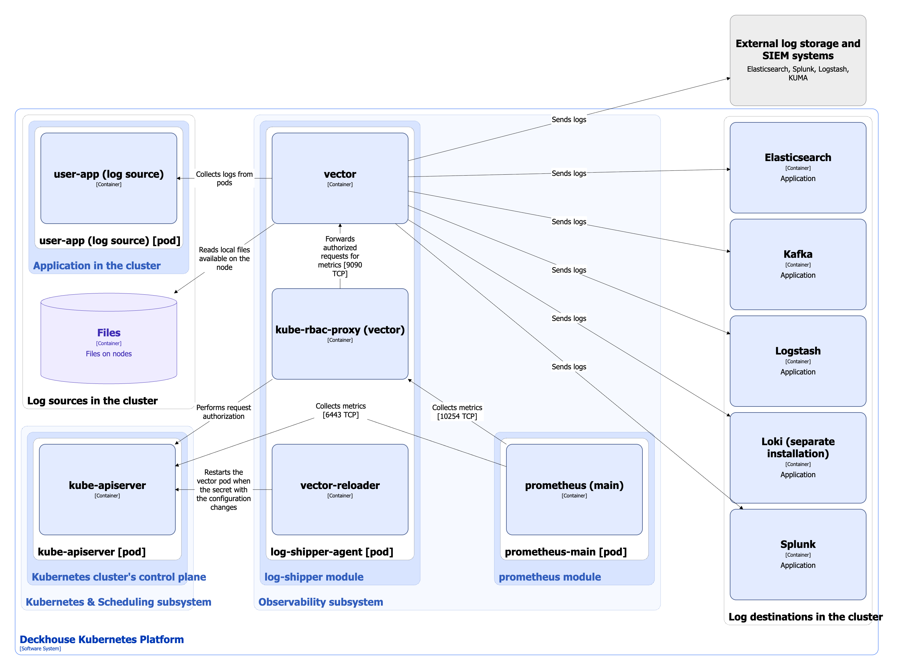
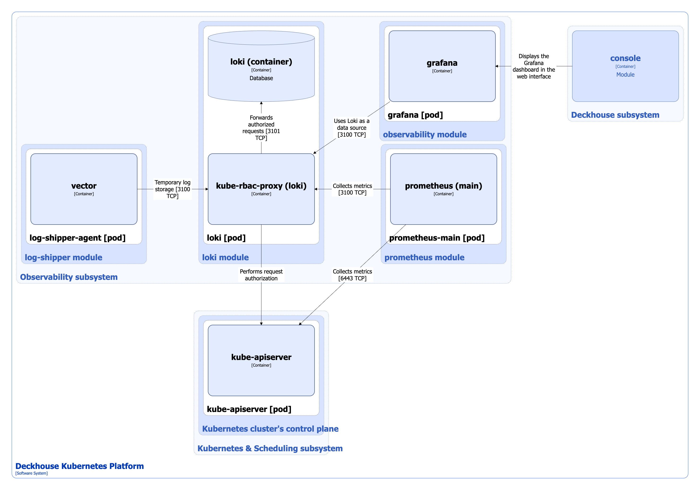

## Log-shipper module

The `log-shipper` module simplifies log collection configuration in Kubernetes clusters. It allows collecting logs both from applications running in the cluster and from the cluster nodes, and then forwarding them to any log storage system — either internal or external (for example, Loki, Elasticsearch, and others).


Deckhouse Kubernetes Platform (DKP) provides integration with log storage systems. The storage systems themselves must be deployed and configured by the user.


For more details about module configuration and usage examples, refer to the [corresponding documentation section](/modules/log-shipper/).

### Module architecture


The following simplifications are made in the diagram:

* The diagram shows containers in different pods interacting directly with each other. In reality, they communicate via the corresponding Kubernetes Services (internal load balancers). Service names are omitted if they are obvious from the diagram context. Otherwise, the Service name is shown above the arrow.
* Pods may run multiple replicas. However, each pod is shown as a single replica in the diagram.


The Level 2 C4 architecture of the [`log-shipper`](/modules/log-shipper/) module and its interactions with other components of DKP are shown in the following diagram:

<!--- Source: structurizr code from https://fox.flant.com/team/d8-system-design/doc/-/tree/main/architecture/diagrams/C4_EN --->

### Module components

The module consists of a single component:

* **log-shipper-agent** (DaemonSet): Separate instance of log-shipper-agent runs on each cluster node and includes the following containers:

  * **vector**: Logging agent based on [Datadog Vector](https://vector.dev/).

    It is configured using the custom resources [ClusterLogDestination](/modules/log-shipper/cr.html#clusterlogdestination), [ClusterLoggingConfig](/modules/log-shipper/cr.html#clusterloggingconfig), and [PodLoggingConfig](/modules/log-shipper/cr.html#podloggingconfig).

  * **vector-reloader**: Sidecar container running [Reloader](https://github.com/stakater/Reloader). It monitors changes to the configuration Secret. When changes are detected, it validates the updated configuration and restarts vector to apply the updates.

  * **kube-rbac-proxy**: Sidecar container with an authorization proxy based on Kubernetes RBAC that provides secure access to agent metrics.

### Module interactions

The module interacts with the following components:

1. **Log sources in the cluster**:

   * Applications running in the cluster — the module collects logs from pods.
   * Files — the module reads local files on cluster nodes.

2. **Log destinations**:

   * Internal log storage systems.
   * External log storage systems and SIEM platforms.

   Both internal and external destinations may include Elasticsearch, Kafka, Logstash, Loki, and Splunk.

3. **Kube-apiserver**:

   * Authorizes requests for metrics.
   * Monitors changes to the Secret containing the vector configuration.

The following external components interact with the module:

1. **Prometheus-main** — collects metrics from log-shipper-agent.

## Loki module

In Kubernetes, system logs stored on nodes are retained only for a limited time and may be lost during node restarts or updates. The `loki` module deploys an internal short-term log storage system in the cluster based on Grafana Loki.

Module capabilities:

* System logs are automatically sent to Loki without additional configuration.
* Logs can be accessed through Grafana and the Deckhouse web UI (the `console` module).


The short-term log storage based on Grafana Loki does not support high availability (HA) mode. For long-term storage of important logs, use external storage systems supported by the [`log-shipper`](/modules/log-shipper/) module.


For more details about module configuration and usage examples, refer to the [corresponding documentation section](/modules/loki/).

### Module architecture

The Level 2 C4 architecture of the [`loki`](/modules/loki/) module and its interactions with other components of DKP are shown in the following diagram:

<!--- Source: structurizr code from https://fox.flant.com/team/d8-system-design/doc/-/tree/main/architecture/diagrams/C4_EN --->

### Module components

The module consists of a single component:

* **loki**: *StatefulSet* with a single replica **loki-0**, which includes the following containers:

  * **loki**: Container running Grafana Loki.
  * **kube-rbac-proxy**: Sidecar container with an authorization proxy based on Kubernetes RBAC that provides secure access to loki and its metrics.

### Module interactions

The following external components interact with the module:

* **vector**: Sends logs from system components to loki.
* **console** (the Grafana instance embedded in the web UI): Uses loki as a data source for log visualization and analysis.
* **prometheus-main**: Collects loki metrics.
