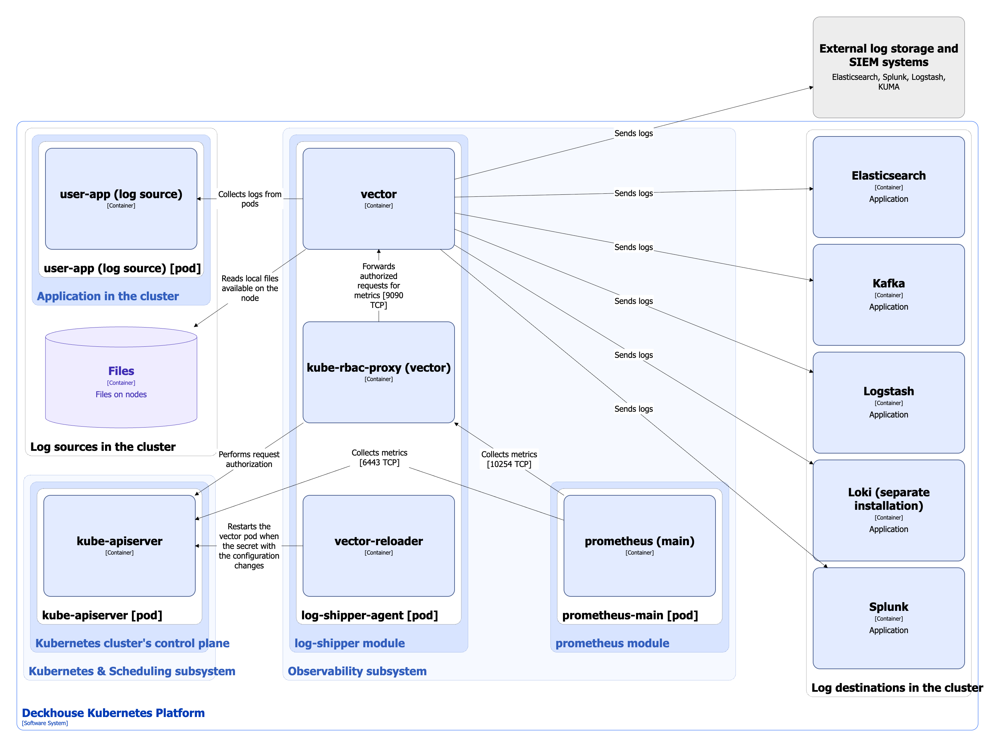

## Модуль log-shipper

Модуль упрощает настройку сбора логов в Kubernetes. Он позволяет быстро организовать сбор логов как с приложений, запущенных в кластере, так и с самих узлов, а затем отправлять их в любую систему хранения — внутреннюю или внешнюю (например, Loki, Elasticsearch и другие).


Платформа DKP обеспечивает интеграцию с системами хранения, сами системы пользователь разворачивает и настраивает самостоятельно.


Подробнее с настройками модуля и примерами его использования можно ознакомиться в соответствующем [разделе документации](/modules/log-shipper/).

### Архитектура модуля


Для лучшего восприятия схемы на ней допущены следующие упрощения:

* На схеме выглядит так, что контейнеры подов взаимодействуют с контейнерами других подов напрямую. На самом деле они взаимодействуют через соответствующие им сервисы Kubernetes (внутренние балансировщики). Если взаимодействие происходит через специфичный сервис, в подписи над стрелкой указано название сервиса.
* Поды могут быть запущены несколькими репликами. На схеме все поды изображены в одной реплике.


Архитектура модуля **log-shipper** на уровне 2 модели C4 и его взаимодействия с другими компонентами платформы изображены на следующей диаграмме:

<!--- Source: structurizr code from https://fox.flant.com/team/d8-system-design/doc/-/tree/main/architecture/diagrams/C4 --->

### Компоненты модуля

Модуль состоит из одного компонента:

1. **log-shipper-agent** (DaemonSet) — на каждом узле кластера запускается отдельный экземпляр **log-shipper-agent**, который в свою очередь состоит из следующих контейнеров:

   * **vector** - в качестве агента логирования используется [Datadog Vector](https://vector.dev/), который настраивается на основе Custom Resources [ClusterLogDestination](/modules/log-shipper/cr.html#clusterlogdestination), [ClusterLoggingConfig](/modules/log-shipper/cr.html#clusterloggingconfig) и [PodLoggingConfig](/modules/log-shipper/cr.html#podloggingconfig).
   * **vector-reloader** - sidecar-контейнер [Reloader](https://github.com/stakater/Reloader), который следит за секретом с конфигурацией и при его изменении перезапускает **vector** для того, чтобы он применил изменённую конфигурацию. **vector-reloader** также валидирует конфигурацию.
   * **kube-rbac-proxy** - sidecar-контейнер с авторизирующим прокси на основе Kubernetes RBAC для организации защищенного доступа к метрикам агента.

### Взаимодействия модуля

Модуль взаимодействует с:

1. Источниками логов в кластере:

   * Приложения, запущенные в кластере - собирает логи с подов.
   * Файлы - читает локальные файлы, доступные на узле.

2. Приемниками логов:

   * внутренними системами хранения логов
   * внешними системами хранения логов и SIEM-системами.

   В качестве как внутренних, так и внешних приемников логов могут использоваться Elasticsearch, Kafka, Logstash, Loki, Splunk.

3. **kube-apiserver**:

   * авторизация запросов на получение метрик,
   * отслеживание изменения секрета с конфигурацией **vector**.

С модулем взаимодействуют следующие внешние для него компоненты:

1. **prometheus-main** - сбор метрик **log-shipper-agent**.

## Модуль loki

В Kubernetes системные логи на узлах сохраняются недолго и могут быть утеряны при перезапуске или обновлении. Этот модуль разворачивает в кластере собственное хранилище оперативных логов на базе Grafana Loki.

Возможности:

* Системные логи автоматически попадают в Loki без дополнительной настройки.
* Доступ к логам реализован через Grafana и веб-интерфейс DKP (console).


Кратковременное хранилище на базе Grafana Loki не поддерживает работу в режиме высокой доступности. Для долговременного хранения важных логов используйте внешние системы, поддерживаемые модулем [log-shipper](/modules/log-shipper/).


Подробнее с настройками модуля и примерами его использования можно ознакомиться в соответствующем [разделе документации](/modules/loki/).

### Архитектура модуля

Архитектура модуля **loki** на уровне 2 модели C4 и его взаимодействия с другими компонентами платформы изображены на следующей диаграмме:

### Компоненты модуля

Модуль состоит из одного компонента:

1. **loki** - *StatefulSet* из одной реплики **loki-0**, которая в свою очередь состоит из следующих контейнеров:

   * **loki** - контейнер с **Grafana Loki**.
   * **kube-rbac-proxy** - sidecar-контейнер с авторизирующим прокси на основе Kubernetes RBAC для организации защищенного доступа к **loki** и его метрикам.

### Взаимодействия модуля

С модулем взаимодействуют следующие внешние для него компоненты:

1. **vector** - отправка логов с системных компонентов.
2. **console** (точнее встроенная в нее **grafana**) - использует **loki** в качестве источника данных для визуализации и анализа.
3. **prometheus-main** - сбор метрик **loki**.
