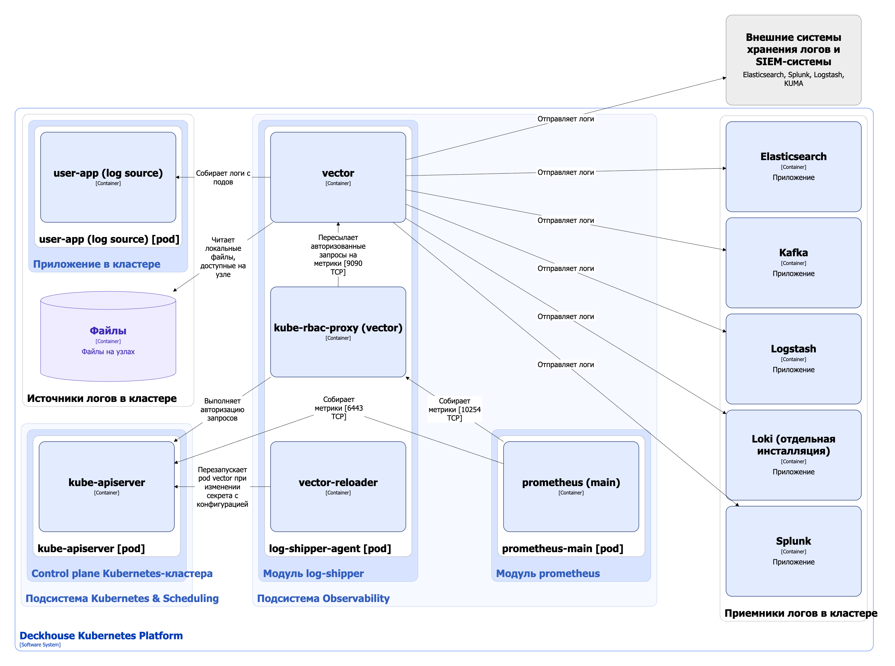
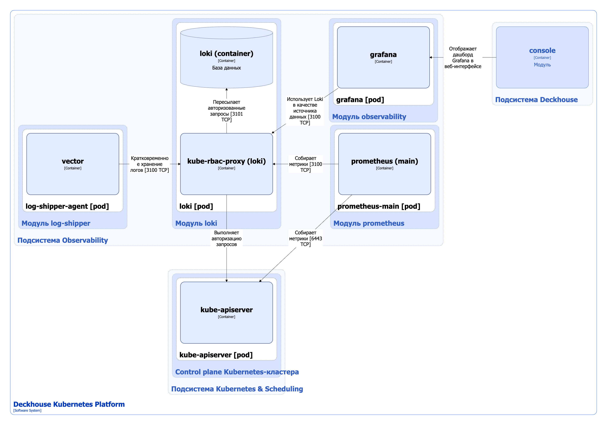

## Модуль log-shipper

Модуль `log-shipper` упрощает настройку сбора логов в Kubernetes-кластере. Он позволяет организовать сбор логов как с приложений, запущенных в кластере, так и с самих узлов, а затем отправлять их в любую систему хранения — внутреннюю или внешнюю (например, Loki, Elasticsearch и другие).


Deckhouse Kubernetes Platform (DKP) обеспечивает интеграцию с системами хранения логов. Сами системы хранения пользователь разворачивает и настраивает самостоятельно.


Подробнее с настройками модуля и примерами его использования можно ознакомиться в [соответствующем разделе документации](/modules/log-shipper/).

### Архитектура модуля


Для упрощения схемы приняты следующие допущения:

* На схеме показано, что контейнеры разных подов взаимодействуют друг с другом напрямую. Фактически они взаимодействуют через соответствующие сервисы Kubernetes (внутренние балансировщики). Названия сервисов не указываются, если они очевидны из контекста. В остальных случаях название сервиса указано над стрелкой.
* Поды могут быть запущены в нескольких репликах, однако на схеме все поды изображены в одной реплике.


Архитектура модуля [`log-shipper`](/modules/log-shipper/) на уровне 2 модели C4 и его взаимодействия с другими компонентами DKP изображены на следующей диаграмме:

<!--- Source: structurizr code from https://fox.flant.com/team/d8-system-design/doc/-/tree/main/architecture/diagrams/C4_RU --->

### Компоненты модуля

Модуль состоит из одного компонента:

* **log-shipper-agent** (DaemonSet) — на каждом узле кластера запускается отдельный экземпляр log-shipper-agent, который в свою очередь состоит из следующих контейнеров:

  * **vector** — агент логирования на базе [Datadog Vector](https://vector.dev/).
  
    Настраивается с помощью кастомных ресурсов[ClusterLogDestination](/modules/log-shipper/cr.html#clusterlogdestination), [ClusterLoggingConfig](/modules/log-shipper/cr.html#clusterloggingconfig) и [PodLoggingConfig](/modules/log-shipper/cr.html#podloggingconfig).

  * **vector-reloader** — сайдкар-контейнер [Reloader](https://github.com/stakater/Reloader), который отслеживает изменения секрета с конфигурацией. При наличии изменений он проверяет обновленную конфигурацию и перезапускает vector для применения обновлений.

  * **kube-rbac-proxy** — сайдкар-контейнер с авторизующим прокси на основе Kubernetes RBAC для организации защищенного доступа к метрикам агента.

### Взаимодействия модуля

Модуль взаимодействует со следующими компонентами:

1. **Источники логов в кластере**:

   * приложения, запущенные в кластере — собирает логи с подов;
   * файлы — читает локальные файлы на узлах кластера.

2. **Приемники логов**:

   * внутренние системы хранения логов;
   * внешние системы хранения логов и SIEM-системы.

   В качестве внутренних и внешних приемников логов могут использоваться Elasticsearch, Kafka, Logstash, Loki, Splunk.

3. **Kube-apiserver**:

   * авторизация запросов на получение метрик;
   * отслеживание изменений секрета с конфигурацией vector.

С модулем взаимодействуют следующие внешние компоненты:

1. **Prometheus-main** — сбор метрик log-shipper-agent.

## Модуль loki

В Kubernetes системные логи на узлах хранятся недолго и могут быть утеряны при перезапуске или обновлении узлов. Модуль `loki` разворачивает в кластере собственное хранилище оперативных логов на базе Grafana Loki.

Возможности модуля:

* системные логи автоматически попадают в Loki без дополнительной настройки;
* доступ к логам реализован через Grafana и веб-интерфейс Deckhouse (модуль `console`).


Кратковременное хранилище на базе Grafana Loki не поддерживает работу в режиме высокой доступности (HA). Для долговременного хранения важных логов используйте внешние системы, поддерживаемые модулем [`log-shipper`](/modules/log-shipper/).


Подробнее с настройками модуля и примерами его использования можно ознакомиться в [соответствующем разделе документации](/modules/loki/).

### Архитектура модуля

Архитектура модуля [`loki`](/modules/loki/) на уровне 2 модели C4 и его взаимодействия с другими компонентами DKP изображены на следующей диаграмме:

<!--- Source: structurizr code from https://fox.flant.com/team/d8-system-design/doc/-/tree/main/architecture/diagrams/C4_RU --->

### Компоненты модуля

Модуль состоит из одного компонента:

* **loki** — *StatefulSet* из одной реплики **loki-0**, которая в свою очередь состоит из следующих контейнеров:

  * **loki** — контейнер с Grafana Loki;
  * **kube-rbac-proxy** — сайдкар-контейнер с авторизующим прокси на основе Kubernetes RBAC для организации защищенного доступа к loki и его метрикам.

### Взаимодействия модуля

С модулем взаимодействуют следующие внешние компоненты:

* **vector** — отправка логов с системных компонентов в loki;
* **console** (встроенная в веб-интерфейс Grafana) — использует loki в качестве источника данных для визуализации и анализа логов;
* **prometheus-main** — сбор метрик loki.
