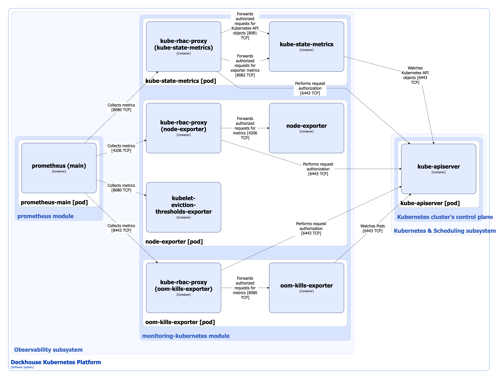

The [`monitoring-kubernetes`](/modules/monitoring-kubernetes/) module provides transparent and timely monitoring of the status of all cluster nodes and key infrastructure components.

Module features:

* Provides an opportunity to plan infrastructure resources (Capacity planning).
* Monitors the container runtime version (docker, containerd) on each node and checks it for compliance with the allowed versions.
* Monitors the performance of the cluster monitoring subsystem itself (Dead man's switch).
* Gets metrics about the availability of file descriptors, sockets, free space, and inodes on each node.
* Monitors the correct operation of key monitoring components: kube-state-metrics, node-exporter, kube-dns.
* Checks the status of all nodes (`NotReady`, `drain`, `cordon`) and promptly reports problems.
* Monitors time synchronization and notifies about deviations.
* Detects cases of prolonged CPU steal overrun (when the node does not receive the required CPU time).
* Controls the status of the Conntrack table on the nodes.
* Shows pods with incorrect statuses, for example, if kubelet failed to do its job.
* Allows you to export metrics to external monitoring systems for a single point of control.

For more details about module configuration, refer to the [corresponding documentation section](/modules/monitoring-kubernetes/configuration.html).

## Module architecture


The following simplifications are made in the diagram:

* The diagram shows containers in different pods interacting directly with each other. In reality, they communicate via the corresponding Kubernetes Services (internal load balancers). Service names are omitted if they are obvious from the diagram context. Otherwise, the Service name is shown above the arrow.
* Pods may run multiple replicas. However, each pod is shown as a single replica in the diagram.


The Level 2 C4 architecture of the [`monitoring-kubernetes`](/modules/monitoring-kubernetes/) module and its interactions with other components of Deckhouse Kubernetes Platform (DKP) are shown in the following diagram:

## Module components

The module consists of the following components:

1. **Kube-state-metrics** (Deployment): Prometheus exporter that collects and provides metrics about the state of objects in a Kubernetes cluster. It connects to the Kubernetes API server, analyzes the current status of resources (Pods, Services, Deployments, Nodes, and others), and generates metrics based on this.

   It consists of the following containers:

   * **kube-state-metrics**: Main container. It is an [open-source project](https://github.com/kubernetes/kube-state-metrics).
   * **kube-rbac-proxy**: Sidecar container with an authorization proxy based on Kubernetes RBAC that provides secure access to the exporter metrics. It is an [open-source project](https://github.com/brancz/kube-rbac-proxy).

1. **Node-exporter** (DaemonSet): Prometheus exporter that runs on each cluster node and collects metrics from these nodes. It collects data about the operating system and hardware.

   It consists of the following containers:

   * **node-exporter**: Main container. It is an [open-source project](https://github.com/kubernetes/kube-state-metrics);
   * **kubelet-eviction-thresholds-exporter**: Sidecar container that collects metrics on the availability of file descriptors, sockets, free space and inodes on each node, compares them as a percentage with [Eviction thresholds](https://kubernetes.io/docs/concepts/scheduling-eviction/node-pressure-eviction/#eviction-thresholds), stated in the [kubelet](../kubernetes-and-scheduling/kubelet.html) configuration file, and exports the resulting values as metrics. This exporter is developed by Flant.
   * **kube-rbac-proxy**: Sidecar container providing authorized access to the exporter metrics (described above).

1. **Oom-kills-exporter** (DaemonSet): Prometheus exporter that runs on each cluster node, monitors OOM-kill (Out-Of-Memory kill) events occurring with containers running on these nodes, and exports a counter of such events as a metric. Oom-kills-exporter also watches pods to synchronize labels containing container IDs that are added to the metrics.

   It consists of the following containers:

   * **oom-kills-exporter**: Main container. This exporter is developed by Flant.
   * **kube-rbac-proxy**: Sidecar container providing authorized access to the exporter metrics (described above).

## Module interactions

The module interacts with the following components:

1. **Kube-apiserver**:

   * Watches Kubernetes API objects;
   * Authorizes requests for metrics.

The following external components interact with the module:

1. **Prometheus-main**: Collects metrics from module exporters.
