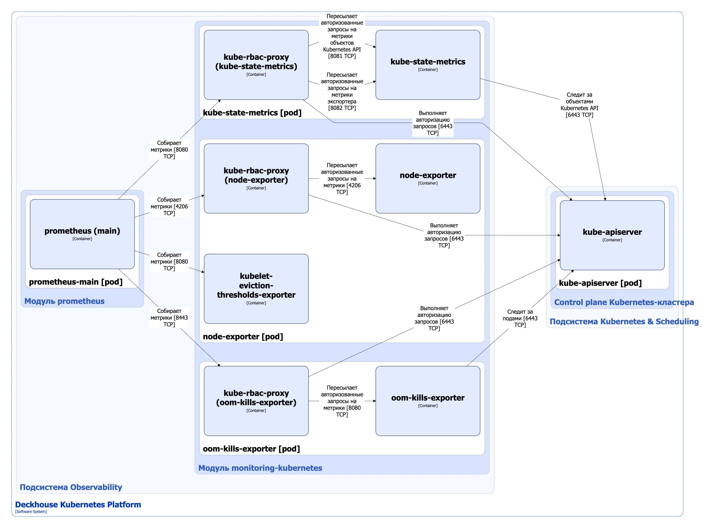

Модуль [`monitoring-kubernetes`](/modules/monitoring-kubernetes/) обеспечивает прозрачный и своевременный контроль состояния всех узлов кластера и ключевых инфраструктурных компонентов.

Возможности модуля:

* предоставляет возможность планировать ресурсы инфраструктуры (Capacity planning);
* отслеживает версию container runtime (docker, containerd) на каждом узле и проверяет её на соответствие разрешенным версиям;
* контролирует работоспособность самой подсистемы мониторинга кластера (Dead man’s switch);
* снимает метрики о доступности файловых дескрипторов, сокетов, свободного места и inode на каждом узле;
* следит за корректной работой ключевых компонентов мониторинга: kube-state-metrics, node-exporter, kube-dns;
* проверяет состояние всех узлов (`NotReady`, `drain`, `cordon`) и своевременно сигнализирует о неполадках;
* следит за синхронизацией времени и уведомляет об отклонениях;
* выявляет случаи продолжительного превышения CPU steal (когда узел не получает нужного времени процессора);
* контролирует состояние таблицы Conntrack на узлах;
* показывает поды с некорректными статусами — например, если kubelet не справился со своей работой;
* позволяет экспортировать метрики во внешние системы мониторинга для единой точки контроля.

Подробнее с настройками модуля можно ознакомиться [в разделе документации модуля](/modules/monitoring-kubernetes/configuration.html).

## Архитектура модуля


Для упрощения схемы приняты следующие допущения:

* На схеме контейнеры разных подов показаны как взаимодействующие напрямую. Фактически обмен выполняется через соответствующие сервисы Kubernetes (внутренние балансировщики). Названия сервисов не указываются, если они очевидны из контекста. В остальных случаях название сервиса приводится над стрелкой.
* Поды могут быть запущены в нескольких репликах, однако на схеме каждый под показан в единственном экземпляре.


Архитектура модуля [`monitoring-kubernetes`](/modules/monitoring-kubernetes/) на уровне 2 модели C4 и его взаимодействия с другими компонентами Deckhouse Kubernetes Platform (DKP) изображены на следующей диаграмме:

## Компоненты модуля

Модуль состоит из следующих компонентов:

1. **Kube-state-metrics** (Deployment) — экспортер Prometheus, который собирает и предоставляет метрики о состоянии объектов в кластере Kubernetes. Он подключается к API-серверу Kubernetes, анализирует текущее состояние ресурсов (Pods, Services, Deployments, Nodes и других) и генерирует на этой основе метрики.

   Состоит из следующих контейнеров:

   * **kube-state-metrics** — основной контейнер. Является [Open Source-проектом](https://github.com/kubernetes/kube-state-metrics);
   * **kube-rbac-proxy** — сайдкар-контейнер с авторизующим прокси на основе Kubernetes RBAC для организации защищенного доступа к метрикам о состоянии объектов Kubernetes API, а также метрикам состояния самого экспортера. Является [Open Source-проектом](https://github.com/brancz/kube-rbac-proxy).

1. **Node-exporter** (DaemonSet) — экспортер Prometheus, запускаемый на каждом узле кластера и собирающий метрики с этих узлов. Он собирает данные об операционной системе и аппаратном обеспечении.

   Состоит из следующих контейнеров:

   * **node-exporter** — основной контейнер. Является [Open Source-проектом](https://github.com/kubernetes/kube-state-metrics);
   * **kubelet-eviction-thresholds-exporter** — сайдкар-контейнер, который снимает показатели доступности файловых дескрипторов, сокетов, свободного места и inode на каждом узле, сравнивает их в процентном соотношении с [Eviction thresholds (порогами вытеснения)](https://kubernetes.io/docs/concepts/scheduling-eviction/node-pressure-eviction/#eviction-thresholds), установленными в конфигурации [kubelet](../kubernetes-and-scheduling/kubelet.html), и экспортирует полученные значения в виде метрик. Является разработкой компании «Флант»;
   * **kube-rbac-proxy** — сайдкар-контейнер, обеспечивающий авторизованный доступа к метрикам экспортера. Подробно описан выше.

1. **Oom-kills-exporter** (DaemonSet) — экспортер Prometheus, запускаемый на каждом узле кластера, следящий за событиями OOM-kill (Out-Of-Memory kill), происходящими с контейнерами, запущенными на этих узлах, и экспортирующий счетчик таких событий в виде метрики. Oom-kills-exporter также следит за подами для синхронизации лейблов, содержащих идентификаторы контейнеров, которые добавляются к метрикам.

   Состоит из следующих контейнеров:

   * **oom-kills-exporter** — основной контейнер. Является разработкой компании «Флант»;
   * **kube-rbac-proxy** — сайдкар-контейнер, обеспечивающий авторизованный доступа к метрикам экспортера. Подробно описан выше.

## Взаимодействия модуля

Модуль взаимодействует со следующими компонентами:

1. **Kube-apiserver**:

   * следит за объектами API Kubernetes;
   * выполняет авторизацию запросов на метрики.

С модулем взаимодействуют следующие внешние компоненты:

1. **Prometheus-main** — собирает метрики с экспортеров модуля.
