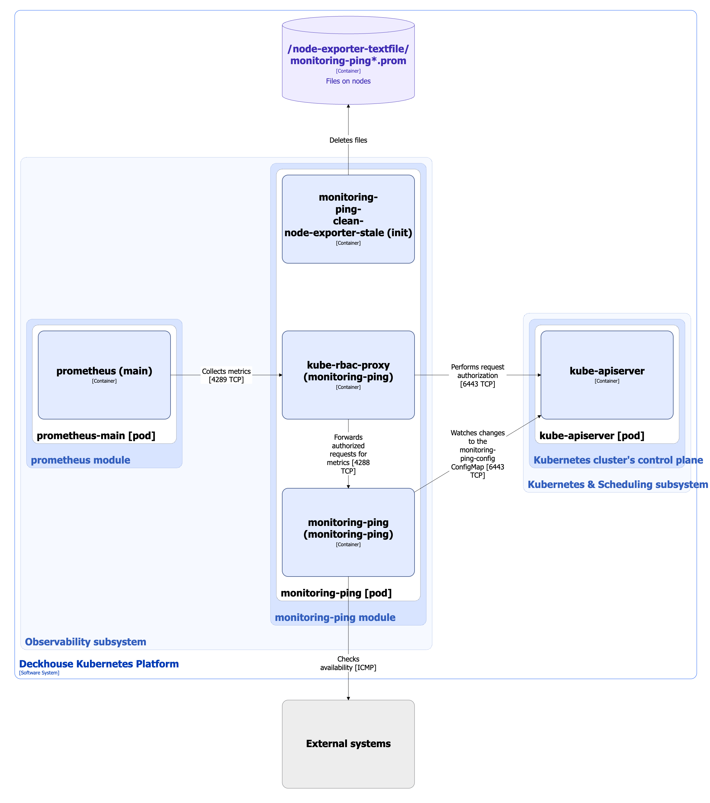

The [`monitoring-ping`](/modules/monitoring-ping/) module provides continuous connectivity verification between all cluster nodes and, if necessary, to external systems.

Module features:

* Automatically checks the availability of all cluster nodes (and, optionally, external systems) using ICMP (ping),testing is started every two seconds.
* All results are exported in metrics format to the Prometheus monitoring system.
* Included is a ready—made dashboard for Grafana, where current availability, delay schedules, and potential network connectivity issues are visualized in real time.
* Allows you to quickly identify nodes with degraded connectivity and speeds up the response to incidents.

For more details about the module configuration and usage examples, refer to the [module documentation](/modules/monitoring-ping/).

## Module architecture


The following simplifications are made in the diagram:

* The diagram shows containers in different pods interacting directly with each other. In reality, they communicate via the corresponding Kubernetes Services (internal load balancers). Service names are omitted if they are obvious from the diagram context. Otherwise, the Service name is shown above the arrow.
* Pods may run multiple replicas. However, each pod is shown as a single replica in the diagram.


The Level 2 C4 architecture of the [`monitoring-ping`](/modules/monitoring-ping/) module and its interactions with other components of DKP are shown in the following diagram:

## Module components

The [`monitoring-ping`](/modules/monitoring-ping/) module consists of a single **monitoring-ping** (DaemonSet) component, that is Prometheus exporter running on each cluster node. Monitoring-ping watches changes to the `monitoring-ping-config` ConfigMap, which contains lists of cluster nodes and external hosts for monitoring. The module also tracks the node's `.status.addresses` field for changes. Upon detecting changes, it invokes a hook that collects a complete list of node names/addresses and passes it to a DaemonSet (the latter recreates the Pods). As a result, monitoring-ping checks the always up-to-date list of nodes.

It consists of the following containers:

* **monitoring-ping-clean-node-exporter-stale**: Init container that deletes from the node the `/node-exporter-textfile/monitoring-ping*.prom` files with stale metrics.
* **monitoring-ping**: Main container. This exporter is developed by Flant.
* **kube-rbac-proxy**: Sidecar container with an authorization proxy based on Kubernetes RBAC, providing secure access to exporter metrics. It is an [open source project](https://github.com/brancz/kube-rbac-proxy).

## Module interactions

The module interacts with the following components:

1. **Kube-apiserver**:

   * Watches changes to the `monitoring-ping-config` ConfigMap, which contains lists of cluster nodes and external hosts for monitoring.
   * Authorizes requests for metrics.

1. **External systems**: Checks their availability.

The following external components interact with the module:

1. **Prometheus-main**: Collects metrics from monitoring-ping exporter.
