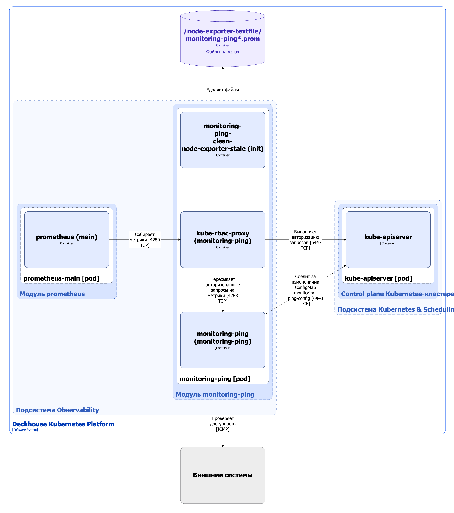

Модуль [`monitoring-ping`](/modules/monitoring-ping/) обеспечивает непрерывную проверку доступности всех узлов кластера и, при необходимости, внешних систем.

Возможности модуля:

* автоматически проверяет доступность всех узлов кластера (и, опционально, внешних систем) с помощью ICMP (ping), тестирование запускается каждые две секунды;
* все результаты экспортируются в формате метрик в систему мониторинга Prometheus;
* в комплекте готовый дашборд для Grafana, где в реальном времени визуализируются текущая доступность, графики задержек и потенциальные проблемы с сетевой связностью;
* позволяет быстро выявлять узлы с деградировавшей связностью и ускоряет реакцию на инциденты.

Подробнее с настройками и примерами использования модуля можно ознакомиться [в разделе документации модуля](/modules/monitoring-ping/).

## Архитектура модуля


Для упрощения схемы приняты следующие допущения:

* На схеме контейнеры разных подов показаны как взаимодействующие напрямую. Фактически обмен выполняется через соответствующие сервисы Kubernetes (внутренние балансировщики). Названия сервисов не указываются, если они очевидны из контекста. В остальных случаях название сервиса приводится над стрелкой.
* Поды могут быть запущены в нескольких репликах, однако на схеме каждый под показан в единственном экземпляре.


Архитектура модуля [`monitoring-ping`](/modules/monitoring-ping/) на уровне 2 модели C4 и его взаимодействия с другими компонентами Deckhouse Kubernetes Platform (DKP) изображены на следующей диаграмме:

## Компоненты модуля

Модуль [`monitoring-ping`](/modules/monitoring-ping/) состоит из одного компонента **monitoring-ping** (DaemonSet) — экспортера Prometheus, запускаемого на каждом узле кластера.  Monitoring-ping следит за изменениями ConfigMap `monitoring-ping-config`, который содержит списки узлов кластера и внешних хостов для мониторинга. Также модуль отслеживает любые изменения поля `.status.addresses` узла. Если они обнаружены, срабатывает хук, который собирает полный список имен узлов и их адресов и передает в DaemonSet, который заново создает поды. Таким образом, monitoring-ping проверяет всегда актуальный список узлов.

Состоит из следующих контейнеров:

* **monitoring-ping-clean-node-exporter-stale** — init-контейнер, удаляющий с узла файлы `/node-exporter-textfile/monitoring-ping*.prom` с устаревшими метриками;
* **monitoring-ping** — основной контейнер. Является разработкой компании «Флант»;
* **kube-rbac-proxy** — сайдкар-контейнер с авторизующим прокси на основе Kubernetes RBAC для организации защищенного доступа к метрикам экспортера. Является [Open Source-проектом](https://github.com/brancz/kube-rbac-proxy).

## Взаимодействия модуля

Модуль взаимодействует со следующими компонентами:

1. **Kube-apiserver**:

   * следит за изменениями ConfigMap `monitoring-ping-config`, который содержит списки узлов кластера и внешних хостов для мониторинга;
   * выполняет авторизацию запросов на метрики.

1. **Внешние системы** — проверяет доступность.

С модулем взаимодействуют следующие внешние компоненты:

1. **Prometheus-main** — собирает метрики с экспортера monitoring-ping.
