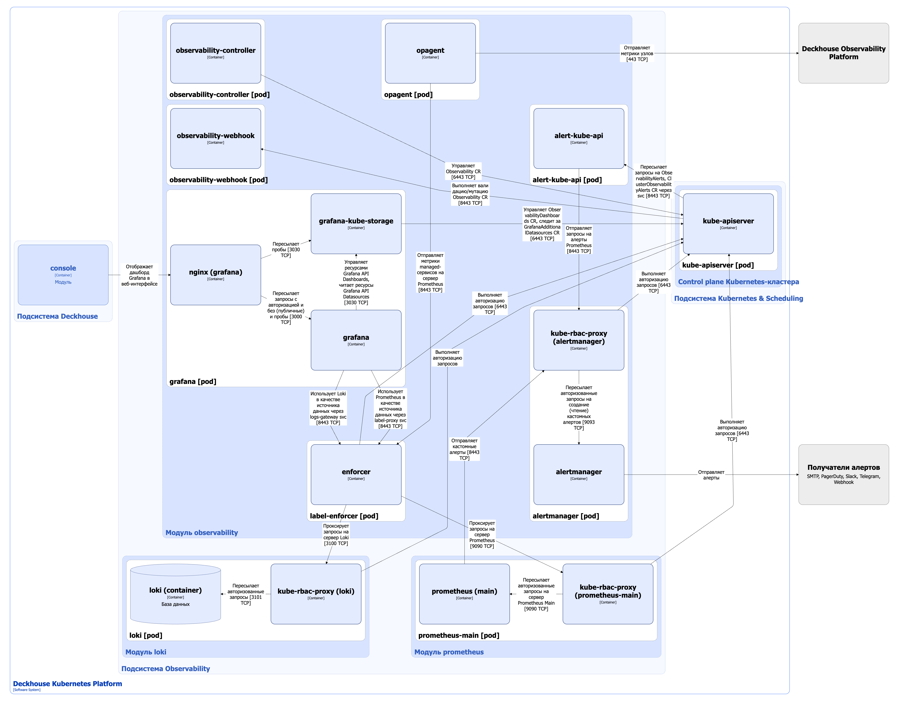

Модуль [`observability`](/modules/observability/) расширяет функциональность модулей [Prometheus](/modules/prometheus/) и [Deckhouse Веб Интерфейс](/modules/console/), предоставляя дополнительные возможности для гибкого управления метриками, дашбордами и алертами, а также средства разграничения доступа к ним.

Возможности модуля:

* **Управление дашбордами** — модуль позволяет пользователям добавлять собственные дашборды в формате Grafana.
* **Управление группами триггеров и метрик** — модуль позволяет создавать и настраивать собственные группы триггеров и метрик.
* **Настройка уведомлений** — модуль позволяет настраивать каналы уведомлений (Telegram, Slack, электронная почта, вебхуки), политики уведомлений, а также дает возможность отключать уведомления при необходимости.
* **Работа с алертами** — модуль предоставляет информацию об активных алертах, а также сохраняет историю завершенных алертов.
* **Предоставление стандартных источников данных**.
* **Поддержка пользовательских источников данных** — модуль дополнительно к предоставляемому набору стандартных источников данных позволяет добавить пользовательские.

Подробнее с описанием модуля можно ознакомиться [в разделе документации модуля](/modules/observability/).

## Архитектура модуля


Для упрощения схемы приняты следующие допущения:

- На схеме контейнеры разных подов показаны как взаимодействующие напрямую. Фактически обмен выполняется через соответствующие сервисы Kubernetes (внутренние балансировщики). Названия сервисов не указываются, если они очевидны из контекста. В остальных случаях название сервиса приводится над стрелкой.
- Поды могут быть запущены в нескольких репликах, однако на схеме каждый под показан в единственном экземпляре.


Архитектура модуля [`observability`](/modules/observability/) на уровне 2 модели C4 и его взаимодействия с другими компонентами DKP изображены на следующей диаграмме:

<!--- Source: structurizr code from https://fox.flant.com/team/d8-system-design/doc/-/tree/main/architecture/diagrams/C4_RU --->

## Компоненты модуля

Модуль состоит из следующих компонентов:

1. **Observability-controller** — состоит из одного контейнера, управляет жизненным циклом большинства кастомных ресурсов модуля, таких как: ObservabilityMetricsRulesGroup, ObservabilityNotificationChannels, ObservabilityNotificationSilence и т.д. Полный список ресурсов, которыми управляет модуль, приведён [в документации модуля](/modules/observability/cr.html).

1. **Observability-webhook** — состоит из одного контейнера, реализующего вебхук-сервер для проверки и изменения кастомных ресурсов через механизмы [Validating/Mutating Admission Controllers](https://kubernetes.io/docs/reference/access-authn-authz/admission-controllers/).

2. **Alert-kube-api** — состоит из одного контейнера, реализует [Kubernetes Extension API Server](https://kubernetes.io/docs/tasks/extend-kubernetes/setup-extension-api-server/), который расширяет Kubernetes API кастомными ресурсами ObservabilityAlerts и ClusterObservabilityAlerts. Alert-kube-api позволяет запрашивать алерты как кастомные реурсы, используя в качестве бэкенда alertmanager, и кэширует их в памяти для быстрого доступа.

4. **Alertmanager** — принимает алерты от Prometheus сервера, обрабатывает и отправляет их конечным получателям. DKP поддерживает отправку алертов через следующие каналы доставки:

   - `Email`;
   - `Telegram`;
   - `Slack`;
   - `Webhook`.

   Компонент содержит следующие контейнеры:

   - **alertmanager** — основной контейнер. В модуле используется в форк [оригинального Alertmanager](https://github.com/prometheus/alertmanager) от компании «Флант», поддерживающий мультитенантность: разделение алертов по системным(кластерным) и проектным, доставка алертов (политики, каналы, сайленсеры) так же мультитенантные, т.е. в разных проектах можно настроить разные каналы и политики доставки.

   - **kube-rbac-proxy** — сайдкар-контейнер с авторизующим прокси на основе Kubernetes RBAC для организации защищенного доступа к API-эндпойнту Alertmanager. Является [Open Source-проектом](https://github.com/brancz/kube-rbac-proxy).

5. **Grafana** — компонент, предоставляющий веб-интерфейс для визуализации данных мониторинга. В модуле [`observability`](/modules/observability/) используется [форк Grafana](https://github.com/okmeter/grafana)от компании «Флант». Используемая модификация Grafana обладает расширенными возможностями, такими как разграничение доступа к метрикам и дашбордам в рамках [мультитенантности](../iam/multitenancy.html). Дашборды Grafana модуля [`observability`](/modules/observability/) интегрированы в [веб-интерфейс](/modules/console/stable/) DKP (управление системой мониторинга из одного окна).

   Компонент содержит следующие контейнеры:

   - **grafana** — основной контейнер;
   - **grafana-kube-storage** — сайдкар-контейнер, реализующий бэкенд для grafana и предоставляющий управление ресурсами Dashboards и чтение ресурсов Datasources Grafana API. Данные ресурсы позволяют просматривать и управлять дашбордами в пределах пространств имён (проектов), а также подключать [пользовательские источники данных](/modules/observability/stable/#%D0%BF%D0%BE%D0%B4%D0%B4%D0%B5%D1%80%D0%B6%D0%BA%D0%B0-%D0%BF%D0%BE%D0%BB%D1%8C%D0%B7%D0%BE%D0%B2%D0%B0%D1%82%D0%B5%D0%BB%D1%8C%D1%81%D0%BA%D0%B8%D1%85-%D0%B8%D1%81%D1%82%D0%BE%D1%87%D0%BD%D0%B8%D0%BA%D0%BE%D0%B2-%D0%B4%D0%B0%D0%BD%D0%BD%D1%8B%D1%85);
   - **nginx** — сайдкар-контейнер, представляющий собой прокси-сервер NGINX, основная задача — раздача статики. Является [Open Source-проектом](https://github.com/nginx/nginx)
   
6. **Label-enforcer** — выполняет авторизацию и проксирование запросов пользователей к источникам метрик (Prometheus через сервис label-proxy) и логов (Loki через сервис logs-gateway), указанным в ресурсах Datasources Grafana API. Label-enforcer проверяет RBAC-доступ к данным мониторинга в зависимости от прав пользователя, получает список доступных пространств имён и обогащает запросы лейблами для возможности фильтрации запрашиваемых данных в рамках пространств имён пользователей. Подробнее о разграничении доступа можно ознакомиться в [в разделе документации модуля](/modules/observability/stable/#%D1%80%D0%B0%D0%B7%D0%B3%D1%80%D0%B0%D0%BD%D0%B8%D1%87%D0%B5%D0%BD%D0%B8%D0%B5-%D0%B4%D0%BE%D1%81%D1%82%D1%83%D0%BF%D0%B0-%D0%BA-%D0%BC%D0%B5%D1%82%D1%80%D0%B8%D0%BA%D0%B0%D0%BC). Label-enforcer обрабатывает не только запросы на чтение, но и запросы на запись.

   Состоит из одного контейнера:

   **enforcer**.

7. **Opagent** (DaemonSet) — агент, предназначенный для сбора метрик как с операционной системы, так и с прикладного программного обеспечения, установленного на серверы. Разработан компанией «Флант» для [Deckhouse Observability Platform (DOP)](/products/observability-platform/) на основе [Okagent (агента Okmeter)](https://okmeter.ru/docs/features/), также входящего в состав системы мониторинга [Okmeter](https://okmeter.ru/docs/overview/). В модуле [`observability`](/modules/observability/) opAgent подключается к managed-сервисам, например [`managed-postgres`](/modules/managed-postgres/), [managed-memcached](/modules/managed-memcached/), [`managed-kafka`](/modules/managed-kafka/) и т.д. (cписок поддерживаемых сервисов постоянно расширяется), собирает с них метрики, затем отправляет их в Prometheus. Если включен модуль [`observability-platform`](/modules/observability-platform/), opAgent собирает метрики с узлов и отправлет в [Deckhouse Observability Platform](/products/observability-platform/).

   opAgent отправляет собранные метрики по протоколу [Prometheus Remote Write](https://prometheus.io/docs/specs/prw/remote_write_spec/) в Prometheus через label-enforcer (метрики managed-сервисов) и в [Deckhouse Observability Platform](/products/observability-platform/) (метрики с узлов).

   Состоит из одного контейнера:

   **opagent**.

## Взаимодействия модуля

Модуль взаимодействует со следующими компонентами:

1. **Kube-apiserver**:

   - для авторизации запросов к данным мониторинга;
   - для управления кастомными ресурсами модуля;

1. **Prometheus** — использует в качестве источника и приемника данных.
1. **Loki** — использует в качестве источника данных.
1. **Получатели алертов** — отправляет алерты.
1. [Deckhouse Observability Platform](/products/observability-platform/) — использует в качестве приемника данных (метрики узлов).

С модулем взаимодействуют следующие внешние компоненты:

1. **Kube-apiserver**:

   - выполняет проверку и изменение кастомных ресурсов модуля (с помощью validating и mutating вебхуков);
   - пересылает в alert-kube-api запросы на кастомные ресурсы ObservabilityAlerts и ClusterObservabilityAlerts.

1. **Prometheus** — отправляет алерты в Alertmanager.
1. **[Deckhouse Веб Интерфейс](/modules/console/)** — использует Grafana для визуализации данных мониторинга.
