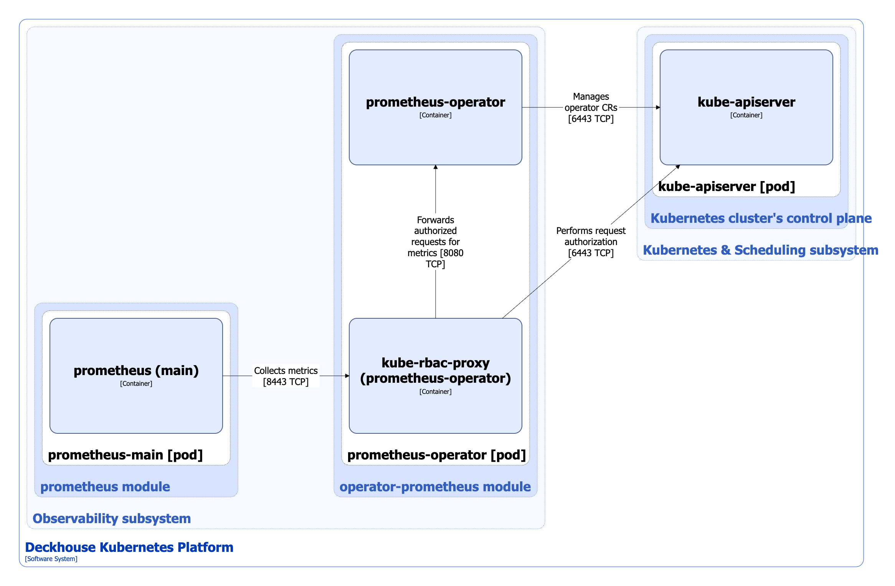

The [`operator-prometheus`](/modules/operator-prometheus/) module installs [Prometheus Operator](https://github.com/coreos/prometheus-operator), which automates the deployment and management of [Prometheus](https://github.com/prometheus/prometheus) installations.

For more details about the module configuration as well as Prometheus Operator operation, refer to [the module documentation](/modules/operator-prometheus/) section.

## Module architecture


The following simplifications are made in the diagram:

* The diagram shows containers in different pods interacting directly with each other. In reality, they communicate via the corresponding Kubernetes Services (internal load balancers). Service names are omitted if they are obvious from the diagram context. Otherwise, the Service name is shown above the arrow.
* Pods may run multiple replicas. However, each pod is shown as a single replica in the diagram.


The Level 2 C4 architecture of the [`operator-prometheus`](/modules/operator-prometheus/) module and its interactions with other components of DKP are shown in the following diagram:

## Module components

Module consists of a single **prometheus-operator** component.  Prometheus-operator is an [open source project](https://github.com/coreos/prometheus-operator) that provides deployment and management of Prometheus and related monitoring components. The purpose of this project is to simplify and automate the configuration of a Prometheus based monitoring stack for Kubernetes clusters.

It consists of the following containers:

* **prometheus-operator**: Main container.
* **kube-rbac-proxy**: Sidecar container with an authorization proxy based on Kubernetes RBAC that provides secure access to the operator metrics. It is an [open-source project](https://github.com/brancz/kube-rbac-proxy).

## Module interactions

The module interacts with the following components:

1. **Kube-apiserver**:

   * Manages the operator [custom resources](/modules/operator-prometheus/cr.html).
   * Authorizes requests for metrics.

The following external components interact with the module:

1. **Prometheus-main**: Collects prometheus-operator metrics.

