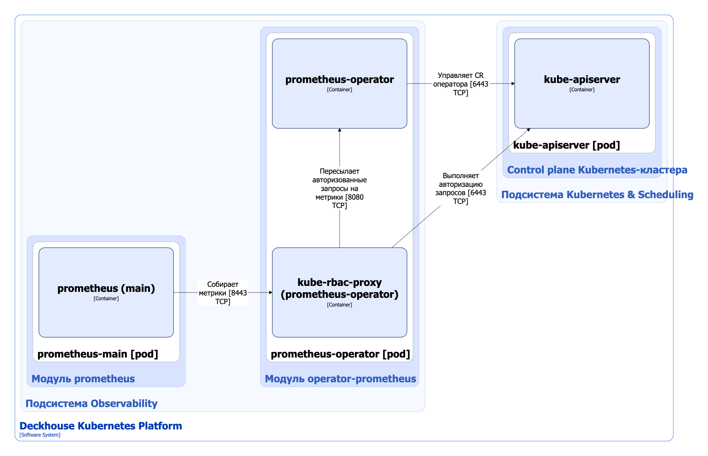

Модуль [`operator-prometheus`](/modules/operator-prometheus/) устанавливает [Prometheus Operator](https://github.com/coreos/prometheus-operator), который автоматизирует развёртывание и управление инсталляциями [Prometheus](https://github.com/prometheus/prometheus).

Подробнее с настройками модуля и описанием работы Prometheus Operator можно ознакомиться [в разделе документации модуля](/modules/operator-prometheus/).

## Архитектура модуля


Для упрощения схемы приняты следующие допущения:

* На схеме контейнеры разных подов показаны как взаимодействующие напрямую. Фактически обмен выполняется через соответствующие сервисы Kubernetes (внутренние балансировщики). Названия сервисов не указываются, если они очевидны из контекста. В остальных случаях название сервиса приводится над стрелкой.
* Поды могут быть запущены в нескольких репликах, однако на схеме каждый под показан в единственном экземпляре.


Архитектура модуля [`operator-prometheus`](/modules/operator-prometheus/) на уровне 2 модели C4 и его взаимодействия с другими компонентами Deckhouse Kubernetes Platform (DKP) изображены на следующей диаграмме:

## Компоненты модуля

Модуль состоит из одного компонента **prometheus-operator**.  Prometheus-operator — [Open Source-проект](https://github.com/coreos/prometheus-operator), обеспечивающий развертывание и управление инсталляциями Prometheus и связанными компонентами мониторинга.  Цель этого проекта — упростить и автоматизировать настройку стека мониторинга на основе Prometheus для кластеров Kubernetes.

Состоит из следующих контейнеров:

* **prometheus-operator** — основной контейнер;
* **kube-rbac-proxy** — сайдкар-контейнер с авторизующим прокси на основе Kubernetes RBAC для организации защищенного доступа к метрикам оператора. Является [Open Source-проектом](https://github.com/brancz/kube-rbac-proxy).

## Взаимодействия модуля

Модуль взаимодействует со следующими компонентами:

1. **Kube-apiserver**:

   * управляет [кастомными ресурсами](/modules/operator-prometheus/cr.html) оператора;
   * выполняет авторизацию запросов на метрики.

С модулем взаимодействуют следующие внешние компоненты:

1. **Prometheus-main** — собирает метрики prometheus-operator.
