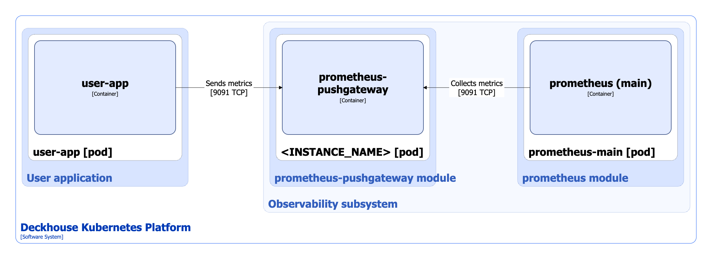

The [`prometheus-pushgateway`](/modules/prometheus-pushgateway/) module installs [Prometheus Pushgateway](https://github.com/prometheus/pushgateway) into the cluster. It gets metrics from the app and pushes them to Prometheus.

For more details about module settings and usage examples, refer to [the module documentation](/modules/prometheus-pushgateway/).

## Module architecture


The following assumptions are used to simplify the diagram:

* The diagram shows direct communication between containers in different Pods.
  In practice, components communicate through Kubernetes Services (internal load balancers). Service names are omitted when obvious from context. In other cases, a service name is shown above the arrow.
* Pods can run with multiple replicas, but only one replica per Pod is shown in the diagram.


The level-2 C4 architecture of the [`prometheus-pushgateway`](/modules/prometheus-pushgateway/) module and its interactions with other components of DKP are shown in the following diagram:

## Module components

The module consists of one or more **\<INSTANCE_NAME\>** (StatefulSet) components, which in turn consist of a single **prometheus-pushgateway** container. Since Prometheus Pushgateway stores data in memory, the number of replicas in the StatefulSet cannot be greater than one; otherwise, the data cannot be deleted correctly. In the [`settings.instances`](https://deckhouse.ru/modules/prometheus-pushgateway/stable/configuration.html#parameters-instances) parameter of the module, you can specify a list of instances, for each of which a separate Pushgateway with the \<INSTANCE_NAME\> name will be created.

## Module interactions

The following external components interact with the module:

1. **User applications**: Send metrics to prometheus-pushgateway.
1. **Prometheus-main**: Collects metrics from prometheus-pushgateway.
