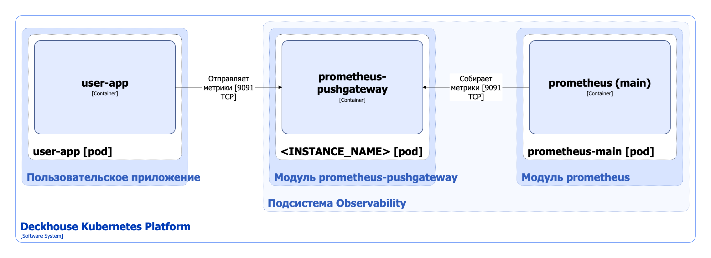

Модуль [`prometheus-pushgateway`](/modules/prometheus-pushgateway/) устанавливает в кластер [Prometheus Pushgateway](https://github.com/prometheus/pushgateway). Он предназначен для приема метрик от приложения и отдачи их Prometheus.

Подробнее с настройками и примерами использования модуля можно ознакомиться [в разделе документации модуля](/modules/prometheus-pushgateway/).

## Архитектура модуля


Для упрощения схемы приняты следующие допущения:

* На схеме контейнеры разных подов показаны как взаимодействующие напрямую. Фактически обмен выполняется через соответствующие сервисы Kubernetes (внутренние балансировщики). Названия сервисов не указываются, если они очевидны из контекста. В остальных случаях название сервиса приводится над стрелкой.
* Поды могут быть запущены в нескольких репликах, однако на схеме каждый под показан в единственном экземпляре.


Архитектура модуля [`prometheus-pushgateway`](/modules/prometheus-pushgateway/) на уровне 2 модели C4 и его взаимодействия с другими компонентами Deckhouse Kubernetes Platform (DKP) изображены на следующей диаграмме:

## Компоненты модуля

Модуль состоит из одного или нескольких компонентов **\<INSTANCE_NAME\>** (StatefulSet), в свою очередь состоящих из одного контейнера prometheus-pushgateway. Поскольку Prometheus Pushgateway хранит данные в памяти, количество реплик в StatefulSet не может быть больше одной, в противном случае данные не могут быть удалены корректно. В параметре [`settings.instances`](https://deckhouse.ru/modules/prometheus-pushgateway/stable/configuration.html#parameters-instances) модуля можно указать список инстансов, для каждого из которых будет создан отдельный Pushgateway с именем \<INSTANCE_NAME\>, где \<INSTANCE_NAME\> — имя инстанса.

## Взаимодействия модуля

С модулем взаимодействуют следующие внешние компоненты:

1. **Пользовательские приложения** — отправляют метрики в prometheus-pushgateway.
1. **Prometheus-main** — собирает метрики с prometheus-pushgateway.
