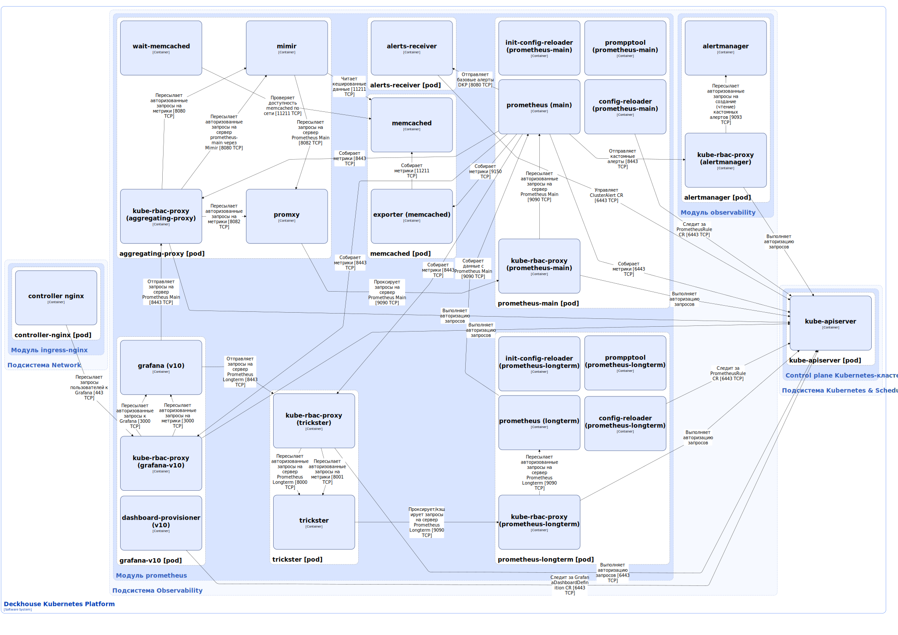

Модуль `prometheus` разворачивает стек мониторинга с предустановленными параметрами для Deckhouse Kubernetes Platform (DKP) и приложений, что упрощает начальную настройку.

Подробнее с описанием модуля можно ознакомиться в [соответствующем разделе документации](/modules/prometheus/).

## Архитектура модуля


Для упрощения схемы приняты следующие допущения:

* На схеме показано, что контейнеры разных подов взаимодействуют друг с другом напрямую. Фактически они взаимодействуют через соответствующие сервисы Kubernetes (внутренние балансировщики). Названия сервисов не указываются, если они очевидны из контекста. В остальных случаях название сервиса указано над стрелкой.
* Поды могут быть запущены в нескольких репликах, однако на схеме все поды изображены в одной реплике.


Архитектура модуля [`prometheus`](/modules/prometheus/) на уровне 2 модели C4 и его взаимодействия с другими компонентами DKP изображены на следующей диаграмме:

<!--- Source: structurizr code from https://fox.flant.com/team/d8-system-design/doc/-/tree/main/architecture/diagrams/C4_RU --->

## Компоненты модуля

Модуль состоит из следующих компонентов:

1. **Prometheus-main** (StatefulSet) — основной Prometheus. [Prometheus](https://github.com/prometheus/prometheus) — система мониторинга и оповещения, использующая базу данных временных рядов (TSDB или time series database). Она в реальном времени собирает и анализирует метрики работы приложений и серверов. Prometheus-main собирает метрики с настроенных объектов мониторинга каждые 30 секунд. С помощью параметра [scrapeInterval](/modules/prometheus/configuration.html#parameters-scrapeinterval) можно изменить это значение.

   В prometheus-main может использоваться оригинальный («vanilla») Prometheus или [Deckhouse Prom++](https://github.com/deckhouse/prompp) — высокопроизводительный форк Prometheus с открытым исходным кодом, разработанный для значительного сокращения потребления памяти при сохранении полной совместимости с оригинальным проектом. В модуле по умолчанию используется Deckhouse Prom++. Есть возможность переключиться с Deckhouse Prom++ на оригинальный Prometheus. В этом случае потребуется миграция данных журнала упреждающей записи (WAL или write-ahead log), поскольку в Deckhouse Prom++ используется свой формат журнала WAL. Миграция осуществляется автоматически при помощи init-контейнера prompptool.

   Prometheus-main является основным источником данных. Он собирает метрики, обрабатывает настроенные правила и отправляет алерты в соответствии с его конфигурацией. Инсталляцию Prometheus, а также его конфигурацию создает [Prometheus Operator](/modules/operator-prometheus/) на основании кастомных ресурсов:

   * [Prometheus](https://github.com/coreos/prometheus-operator/blob/master/Documentation/api-reference/api.md#prometheus) — описывает инсталляцию (кластер) Prometheus;
   * [ServiceMonitor](https://github.com/coreos/prometheus-operator/blob/master/Documentation/api-reference/api.md#servicemonitor) — задаёт, как собирать метрики с набора сервисов;
   * [PrometheusRule](https://github.com/coreos/prometheus-operator/blob/master/Documentation/api-reference/api.md#prometheusrule) — содержит набор правил Prometheus.

   Prometheus Operator отслеживает ресурсы Prometheus и для каждого генерирует:

   * StatefulSet с самим Prometheus;
   * секрет `prometheus-main` с `prometheus.yaml` (основной конфигурационный файл) и `configmaps.json` (конфигурационный файл для контейнера config-reloader, описанного ниже). Секрет `prometheus-main` монтируется в под prometheus-main и используется контейнером config-reloader.
  
   Prometheus Operator отслеживает ресурсы ServiceMonitor и PrometheusRule и на их основании обновляет конфигурацию (prometheus.yaml и configmaps.json) в указанном выше секрете.

   Подробнее с описанием работы Prometheus Operator можно ознакомиться [в разделе документации модуля](/modules/operator-prometheus/).

   Подробнее с описанием работы компонента prometheus-main можно ознакомиться в разделе [Архитектура мониторинга](monitoring.html#prometheus).

   Prometheus-main состоит из следующих контейнеров:

   * **init-config-reloader** — init-контейнер, выполняющий однократный запуск config-reloader для загрузки конфигурации Prometheus.
   * **prompptool** — init-контейнер, выполняющий автоматическую миграцию данных журнала WAL в случае переключения с Deckhouse Prom++ на оригинальный Prometheus и наоборот;
   * **config-reloader** — сайдкар-контейнер, который следит за изменениями в файле конфигурации `prometheus.yaml` и, при необходимости, вызывает перезагрузку конфигурации Prometheus (HTTP-запросом на специальный эндпоинт `/-/reload`). Config-reloader является [утилитой](https://github.com/coreos/prometheus-operator/tree/master/cmd/prometheus-config-reloader) из Open Source-проекта [Prometheus Operator](https://github.com/coreos/prometheus-operator/).
   * **prometheus** — основной контейнер;
   * **kube-rbac-proxy** — сайдкар-контейнер с авторизующим прокси на основе Kubernetes RBAC для организации защищенного доступа к серверу Prometheus. Является [Open Source-проектом](https://github.com/brancz/kube-rbac-proxy).

1. **Prometheus-longterm** (StatefulSet) — дополнительный Prometheus, хранящий выборку разреженных метрик из основного Prometheus (prometheus-main). Это позволяет пользователям просматривать и анализировать исторические тренды за длительный период времени. Prometheus-longterm получает данные благодаря настроенной федерации с основным Prometheus.

   В prometheus-longterm также может использоваться оригинальный Prometheus или Deckhouse Prom++. Состав контейнеров и принцип их работы у prometheus-longterm такой же, как и у prometheus-main.

   
   Grafana-v10 в ближайшее время будет отключена, для просмотра дашбордов мониторинга нужно будет использовать веб-интерфейс DKP.
   

1. **Grafana-v10** — необязательный компонент Grafana, предоставляющий веб-интерфейс для визуализации данных мониторинга. Grafana отображает дашборды, поставляемые вместе с модулями DKP. Grafana умеет работать в режиме высокой доступности, не хранит состояние и настраивается с помощью [кастомных ресурсов](/modules/prometheus/cr.html#grafanaadditionaldatasource). Grafana по умолчанию включена, но её можно отключить при помощи [следующего параметра модуля](/modules/prometheus/configuration.html#parameters-grafana-enabled).

   Состоит из следующих контейнеров:

   * **dashboard-provisioner** — сайдкар-контейнер, который следит за кастомными ресурсами [GrafanaDashboardDefinition](/modules/prometheus/cr.html#grafanadashboarddefinition) и при появлении новых GrafanaDashboardDefinition добавляет описанные в них дашборды в фолдер Grafana;
   * **grafana** — основной контейнер. Является [Open Source-проектом](https://github.com/grafana/grafana);
   * **kube-rbac-proxy** — сайдкар-контейнер, обеспечивающий авторизованный доступа к серверу Grafana и его метрикам. Подробно описан выше.

1. **Aggregating-proxy** — выполняет кеширование метрик, сбор данных с двух Prometheus (если они работают в режиме высокой доступности), дедупликацию данных и вычисление запроса.

   Состоит из следующих контейнеров:

   * **wait-memcached** — init-контейнер, ожидающий доступности компонента memcached по сети. Aggregating-proxy использует memcached для кеширования метрик в оперативной памяти;
   * **mimir** — сайдкар-контейнер, работающий с компонентом memcached для оптимизации запросов и кэширования данных. При отсутствии данных в кеше, mimir пересылает запрос на компонент prometheus-main через еще один сайдкар-контейнер promxy. Является [Open Source-проектом](https://github.com/grafana/mimir);
   * **promxy** — сайдкар-контейнер, проксирующий запросы на компонент prometheus-main. Promxy - это прокси-сервер для Prometheus, который позволяет нескольким узлам Prometheus выглядеть как одна конечная точка API для пользователя. Является [Open Source-проектом](https://github.com/jacksontj/promxy);
   * **kube-rbac-proxy** — сайдкар-контейнер, обеспечивающий авторизованный доступа к контейнерам mimir (запросы на сервер Prometheus и запросы на метрики контейнера) и promxy (запросы на метрики контейнера). Подробно описан выше.

1. **Memcached** (StatefulSet) — компонент, используемый aggregating-proxy для кеширования метрик Prometheus. Memcached - программное обеспечение, реализующее сервис кеширования данных в оперативной памяти. Цель — ускорить выполнение запросов к метрикам Prometheus.

   Состоит из следующих контейнеров:

   * **memcached** — основной контейнер. Является [Open Source-проектом](https://github.com/memcached/memcached);
   * **exporter** — сайдкар-контейнер, экспортирующий метрики контейнера memcached. Exporter собирает метрики контейнера memcached через сетевое подключение, а также из PID-файла процесса memcached. Является [Open Source-проектом](https://github.com/prometheus/memcached_exporter).

1. **Trickster** — кеширующий прокси-сервер, снижающий нагрузку на Prometheus. Используется для кеширования и проксирования запросов на prometheus-longterm. В ближайшее время будет deprecated.

   Состоит из следующих контейнеров:

   * **trickster** — основной контейнер. Является [Open Source-проектом](https://github.com/trickstercache/trickster);
   * **kube-rbac-proxy** — сайдкар-контейнер, обеспечивающий авторизованный доступа к прокси-серверу и его метрикам. Подробно описан выше.

   
   Alerts-receiver в ближайшее время будет удален из модуля [`prometheus`](/modules/prometheus/), для приема всех алертов будет использоваться Alertmanager из модуля [`observability`](/modules/observability/).
   

1. **Alerts-receiver** — сервер, совместимый с API [Alertmanager](https://github.com/prometheus/alertmanager). Alerts-receiver принимает базовые алерты от prometheus-main, создает на их основе кастомные ресурсы [ClusterAlerts](https://deckhouse.ru/modules/prometheus/cr.html#clusteralert), обновляет их статусы и удаляет, если алерт больше не активен. Кастомные ресурсы ClusterAlerts используется для информирования пользователей DKP об активных алертах и отображаются в веб-интерфейсе DKP. Является разработкой компании «Флант». Состоит из одного контейнера.

## Режим отказоустойчивости и высокой доступности мониторинга (HA)

Модуль [`prometheus`](/modules/prometheus/) обеспечивает встроенную отказоустойчивость всех его ключевых компонентов. Все сервисы мониторинга (Prometheus-серверы, системы хранения, прокси и прочие важные компоненты) по умолчанию развертываются в нескольких копиях. Это гарантирует, что в случае сбоя отдельного экземпляра сервис продолжит работу без потери данных и доступности.

Prometheus — основной компонент сбора метрик — запускается минимум в двух копиях (при наличии достаточного количества узлов в кластере). Оба инстанса Prometheus используют одинаковую конфигурацию и получают одни и те же данные. Чтобы обеспечить бесшовную работу при отказе одной из копий для обращения к Prometheus используется специальный компонент — aggregation-proxy. Он позволяет объединять метрики обоих Prometheus-инстансов и всегда возвращать наиболее полные и актуальные данные, даже если одна из копий временно недоступна.

## Взаимодействия модуля

Модуль взаимодействует со следующими компонентами:

1. **Kube-apiserver**:

   * мониторинг кастомных ресурсов PrometheusRule и GrafanaDashboardDefinition;
   * управление кастомными ресурсами ClusterAlert;
   * авторизация запросов на получение метрик компонентов модуля.

2. **Alertmanager** — отправка кастомных алертов.

Prometheus, входящий в состав модуля, собирает метрики со всех компонентов DKP:

* компоненты модулей;
* компоненты control plane кластера;
* экспортеры, собирающие метрики загрузки аппаратных ресурсов кластера;
* экспортеры, собирающие метрики ресурсов Kubernetes;
* пользовательские приложения (требуется дополнительная настройка).

Взаимодействия Prometheus с компонентами DKP, связанные со сбором метрик, не показаны на схеме, чтобы не усложнять её большим количеством связей.

С модулем взаимодействуют следующие внешние компоненты:

1. **Ingress-controller** (controller nginx на схеме) — пересылает запросы пользователей к Grafana.
