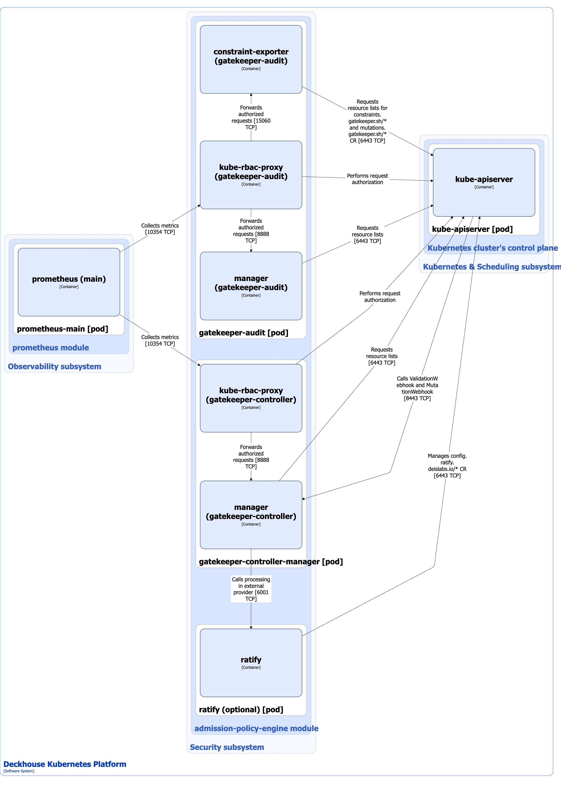

The `admission-policy-engine` module enforces security policies and operational restrictions in a Kubernetes cluster, including checks based on [Pod Security Standards](https://kubernetes.io/docs/concepts/security/pod-security-standards/) and rules from the `SecurityPolicy` and `OperationPolicy` custom resources.

For a detailed description of the module, refer to [the corresponding documentation section](/modules/admission-policy-engine/).

## Module architecture


The following simplifications are made in the diagram:

* The diagram shows containers in different pods interacting directly with each other. In reality, they communicate via the corresponding Kubernetes Services (internal load balancers). Service names are omitted if they are obvious from the diagram context. Otherwise, the Service name is shown above the arrow.
* Pods may run multiple replicas. However, each pod is shown as a single replica in the diagram.


The Level 2 C4 architecture of the [`admission-policy-engine`](/modules/admission-policy-engine/) module and its interactions with other components of Deckhouse Kubernetes Platform (DKP) are shown in the following diagram:

<!--- Source: structurizr code from https://fox.flant.com/team/d8-system-design/doc/-/tree/main/architecture/diagrams/C4_EN --->

## Module components

The module consists of the following components:

1. **Gatekeeper-controller-manager**: It is a [Gatekeeper](https://open-policy-agent.github.io/gatekeeper/website/docs/) controller that validates newly created Kubernetes resources against security rules.

   Security rules are defined using ConstraintTemplate and `constraints.gatekeeper.sh/*` custom resources. A ConstraintTemplate defines new policy types, based on which specific security policies are created to validate resources.

   The **gatekeeper-controller-manager** also mutates Kubernetes resources based on the following Gatekeeper custom resources:

   * AssignMetadata: Defines mutation rules for the `metadata` section.
   * Assign: Defines mutation rules for fields outside the `metadata` section.
   * ModifySet: Defines rules for adding or removing items in a list.
   * AssignImage: Defines mutation rules for the `image` field.

   It consists of the following containers:

   * **manager**: Main container.
   * **kube-rbac-proxy**: Sidecar container providing an RBAC-based authorization proxy for secure access to controller metrics.

1. **Gatekeeper-audit**: Implements periodic checks of existing Kubernetes resources for compliance with security policies.

   It consists of the following containers:

   * **manager**: Main container.
   * **constraint-exporter**: Sidecar container that exposes additional metrics for the `constraints.gatekeeper.sh/*` and `mutations.gatekeeper.sh/*` custom resources.
   * **kube-rbac-proxy**: Sidecar container providing an RBAC-based authorization proxy for secure access to metrics from `manager` and `constraint-exporter`.

1. **ratify**: Optional component that consists of a single [**ratify**](https://ratify.dev/docs/what-is-ratify) container and provides a [Gatekeeper provider](https://open-policy-agent.github.io/gatekeeper/website/docs/externaldata) implementation for validating metadata of used artifacts. In DKP, this provider is used to verify container image signatures.

   The ratify component is available in the following DKP editions: SE+, EE, CSE Lite, CSE Pro.

## Module interactions

The module interacts with the following components:

* **Kube-apiserver**:

  * Watches all Kubernetes resources.
  * Works with the ConstraintTemplate, constraints.gatekeeper.sh/*, Assign, AssignImage, AssignMetadata, ModifySet, and config.ratify.deislabs.io/* custom resources.

The following external components interact with the module:

1. **Kube-apiserver**: Validates Kubernetes resources and checks their compliance with the defined security rules.

1. **Prometheus-main**: Collects module metrics.

## Custom resources

The `admission-policy-engine` module adds custom resources to the DKP platform that simplify configuration of the most commonly used security policies. The following [custom resources](admission-policy-engine/cr.html) are used:

* OperationPolicy: Describes the operational policy of the cluster.
* SecurityPolicy: Describes the security policy of the cluster.
* SecurityPolicyException: Describes exceptions to the cluster security policy.

  These custom resources are processed using the [hooks](../module-development/structure/#hooks) mechanism. For details on this mechanism, refer to the [addon-operator documentation](https://flant.github.io/addon-operator/OVERVIEW.html).

  Based on OperationPolicy and SecurityPolicy, [Gatekeeper](https://open-policy-agent.github.io/gatekeeper/website/docs/) custom resources are generated.
