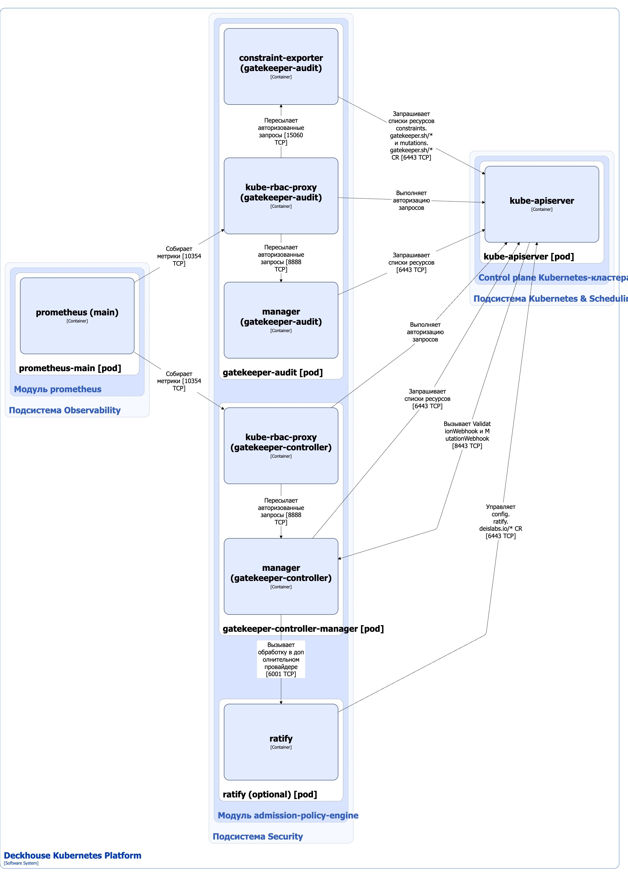

Модуль [`admission-policy-engine`](/modules/admission-policy-engine/) обеспечивает применение политик безопасности и операционных политик в кластере Kubernetes. Политики применяются на основе проверок по [Pod Security Standards](https://kubernetes.io/docs/concepts/security/pod-security-standards/) и правил из следующих кастомных ресурсов:

- OperationPolicy — описывает операционную политику кластера;
- SecurityPolicy — описывает политику безопасности кластера;
- SecurityPolicyException — описывает исключения из политики безопасности кластера.


Обработка этих кастомных ресурсов выполняется с использованием [хуков](../module-development/structure/#hooks). Подробнее о концепции хуков можно узнать из документации [addon-operator](https://flant.github.io/addon-operator/OVERVIEW.html).

На основе кастомных ресурсов OperationPolicy и SecurityPolicy [Deckhouse-контроллер](/modules/deckhouse/) с использованием [addon-operator](https://flant.github.io/addon-operator/OVERVIEW.html) создает кастомные ресурсы для [Gatekeeper](https://open-policy-agent.github.io/gatekeeper/website/docs/). Gatekeeper на основе этих кастомных ресурсов валидирует создаваемые или обновляемые ресурсы Kubernetes.


Подробнее с описанием модуля можно ознакомиться [в разделе документации модуля](/modules/admission-policy-engine/).

## Архитектура модуля


Для упрощения схемы приняты следующие допущения:

* На схеме показано, что контейнеры разных подов взаимодействуют друг с другом напрямую. Фактически они взаимодействуют через соответствующие сервисы Kubernetes (внутренние балансировщики). Названия сервисов не указываются, если они очевидны из контекста. В остальных случаях название сервиса указано над стрелкой.
* Поды могут быть запущены в нескольких репликах, однако на схеме все поды изображены в одной реплике.


Архитектура модуля [`admission-policy-engine`](/modules/admission-policy-engine/) на уровне 2 модели C4 и его взаимодействие с другими компонентами Deckhouse Kubernetes Platform (DKP) изображены на следующей диаграмме:

<!--- Source: structurizr code from https://fox.flant.com/team/d8-system-design/doc/-/tree/main/architecture/diagrams/C4_RU --->

## Компоненты модуля

Модуль состоит из следующих компонентов:

1. **Gatekeeper-controller-manager** — это контроллер ([Gatekeeper](https://open-policy-agent.github.io/gatekeeper/website/docs/)), выполняющий следующие операции:

   * управление [кастомными ресурсами Gatekeeper](https://github.com/open-policy-agent/gatekeeper/tree/master/charts/gatekeeper/crds);

   * валидация ресурсов Kubernetes, указанных в кастомных ресурсах из `constraints.gatekeeper.sh/*` API-группы;

   * мутация ресурсов Kubernetes, указанных в кастомных ресурсах [AssignMetadata](/modules/admission-policy-engine/gatekeeper-cr.html#assignmetadata), [Assign](/modules/admission-policy-engine/gatekeeper-cr.html#assign), [ModifySet](/modules/admission-policy-engine/gatekeeper-cr.html#modifyset) и [AssignImage](/modules/admission-policy-engine/gatekeeper-cr.html#assignimage).

   Правила безопасности задаются с помощью кастомных ресурсов ConstraintTemplate и кастомных ресурсов из `constraints.gatekeeper.sh/*` API-группы. ConstraintTemplate описывает новые типы политик, на основании которых создаются конкретные политики безопасности для проверки ресурсов.

   Состоит из следующих контейнеров:

   * **manager** — основной контейнер;
   * **kube-rbac-proxy** — сайдкар-контейнер с авторизующим прокси на основе Kubernetes RBAC для организации защищенного доступа к метрикам контроллера.

1. **Gatekeeper-audit** — реализует функционал периодической проверки существующих ресурсов Kubernetes на соответствие политикам безопасности.

   Состоит из следующих контейнеров:

   * **manager** — основной контейнер;
   * **constraint-exporter** — сайдкар-контейнер, предоставляющий дополнительные метрики по кастомным ресурсам `constraints.gatekeeper.sh/*` и `mutations.gatekeeper.sh/*`;
   * **kube-rbac-proxy** — сайдкар-контейнер с авторизующим прокси на основе Kubernetes RBAC для организации защищенного доступа к метрикам `manager` и `constraint-exporter`.

1. **ratify** — опциональный компонент, состоящий из одного контейнера [**ratify**](https://ratify.dev/docs/what-is-ratify). Он представляет собой реализацию [провайдера Gatekeeper](https://open-policy-agent.github.io/gatekeeper/website/docs/externaldata) для проверки метаданных используемых артефактов. В DKP этот провайдер применяется для проверки подписи образов контейнеров и доступен в редакциях DKP SE+, EE, CSE Lite и CSE Pro.


   Gatekeeper использует кастомный ресурс Provider для расширения функционала по валидации ресурсов Kubernetes. Ресурс Provider описывает endpoint сервиса, на который Gatekeeper передает запрос при выполнении ValidationWebhook. Некоторые модули DKP, такие как [operator-trivy](/modules/operator-trivy), могут создавать кастомные ресурсы Provider и тем самым расширять функционал проверок.


## Взаимодействия модуля

Модуль взаимодействует со следующими компонентами:

* **Kube-apiserver**:

  * мониторинг ресурсов Kubernetes, указанных в кастомных ресурсах из `constraints.gatekeeper.sh/*` и `mutations.gatekeeper.sh/*` API-групп;
  * работа с кастомными ресурсами ConstraintTemplate, Assign, AssignImage, AssignMetadata, ModifySet, а также с ресурсами из `constraints.gatekeeper.sh/*` и `config.ratify.deislabs.io/*` API-групп.

С модулем взаимодействуют следующие внешние компоненты:

1. **Kube-apiserver** — валидация ресурсов Kubernetes и проверка на соответствие заданным правилам безопасности.

1. **Prometheus-main** — сбор метрик модуля.
