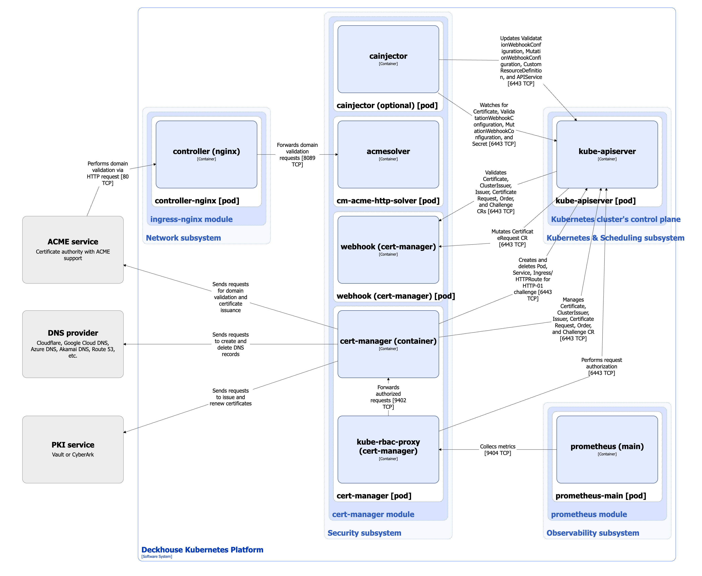

The [`cert-manager`](/modules/cert-manager/) module automates the full certificate management lifecycle in a cluster: from issuing and renewing self-signed certificates to integration with external certificate authorities such as Let's Encrypt, HashiCorp Vault, and Venafi. This significantly simplifies service security and provides centralized control over all certificate-related processes.

## Module architecture


The following simplifications are made in the diagram:

- The diagram shows containers in different pods interacting directly with each other. In reality, they communicate via the corresponding Kubernetes Services (internal load balancers). Service names are omitted if they are obvious from the diagram context. Otherwise, the Service name is shown above the arrow.
- Pods may run multiple replicas. However, each pod is shown as a single replica in the diagram.


The Level 2 C4 architecture of the [`cert-manager`](/modules/cert-manager/) module and its interactions with other DKP components are shown in the following diagram:

<!--- Source: structurizr code from https://fox.flant.com/team/d8-system-design/doc/-/tree/main/architecture/diagrams/C4_EN --->

## Module components

The `cert-manager` module consists of the following components:

1. **Cert-manager**: A controller that provides the full certificate management lifecycle in Deckhouse Kubernetes Platform (DKP). Cert-manager manages the following custom resources:

    - Issuer: Describes settings and parameters for obtaining certificates from a specific source, such as a CA or an external service. It is used within a selected namespace.
    - ClusterIssuer: Similar to Issuer, but applies to the entire cluster and is available in all namespaces.
    - Certificate: Defines the required certificate and specifies parameters such as the subject, validity period, the Issuer or ClusterIssuer used, and additional options.
    - CertificateRequest: A request to issue or renew a certificate.
    - Challenge: Describes a task used to complete domain validation, such as an `HTTP-01` or `DNS-01 challenge` for Let's Encrypt.
    - Order: Groups related Challenges into a sequence for obtaining a certificate from an ACME server, such as Let's Encrypt.

    The component includes the following containers:

    - **cert-manager**: Main container.
    - **kube-rbac-proxy**: Sidecar container with an authorization proxy based on Kubernetes RBAC that provides secure access to the cert-manager container metrics.

    
    To complete the `DNS-01 challenge`, **cert-manager** supports a number of popular DNS providers, such as AzureDNS, Cloudflare, DigitalOcean, and others. For the full list of supported DNS providers, refer to [the cert-manager documentation](https://cert-manager.io/docs/configuration/acme/dns01/). For providers that are not supported out of the box, [webhook](https://cert-manager.io/docs/configuration/acme/dns01/webhook/) issuer types are used as external components. To work correctly, such providers must be installed in the `d8-cert-manager` system namespace. When making changes to this namespace, it is recommended to always account for such extensions so they remain operational.
    

1. **Webhook**: A component consisting of a single webhook container that performs the following actions:
    - validates the Issuer, ClusterIssuer, Certificate, CertificateRequest, Challenge, and Order custom resources;
    - mutates CertificateRequest custom resources by adding the user identity created the certificate request.

    In DKP, validation is disabled for resources in the `d8-cert-manager` namespace and for namespaces with the `cert-manager.io/disable-validation=true` label.

1. **Cainjector**: An additional component consisting of a single [cainjector](https://cert-manager.io/docs/concepts/ca-injector/) container. Cainjector automatically injects or updates root certificate authority (CA) certificates in all relevant Kubernetes resources: ValidatingWebhookConfiguration, MutatingWebhookConfiguration, CustomResourceDefinition, and APIService. This keeps trusted root certificates up to date for services that use webhooks and API extensions.

    Cainjector is enabled using the [`.spec.settings.enableCAInjector`](/modules/cert-manager/configuration.html#parameters-enablecainjector) parameter in the [`cert-manager`](/modules/cert-manager/configuration.html) module settings. DKP does not use cainjector, so enable it only if your services use custom CA injections.

    Cainjector processes only resources with the `cert-manager.io/inject-ca-from`, `cert-manager.io/inject-ca-from-secret`, or `cert-manager.io/inject-apiserver-ca` annotations, depending on the resource type.

1. **Cm-acme-http-solver**: A temporary pod with the **acmesolver** container that is launched to complete an [`HTTP-01 Challenge`](https://cert-manager.io/docs/configuration/acme/http01/) during domain validation through ACME, such as Let's Encrypt. This pod is automatically created by cert-manager controller for the duration of the `HTTP-01 Challenge` and is deleted after the procedure is complete. This approach provides secure temporary publication of the resource that confirms domain ownership for certificate issuance.

## Module interactions

The `cert-manager` module interacts with the following components:

1. **Kube-apiserver**:

    - manages the Issuer, ClusterIssuer, Certificate, CertificateRequest, Challenge, and Order custom resources;
    - watches and updates ValidatingWebhookConfiguration, MutatingWebhookConfiguration, CustomResourceDefinition, and APIService resources.

1. **ACME service**: Handles requests for domain verification and certificate issuance.

1. **PKI service**: Handles requests for issuing and renewing certificates.

1. **DNS provider**: Handles requests to add and delete records in DNS services to complete `DNS-01 Challenge` during domain validation through ACME server.

The following external components interact with the module:

1. **Kube-apiserver**:
    - validates the Issuer, ClusterIssuer, Certificate, CertificateRequest, Challenge, and Order custom resources;
    - mutates CertificateRequest custom resources.

1. **Prometheus-main**: Collects **cert-manager** metrics.

1. **Nginx Controller**: Forwards requests from ACME server to cm-acme-http-solver.
