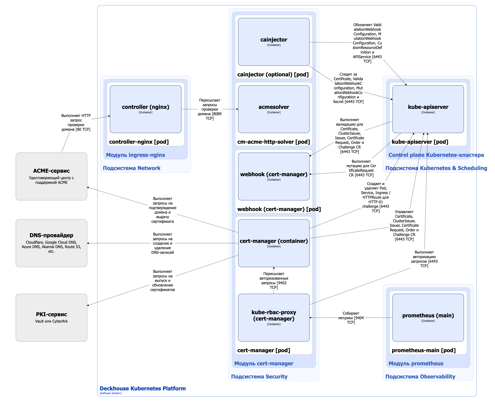

Модуль [`cert-manager`](/modules/cert-manager/) автоматизирует полный цикл управления сертификатами в кластере: от выпуска и продления сертификатов, включая самоподписанные, до интеграции с внешними центрами сертификации, такими как Let's Encrypt, HashiCorp Vault и Venafi. Это упрощает обеспечение безопасности сервисов и позволяет централизованно контролировать процессы, связанные с сертификатами.

## Архитектура модуля


Для упрощения схемы приняты следующие допущения:

- На схеме контейнеры разных подов показаны как взаимодействующие напрямую. Фактически обмен выполняется через соответствующие сервисы Kubernetes (внутренние балансировщики). Названия сервисов не указываются, если они очевидны из контекста. В остальных случаях название сервиса приводится над стрелкой.
- Поды могут быть запущены в нескольких репликах, однако на схеме каждый под показан в единственном экземпляре.


Архитектура модуля [`cert-manager`](/modules/cert-manager/) на уровне 2 модели C4 и его взаимодействия с другими компонентами DKP изображены на следующей диаграмме:

<!--- Source: structurizr code from https://fox.flant.com/team/d8-system-design/doc/-/tree/main/architecture/diagrams/C4_RU --->

## Компоненты модуля

Модуль `cert-manager` состоит из следующих компонентов:

1. **Cert-manager** — контроллер, обеспечивающий полный цикл управления сертификатами в Deckhouse Kubernetes Platform (DKP). `Cert-manager` управляет следующими кастомными ресурсами:

   - Issuer — описывает настройки источника, от которого выпускаются сертификаты, например CA, ACME-сервис или внешний PKI-провайдер. Действует в пределах выбранного пространства имён;
   - ClusterIssuer — кластерный аналог Issuer: действует на весь кластер и доступен во всех пространствах имён;
   - Certificate — описывает требуемый сертификат: субъект, срок действия, используемый Issuer или ClusterIssuer, а также дополнительные параметры выпуска;
   - CertificateRequest — заявка на выпуск или продление сертификата;
   - Challenge — задание для прохождения проверки владения доменом, например с помощью HTTP-01 или DNS-01 challenge в ACME;
   - Order — объект ACME, объединяющий связанные Challenge в последовательность для получения сертификата у ACME-сервера, например Let's Encrypt.

   Компонент содержит следующие контейнеры:

   - **cert-manager** — основной контейнер;
   - **kube-rbac-proxy** — сайдкар-контейнер с авторизующим прокси на основе Kubernetes RBAC для организации защищенного доступа к метрикам контейнера cert-manager.

   
   Для прохождения DNS-01 challenge `cert-manager` поддерживает ряд популярных DNS-провайдеров, включая AzureDNS, Cloudflare и DigitalOcean. С полным списком поддерживаемых DNS-провайдеров можно ознакомиться [в документации cert-manager](https://cert-manager.io/docs/configuration/acme/dns01/). Для провайдеров, не поддерживаемых «из коробки», используются issuer типа [вебхук](https://cert-manager.io/docs/configuration/acme/dns01/webhook/). Такие issuer являются внешними компонентами, поэтому для корректной работы их необходимо устанавливать в системное пространство имён  `d8-cert-manager`. При внесении изменений в это пространство имён учитывайте наличие подобных расширений, чтобы сохранить их работоспособность.
   

1. **Webhook** — компонент, состоящий из одного вебхук-контейнера и выполняющий следующие операции:
   - валидацию кастомных ресурсов Issuer, ClusterIssuer, Certificate, CertificateRequest, Challenge, Order;
   - мутацию кастомных ресурсов CertificateRequest — вебхук добавляет информацию о пользователе, создавшем запрос на сертификат.

    В DKP валидация отключена для ресурсов в пространстве имён `d8-cert-manager`, а также для пространств имён с лейблом `cert-manager.io/disable-validation=true`.

1. **Cainjector** — дополнительный компонент, состоящий из одного [контейнера cainjector](https://cert-manager.io/docs/concepts/ca-injector/). Cainjector отвечает за автоматическую подстановку или обновление сертификатов корневого центра сертификации (CA) во все релевантные ресурсы Kubernetes: ValidatingWebhookConfiguration, MutatingWebhookConfiguration, CustomResourceDefinition и APIService. Это обеспечивает актуальность доверенных корневых сертификатов для сервисов, использующих вебхуки и расширения API.

   Cainjector включается параметром [`.spec.settings.enableCAInjector`](/modules/cert-manager/configuration.html#parameters-enablecainjector) в настройках модуля [`cert-manager`](/modules/cert-manager/configuration.html). DKP не использует cainjector для собственных компонентов, поэтому включайте его только в том случае, если вашим приложениям или внешним расширениям требуется инъекция CA в ресурсы Kubernetes.

   Cainjector обрабатывает только ресурсы с аннотациями  `cert-manager.io/inject-ca-from`, `cert-manager.io/inject-ca-from-secret` или `cert-manager.io/inject-apiserver-ca` в зависимости от типа ресурса.

1. **Cm-acme-http-solver** — временный под с контейнером acmesolver, запускаемый для прохождения [HTTP-01 Challenge](https://cert-manager.io/docs/configuration/acme/http01/) при валидации домена через ACME (например, Let's Encrypt). Этот под автоматически создаётся контроллером `cert-manager` на время исполнения HTTP-01 Challenge и удаляется по завершении процедуры. Такой подход реализует безопасную временную публикацию ресурса, подтверждающего владение доменом для получения сертификата.

## Взаимодействия модуля

Модуль `cert-manager` взаимодействует со следующими компонентами:

1. **Kube-apiserver**:

   - управляет кастомными ресурсами Issuer, ClusterIssuer, Certificate, CertificateRequest, Challenge, Order;
   - отслеживает и обновляет ресурсы ValidatingWebhookConfiguration, MutatingWebhookConfiguration, CustomResourceDefinition и APIService.

1. **ACME-сервис** — обрабатывает запросы на подтверждение домена и выпуск сертификатов.

1. **PKI-сервис** — обрабатывает запросы для выпуска и обновления (перевыпуска) сертификатов.

1. **DNS-провайдер** — обрабатывает запросы на добавление и удаление записей в службах DNS для прохождения DNS-01 Challenge при валидации домена через ACME-сервер.

С модулем взаимодействуют следующие внешние компоненты:

1. **Kube-apiserver**:

   - отправляет вебхук-запросы на валидацию кастомных ресурсов Issuer, ClusterIssuer, Certificate, CertificateRequest, Challenge, Order;
   - отправляет вебхук-запросы на мутацию кастомных ресурсов CertificateRequest.

1. **Prometheus-main** — собирает метрики `cert-manager`.

1. **Nginx Controller** — пересылает запросы от ACME-сервера к `cm-acme-http-solver`.
