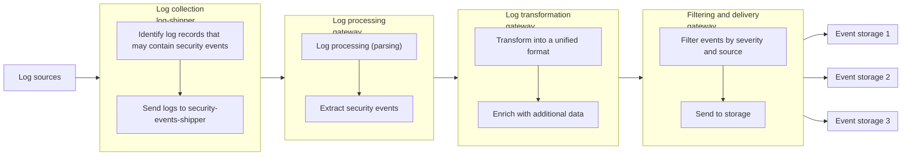

The Deckhouse Kubernetes Platform (DKP) security event audit is based on the [Falco](https://falco.org/) threat detection system.
DKP deploys Falco agents on each node as part of a DaemonSet.
Once started, the agents begin collecting OS system calls and Kubernetes audit data.


Falco developers recommend running it as a systemd service,
which can be challenging in Kubernetes clusters that support autoscaling.
DKP includes additional security mechanisms such as multitenancy and resource control policies.
Combined with the DaemonSet deployment, these mechanisms ensure a high level of protection.



Each cluster node runs a Falco Pod with the following components:

- `falco`: Collects events, enriches them with metadata, and outputs them to stdout.
- `rules-loader`: Retrieves rule data from [FalcoAuditRules](/modules/runtime-audit-engine/cr.html#falcoauditrules) custom resources
  and stores them in a shared directory.
- [`falcosidekick`](https://github.com/falcosecurity/falcosidekick): Receives events from `falco`
  and exports them as metrics to external systems.
- `kube-rbac-proxy`: Protects the `falcosidekick` metrics endpoint from unauthorized access.


<!--- Source: https://docs.google.com/drawings/d/1rxSuJFs0tumfZ56WbAJ36crtPoy_NiPBHE6Hq5lejuI --->

## Audit rules

Security event analysis is performed using rules that define suspicious behavior patterns.
Each rule consists of a condition expression written in accordance with [Falco's condition syntax](https://falco.org/docs/concepts/rules/conditions/).

### Built-in rules

DKP provides the following types of built-in rules:

- **Kubernetes audit rules**: Help detect security issues in DKP and in the audit mechanism itself.
  These rules are located in the `falco` container at `/etc/falco/k8s_audit_rules.yaml`.

### Custom rules

Custom rules can be defined using the [FalcoAuditRules](/modules/runtime-audit-engine/cr.html#falcoauditrules) custom resource.

Each Falco agent includes a sidecar container with a [`shell-operator`](https://github.com/flant/shell-operator) instance.
This instance reads rules from Kubernetes resources, converts them into Falco rule format,
and stores them in the `/etc/falco/rules.d/` directory inside the Pod.
When a new rule is added, Falco automatically reloads the configuration.


## New architecture

> This functionality is experimental and may change in future releases.

The proposed solution is intended to build a unified pipeline for working with security events extracted from the logs of applications and Kubernetes infrastructure components.

Key idea: a security event is information from logs of various services, normalized into a single contract.

### What is considered a security event

A security event is a structured record of an action or fact that is significant from an information security perspective. Typical categories of such events include:

- authentication and authorization;
- access to APIs and configuration;
- changes to cluster objects;
- runtime and network activity anomalies.

Regardless of the original log format, the output is a uniform event model with a mandatory minimum set of attributes:

- event identifier (`id`) and time (`timestamp`);
- source (`source.component`);
- classification (`event.code`, `event.category`, `event.severity`, `event.outcome`);
- service metadata (`eventMetadata`), including the cluster identifier.

Additionally, attributes describing the subject (`actor`) and the object (`object`) may be present if they can be extracted from the original log.

### Final event schema

Below is the structure of the event **that is sent to storage**.

Required fields:
- `id`, `timestamp`;
- `source.component`;
- `event.code`, `event.category`, `event.severity`, `event.outcome`;
- `eventMetadata.cluster`.

Optional fields:
- `eventMetadata.sourceIPs`;
- `actor.*`;
- `object.*`.

```json
{
  "id": "2f0de5c2-2e58-4d3f-b4fe-5ec6f1935b9f",
  "timestamp": "2026-05-10T14:21:03Z",
  "source": {
    "component": "kube-apiserver"
  },
  "event": {
    "code": "UNAUTHORIZED_ACCESS",
    "category": "Rbac",
    "severity": "High",
    "outcome": "Failure"
  },
  "eventMetadata": {
    "cluster": "prod-cluster",
    "sourceIPs": [
      "206.123.145.70"
    ]
  },
  "actor": {
    "id": "system:serviceaccount:default:demo",
    "type": "ServiceAccount"
  },
  "object": {
    "id": "/api/v1/namespaces/default/secrets",
    "type": "KubernetesResource"
  }
}
```

### Solution architecture

- collecting logs from Pod sources and node files;
- initial selection of records that may contain security events;
- parsing and extracting useful fields;
- transforming into a unified model and enriching with context;
- policy-based filtering and delivery to the configured storages.

The architecture separates three stages of the pipeline: **collection**, **processing/enrichment**, and **delivery**. At the delivery stage, sending to several types of storage and analytics systems is supported (e.g., Loki, Elasticsearch, Kafka, Splunk, Vector, File).

### Processing pipeline



### Log collection

Collection is performed via the auxiliary `log-shipper` module:

- container sources use application logs within the namespace;
- cluster sources use node files and system service logs (for example, `/var/log/kube-audit/audit.log`, `/var/log/auth.log`).

At the collection stage, only lightweight selective filtering is applied (comparison operators and patterns: `In`, `NotIn`, `Regex`, `NotRegex`, `Exists`, `DoesNotExist`), without deep content parsing. This reduces processing load and decreases the amount of irrelevant traffic.

Example of an input log for the selection stage:

```json
{
  "time": "2026-05-10T14:21:03Z",
  "kind": "Event",
  "source": "kube-apiserver",
  "level": "Metadata",
  "message": "Unauthorized",
  "reason": "Unauthorized",
  "code": 401,
  "requestURI": "/api/v1/namespaces/default/secrets",
  "user": "system:serviceaccount:default:demo",
  "sourceIPs": [
    "206.123.145.70"
  ]
}
```

### Processing (parsing) and event extraction

After being forwarded to the `gateway`, the log structure is recognized. Standard parsing strategies are supported:

- `JSON`: for structured logs;
- `Regex`: for string formats with predictable patterns;
- `Grok`: for complex, non-unified formats.

The parsing result is used to derive event signals and build a unified set of fields.

Example of an input log for parsing (the same fragment as in the selection stage):

```json
{
  "time": "2026-05-10T14:21:03Z",
  "kind": "Event",
  "source": "kube-apiserver",
  "level": "Metadata",
  "message": "Unauthorized",
  "reason": "Unauthorized",
  "code": 401,
  "requestURI": "/api/v1/namespaces/default/secrets",
  "user": "system:serviceaccount:default:demo",
  "sourceIPs": [
    "206.123.145.70"
  ]
}
```

After parsing, the record becomes a source of fields for event classification (code/category/severity/outcome), as well as for building context (`actor`, network attributes, and source metadata).

Example output of the parsing stage:

```json
{
  "parsed": {
    "timestamp": "2026-05-10T14:21:03Z",
    "source_component": "kube-apiserver",
    "http_status": 401,
    "request_uri": "/api/v1/namespaces/default/secrets",
    "actor_id": "system:serviceaccount:default:demo",
    "source_ip": "206.123.145.70"
  }
}
```

### Event transformation and enrichment

Transformation is implemented in two steps:

1. **Transform**: map fields from the original log to the fields of the target event model.
2. **Enrich**: add or refine fields from additional context sources (for example, static environment attributes, subject roles, and service indicators).

The order is fixed: `Transform` is applied first, then `Enrich`. In case of a conflict for a target field, the final value is determined by the enrichment stage.

Example data after `Transform`/`Enrich` (based on the same input log):

```json
{
  "id": "2f0de5c2-2e58-4d3f-b4fe-5ec6f1935b9f",
  "timestamp": "2026-05-10T14:21:03Z",
  "source": {
    "component": "kube-apiserver"
  },
  "event": {
    "code": "UNAUTHORIZED_ACCESS",
    "category": "Rbac",
    "severity": "High",
    "outcome": "Failure"
  },
  "actor": {
    "id": "system:serviceaccount:default:demo",
    "type": "ServiceAccount"
  },
  "eventMetadata": {
    "cluster": "prod-cluster",
    "sourceIPs": [
      "206.123.145.70"
    ],
    "requestURI": "/api/v1/namespaces/default/secrets"
  }
}
```

### Filtering and delivery

After the event is formed, a delivery policy is applied:

- source filtering;
- filtering by minimum severity;
- routing to one or more destinations.

Filtering rules can use both exact source identifiers and source masks, which makes it possible to manage flows at the level of individual services or entire groups.

Destinations can be storage and processing systems such as cluster Loki, external SIEM/log platforms, and streaming buses. The delivery scheme supports parallel delivery to multiple target systems.

### Minimal sufficient lifecycle

In a practical scenario, the architecture works along the following chain:

1. Log sources are connected to the collection pipeline.
2. An initial selection of potentially relevant records is performed.
3. Records are parsed and transformed into unified events.
4. Events are enriched with contextual attributes.
5. Filtering and routing rules are applied.
6. Events are delivered to target storages and analytics systems.

The result is a unified and manageable flow of security events suitable for monitoring, investigations, and long-term auditing.
