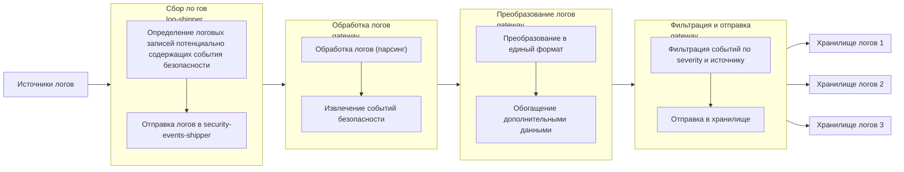

Аудит событий безопасности Deckhouse Kubernetes Platform (DKP) основан на системе обнаружения угроз [Falco](https://falco.org/).
DKP запускает объединённые в DaemonSet агенты Falco на каждом узле,
после чего те приступают к сбору системных вызовов ОС и данных, полученных в ходе аудита событий Kubernetes.


Разработчики Falco рекомендуют запускать его как systemd-сервис,
что может быть затруднительно в кластерах Kubernetes с поддержкой автомасштабирования.
В DKP реализованы дополнительные механизмы безопасности, такие как мультитенантность и политики контроля ресурсов,
которые в сочетании с использованием DaemonSet обеспечивают высокий уровень защиты.



<!--- Source: https://docs.google.com/drawings/d/1NZ91z8NXNiuS50ybcMoMsZI3SbQASZXJGLANdaNNm_U --->

На каждом узле кластера запускается под Falco со следующими компонентами:

- `falco` — собирает события, обогащает их метаданными и отправляет в stdout;
- `rules-loader` — собирает данные с правилами из [кастомных ресурсов FalcoAuditRules](/modules/runtime-audit-engine/cr.html#falcoauditrules)
  и сохраняет их в общую директорию;
- [`falcosidekick`](https://github.com/falcosecurity/falcosidekick) — принимает события от `falco`
  и экспортирует их в виде метрик во внешние системы;
- `kube-rbac-proxy` — защищает эндпоинт метрик `falcosidekick` от неавторизованного доступа.


<!--- Source: https://docs.google.com/drawings/d/1rxSuJFs0tumfZ56WbAJ36crtPoy_NiPBHE6Hq5lejuI --->

## Правила аудита

Для анализа событий безопасности применяются правила, определяющие критерии подозрительного поведения.
Каждое правило представляет собой выражение, содержащее определённое условие
и написанное в соответствии [с синтаксисом условий Falco](https://falco.org/docs/concepts/rules/conditions/).

### Встроенные правила

В DKP предусмотрены следующие виды встроенных правил:

- **правила для аудита Kubernetes**, которые помогают выявить проблемы с безопасностью DKP и самим механизмом аудита.
  Эти правила расположены в контейнере `falco` по пути `/etc/falco/k8s_audit_rules.yaml`;
- **нормативные правила**, удовлетворяющие требованиям приказа ФСТЭК России №118 от 4 июля 2022 г.
  «Требования по безопасности информации к средствам контейнеризации».
  Эти правила `fstec` описаны в формате [кастомного ресурса FalcoAuditRules](/modules/runtime-audit-engine/cr.html#falcoauditrules).

### Пользовательские правила

Для добавления пользовательских правил используется [кастомный ресурс FalcoAuditRules](/modules/runtime-audit-engine/cr.html#falcoauditrules).

У каждого агента Falco есть сайдкар-контейнер с экземпляром сервиса [`shell-operator`](https://github.com/flant/shell-operator).
Этот экземпляр считывает правила из ресурсов Kubernetes, конвертирует их в правила Falco
и сохраняет правила в директорию `/etc/falco/rules.d/` в поде.
При добавлении нового правила Falco автоматически обновляет конфигурацию.


<!--- Source: https://docs.google.com/drawings/d/13MFYtiwH4Y66SfEPZIcS7S2wAY6vnKcoaztxsmX1hug --->


## Новая архитектура

> Данный функционал является экспериментальным и может быть изменён в следующих версиях.


Предлагаемое решение предназначено для построения единого контура работы с событиями безопасности, извлекаемыми из логов приложений и инфраструктурных компонентов Kubernetes.

Цель решения — получить логовые записи из распределённых источников, выделить в них события безопасности, привести события к единому формату и отправить в централизованные системы хранения и аналитики.
Ключевая идея: событие безопасности — это информация из логов разных сервисов, нормализованная в единый контракт.

Текущая (действующая) модель работы описана в основной документации. Ниже представлена новая архитектура, предлагаемая как экспериментальный вариант развития.

### Что считается событием безопасности

Событие безопасности — структурированная запись о значимом с точки зрения ИБ действии или факте. Типовые категории таких событий:

- аутентификация и авторизация;
- доступ к API и конфигурации;
- изменения объектов кластера;
- аномалии runtime и сетевой активности.

Независимо от исходного формата лога, на выходе формируется единообразная модель события с обязательным минимумом атрибутов:

- идентификатор события (`id`) и время (`timestamp`);
- источник (`source.component`);
- классификация (`event.code`, `event.category`, `event.severity`, `event.outcome`);
- служебные метаданные (`eventMetadata`), включая идентификатор кластера.

Дополнительно могут присутствовать атрибуты субъекта (`actor`) и объекта (`object`), если они извлекаются из исходного лога.

### Схема итогового события

Ниже приведена структура события, **которое отправляется в хранилище**.

Обязательные поля:
- `id`, `timestamp`;
- `source.component`;
- `event.code`, `event.category`, `event.severity`, `event.outcome`;
- `eventMetadata.cluster`.

Опциональные поля:
- `eventMetadata.sourceIPs`;
- `actor.*`;
- `object.*`.

```json
{
  "id": "2f0de5c2-2e58-4d3f-b4fe-5ec6f1935b9f",
  "timestamp": "2026-05-10T14:21:03Z",
  "source": {
    "component": "kube-apiserver"
  },
  "event": {
    "code": "UNAUTHORIZED_ACCESS",
    "category": "Rbac",
    "severity": "High",
    "outcome": "Failure"
  },
  "eventMetadata": {
    "cluster": "prod-cluster",
    "sourceIPs": [
      "206.123.145.70"
    ]
  },
  "actor": {
    "id": "system:serviceaccount:default:demo",
    "type": "ServiceAccount"
  },
  "object": {
    "id": "/api/v1/namespaces/default/secrets",
    "type": "KubernetesResource"
  }
}
```

### Архитектура решения

- сбор логов из pod-источников и узловых файлов;
- первичный отбор записей, потенциально содержащих события безопасности;
- парсинг и извлечение полезных полей;
- трансформация в единую модель и обогащение контекстом;
- фильтрация по политике и отправка в назначенные хранилища.

Архитектура разделяет три фазы конвейера: **сбор**, **обработка/обогащение**, **доставка**. На уровне доставки поддерживается отправка в несколько типов систем хранения и аналитики (например, Loki, Elasticsearch, Kafka, Splunk, Vector, File).

### Пайплайн обработки



### Сбор логов

Сбор выполняется через вспомогательный модуль `log-shipper`:

- для контейнерных источников используются логи приложений в namespace;
- для кластерных источников используются файлы узлов и системных сервисов (например, `/var/log/kube-audit/audit.log`, `/var/log/auth.log`).

На этапе сбора применяется только лёгкий селективный отбор (операции сравнения и шаблоны: `In`, `NotIn`, `Regex`, `NotRegex`, `Exists`, `DoesNotExist`), без глубокого разбора содержимого. Это снижает нагрузку на обработку и уменьшает объём нерелевантного трафика.

Пример исходного лога для этапа отбора:

```json
{
  "time": "2026-05-10T14:21:03Z",
  "kind": "Event",
  "source": "kube-apiserver",
  "level": "Metadata",
  "message": "Unauthorized",
  "reason": "Unauthorized",
  "code": 401,
  "requestURI": "/api/v1/namespaces/default/secrets",
  "user": "system:serviceaccount:default:demo",
  "sourceIPs": [
    "206.123.145.70"
  ]
}
```

### Обработка (парсинг) и извлечение событий

После передачи в `gateway` выполняется распознавание структуры логов. Поддерживаются стандартные стратегии парсинга:

- `JSON` — для структурированных логов;
- `Regex` — для строковых форматов с предсказуемым шаблоном;
- `Grok` — для сложных неунифицированных форматов.

Результат парсинга используется для извлечения признаков события и построения унифицированного набора полей.

Пример входного лога для парсинга (тот же фрагмент, что и на этапе отбора):

```json
{
  "time": "2026-05-10T14:21:03Z",
  "kind": "Event",
  "source": "kube-apiserver",
  "level": "Metadata",
  "message": "Unauthorized",
  "reason": "Unauthorized",
  "code": 401,
  "requestURI": "/api/v1/namespaces/default/secrets",
  "user": "system:serviceaccount:default:demo",
  "sourceIPs": [
    "206.123.145.70"
  ]
}
```

После парсинга запись становится источником полей для классификации события (код/категория/severity/outcome), а также для построения контекста (`actor`, сетевые атрибуты, метаданные источника).

Пример результата этапа парсинга:

```json
{
  "parsed": {
    "timestamp": "2026-05-10T14:21:03Z",
    "source_component": "kube-apiserver",
    "http_status": 401,
    "request_uri": "/api/v1/namespaces/default/secrets",
    "actor_id": "system:serviceaccount:default:demo",
    "source_ip": "206.123.145.70"
  }
}
```

### Преобразование и обогащение события

Преобразование реализуется в двух шагах:

1. **Transform** — сопоставление полей исходного лога с полями целевой модели события.
2. **Enrich** — добавление или уточнение полей из дополнительных источников контекста (например, статических атрибутов среды, роли субъекта, служебных признаков).

Порядок фиксирован: сначала применяется `Transform`, затем `Enrich`. При конфликте целевого поля итоговое значение определяется этапом обогащения.

Пример данных после `Transform`/`Enrich` (на основе того же исходного лога):

```json
{
  "id": "2f0de5c2-2e58-4d3f-b4fe-5ec6f1935b9f",
  "timestamp": "2026-05-10T14:21:03Z",
  "source": {
    "component": "kube-apiserver"
  },
  "event": {
    "code": "UNAUTHORIZED_ACCESS",
    "category": "Rbac",
    "severity": "High",
    "outcome": "Failure"
  },
  "actor": {
    "id": "system:serviceaccount:default:demo",
    "type": "ServiceAccount"
  },
  "eventMetadata": {
    "cluster": "prod-cluster",
    "sourceIPs": [
      "206.123.145.70"
    ],
    "requestURI": "/api/v1/namespaces/default/secrets"
  }
}
```


### Фильтрация и отправка событий

После формирования события применяется политика доставки:

- фильтрация по источникам;
- фильтрация по минимальному уровню критичности;
- маршрутизация в одно или несколько назначений.

Правила фильтрации могут использовать как точные идентификаторы источников, так и маски источников, что позволяет управлять потоками на уровне отдельных сервисов или целых групп.

В качестве назначений используются системы хранения и обработки событий: кластерный Loki, внешние SIEM/лог-платформы и потоковые шины. Схема доставки поддерживает параллельную отправку в несколько целевых систем.

Пример результата этапа фильтрации и маршрутизации (на основе того же события):

```json
{
  "event": {
    "code": "UNAUTHORIZED_ACCESS",
    "severity": "High"
  },
  "routing": {
    "matchedPolicy": "rbac-high-and-higher",
    "destinations": [
      "cluster-loki",
      "external-siem"
    ]
  },
  "delivery": {
    "status": "scheduled"
  }
}
```

### Минимально достаточный цикл работы

В практическом сценарии архитектура работает по следующей цепочке:

1. Источники логов подключаются к контуру сбора.
2. Выполняется первичный отбор потенциально релевантных записей.
3. Записи парсятся и преобразуются в унифицированные события.
4. События обогащаются контекстными атрибутами.
5. Применяются правила фильтрации и маршрутизации.
6. События отправляются в целевые хранилища и аналитические системы.

Итогом является единый и управляемый поток событий безопасности, пригодный для мониторинга, расследований и долгосрочного аудита.

