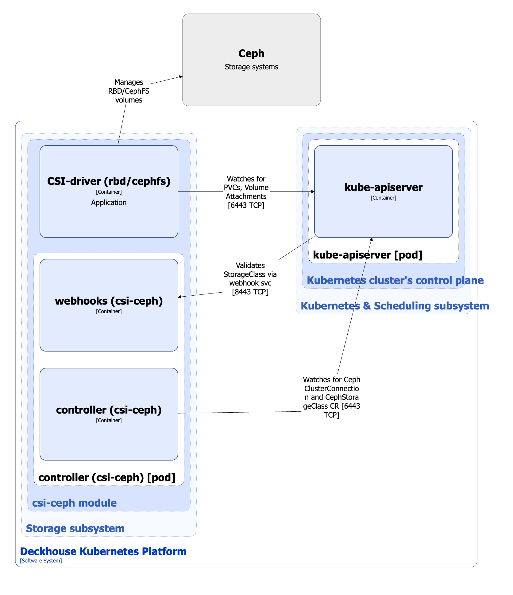

The `csi-ceph` module is designed to integrate DKP with Ceph clusters and provides storage management based on [RBD (RADOS Block Device)](https://docs.ceph.com/en/reef/rbd/) or [CephFS](https://docs.ceph.com/en/reef/cephfs/). It allows creating StorageClasses in Kubernetes using the CephStorageClass resource.

For more details about the module, refer to [the module documentation section](/modules/csi-ceph/).

## Module architecture


The following simplifications are made in the diagram:

* The diagram shows containers in different pods interacting directly with each other. In reality, they communicate via the corresponding Kubernetes Services (internal load balancers). Service names are omitted if they are obvious from the diagram context. Otherwise, the Service name is shown above the arrow.
* Pods may run multiple replicas. However, each pod is shown as a single replica in the diagram.


The Level 2 C4 architecture of the [`csi-ceph`](/modules/csi-ceph/) module and its interactions with other components of Deckhouse Kubernetes Platform (DKP) are shown in the following diagram:

<!--- Source: structurizr code from https://fox.flant.com/team/d8-system-design/doc/-/tree/main/architecture/diagrams/C4_EN --->

## Module components

The module consists of the following components:

1. **Controller**: A controller that reconciles the following [custom resources](/modules/csi-ceph/stable/cr.html):

   * CephClusterConnection: Ceph cluster connection parameters.
   * CephStorageClass: Defines the configuration for the Kubernetes StorageClass that will be created.

   CephStorageClass specifies the storage class type (`CephFS` or `RBD`), reclaim policy, Ceph cluster connection parameters, and additional parameters specific to each storage class type. Depending on the storage class type, these parameters are used by the provisioner of either the `rbd.csi.ceph.com` or `cephfs.csi.ceph.com` CSI driver when managing volumes.

   The `CephMetadataBackup` custom resource is used in migration and recovery workflows implemented by module hooks, rather than by the main runtime controller.

   It consists of the following containers:

   * **controller**: Main container.
   * **webhook**: A sidecar container that implements a webhook server for StorageClass resources validation.

1. **CSI driver (`rbd/cephfs`)**: An implementation of the CSI driver for the `rbd.csi.ceph.com` or `cephfs.csi.ceph.com` provisioner. The CSI driver is selected by setting the storage class type in the CephStorageClass custom resource.

   The `csi-cephfs` CSI driver follows the standard CSI driver architecture used in DKP. For details, see [the standard CSI driver documentation page](../../cluster-and-infrastructure/infrastructure/csi-driver.html).

   The `csi-rbd` CSI driver uses an architecture that differs from the standard CSI driver architecture. For details, see [the CSI driver documentation page](../../storage/csi-drivers/csi-driver-ceph-rbd.html).

## Module interactions

The module interacts with the following components:

* **Kube-apiserver**:

  * Watches PersistentVolume, PersistentVolumeClaim, VolumeAttachment, and StorageClass resources.
  * Reconciles CephClusterConnection and CephStorageClass custom resources.
  * Creates StorageClass resources.

The following external components interact with the module:

* **Kube-apiserver**: Validates StorageClass resources.
