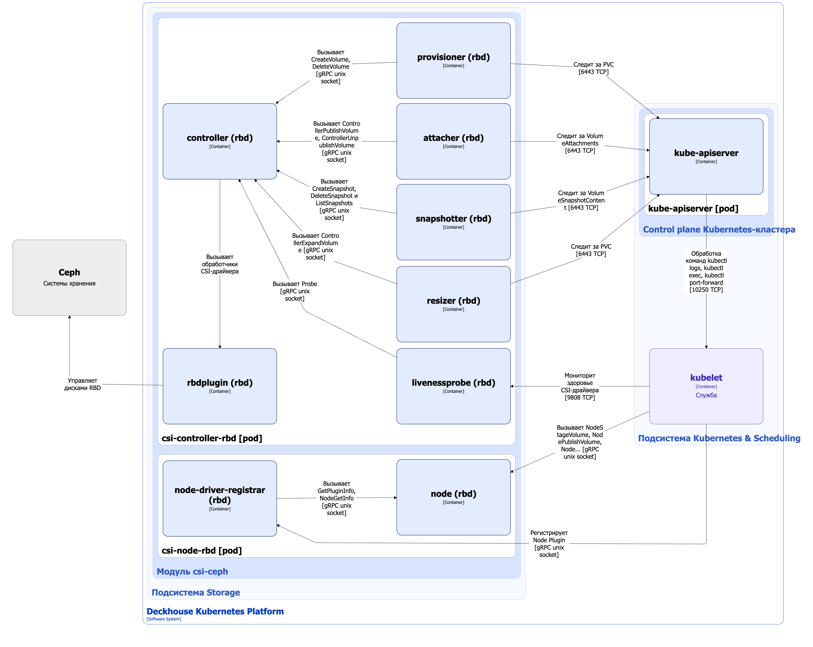

Модуль `csi-ceph` предназначен для  интеграции DKP с Ceph-кластерами и обеспечивает управление хранилищем на основе [RBD (RADOS Block Device)](https://docs.ceph.com/en/reef/rbd/) или [CephFS](https://docs.ceph.com/en/reef/cephfs/). Он позволяет создавать StorageClass в Kubernetes с помощью ресурса CephStorageClass.

Подробнее с описанием модуля можно ознакомиться [в разделе документации модуля](/modules/csi-ceph/).

## Архитектура модуля


Для упрощения схемы приняты следующие допущения:

* На схеме показано, что контейнеры разных подов взаимодействуют друг с другом напрямую. Фактически они взаимодействуют через соответствующие сервисы Kubernetes (внутренние балансировщики). Названия сервисов не указываются, если они очевидны из контекста. В остальных случаях название сервиса указано над стрелкой.
* Поды могут быть запущены в нескольких репликах, однако на схеме все поды изображены в одной реплике.


Архитектура модуля [`csi-ceph`](/modules/csi-ceph/) на уровне 2 модели C4 и его взаимодействия с другими компонентами Deckhouse Kubernetes Platform (DKP) изображены на следующей диаграмме:

<!--- Source: structurizr code from https://fox.flant.com/team/d8-system-design/doc/-/tree/main/architecture/diagrams/C4_RU --->

## Компоненты модуля

Модуль состоит из следующих компонентов:

1. **Controller** — контроллер, обслуживающий следующие [кастомные ресурсы](/modules/csi-ceph/stable/cr.html):

    * CephClusterAuthentication — параметры аутентификации кластера Ceph;
    * CephClusterConnection — параметры подключения к кластеру Ceph;
    * CephMetadataBackup — резервная копия метаданных Persistent Volume;
    * CephStorageClass —  определяет конфигурацию для Kubernetes StorageClass.

    В CephStorageClass задается тип storage-класса (`CephFS`, `RBD`), reclaim policy, параметры аутентификации кластера Ceph, параметры подключения к кластеру Ceph, а так же специфичные для каждого storage-класса дополнительные параметры. В зависимости от типа storage-класса эти параметры используются provisioner’ом CSI-драйвера `rbd.csi.ceph.com` или `cephfs.csi.ceph.com` при управлении томами.

   Состоит из следующих контейнеров:

   * **controller** — основной контейнер;
   * **webhook** — сайдкар-контейнер, реализующий вебхук-сервер для проверки кастомных ресурсов CephClusterAuthentication, CephClusterConnection, CephMetadataBackup и CephStorageClass.

2. **CSI-драйвер (rbd/cephfs)** — реализация CSI-драйвера для `rbd.csi.ceph.com` или `cephfs.csi.ceph.com` provisioner.

CSI-драйвер (cephfs) реализован по типовой архитектуре CSI-драйвера, используемого в DKP, можно ознакомиться [в разделе документации архитектуры CSI-драйвера](../cluster-and-infrastructure/infrastructure/csi-driver.html).

CSI-драйвер (rbd) реализован по отличной от типовой архитектуры CSI-драйвера.

### Архитектура CSI-драйвера (rbd)


Для упрощения схемы приняты следующие допущения:

* На схеме показано, что контейнеры разных подов взаимодействуют друг с другом напрямую. Фактически они взаимодействуют через соответствующие сервисы Kubernetes (внутренние балансировщики). Названия сервисов не указываются, если они очевидны из контекста. В остальных случаях название сервиса указано над стрелкой.
* Поды могут быть запущены в нескольких репликах, однако на схеме все поды изображены в одной реплике.


Архитектура CSI-драйвера (rbd) на уровне 2 модели C4 и его взаимодействия с другими компонентами Deckhouse Kubernetes Platform (DKP) изображены на следующей диаграмме:

<!--- Source: structurizr code from https://fox.flant.com/team/d8-system-design/doc/-/tree/main/architecture/diagrams/C4_RU --->

### Компоненты драйвера

Драйвер состоит из следующих компонентов:

1. **Csi-controller-rbd** (Deployment) — Controller Plugin, отвечающий за глобальные операции с томами: создание и удаление, подключение и отключение от узлов, а также управление снимками.

   Состоит из следующих контейнеров:

   * **controller** — основной контейнер, реализующий функциональность CSI-драйвера (capabilities) в виде gRPC-сервисов Identity Service и Controller Service согласно [спецификации CSI](https://github.com/container-storage-interface/spec/blob/master/spec.md#rpc-interface);

   * **rbdplugin** — сайдкар-контейнер, реализующий интерфейс взаимодействия с кластером Ceph;

   * **сайдкар-контейнеры контроллера** — поддерживаемые сообществом Kubernetes внешние контроллеры (external controllers).

     Они необходимы, поскольку persistent volume controller, запущенный в kube-controller-manager (компонент [control plane кластера DKP](../../kubernetes-and-scheduling/control-plane.html)), не имеет интерфейса взаимодействия с CSI-драйверами. Внешние контроллеры следят за ресурсами PersistentVolumeClaim и вызывают соответствующие функции CSI-драйвера в контейнере controller. Они также выполняют служебные функции, такие как получение информации о плагине и его capabilities или проверка состояния драйвера (liveness probe).

     Внешние контроллеры взаимодействуют c контейнером controller по gRPC через Unix-сокеты.

     В csi-controller входят следующие внешние контроллеры:

     * **provisioner** ([external-provisioner](https://github.com/kubernetes-csi/external-provisioner)) — отслеживает ресурсы PersistentVolumeClaim и вызывает RPC `CreateVolume` или `DeleteVolume`. Также использует RPC `ValidateVolumeCapabilities` для проверки совместимости;

     * **attacher** ([external-attacher](https://github.com/kubernetes-csi/external-attacher)) — отслеживает ресурсы VolumeAttachment после того, как под запланирован на узел, а также подключает и отключает тома через RPC `ControllerPublishVolume` и `ControllerUnpublishVolume`;

     * **resizer** ([external-resizer](https://github.com/kubernetes-csi/external-resizer)) — отслеживает обновления ресурсов PersistentVolumeClaim, расширяет тома с помощью RPC `ControllerExpandVolume`, если пользователь запросил больше дискового пространства для PVC и драйвер поддерживает capability `EXPAND_VOLUME`;

     * **snapshotter** ([external-snapshotter](https://github.com/kubernetes-csi/external-snapshotter)) — работает совместно с модулем [`snapshot-controller`](/modules/snapshot-controller/), следит за ресурсами VolumeSnapshotContent, а также управляет снимками томов через RPC `CreateSnapshot`, `DeleteSnapshot` и `ListSnapshots` (если драйвер это поддерживает);

     * [**livenessprobe**](https://github.com/kubernetes-csi/livenessprobe) — отслеживает состояние CSI-драйвера через RPC `Probe` из Identity Service и предоставляет HTTP-эндпоинт `/healthz`, за которым следит [kubelet](../../kubernetes-and-scheduling/kubelet.html). При неуспешной *livenessProbe* kubelet перезапускает под csi-controller.

2. **Csi-node-rbd** (DaemonSet) — Node Plugin, работающий на всех узлах кластера и отвечающий за локальное монтирование и размонтирование томов.

   > **Внимание.** У плагина есть привилегированный доступ к файловой системе каждого узла. В Linux для этого требуется capability `CAP_SYS_ADMIN`. Это необходимо для выполнения операций монтирования и работы с блочными устройствами.

   Состоит из следующих контейнеров:

   * **node** — основной контейнер, реализующий функции CSI-драйвера в виде gRPC-сервисов Identity Service и Node Service согласно [спецификации CSI](https://github.com/container-storage-interface/spec/blob/master/spec.md#rpc-interface);

   * **node-driver-registrar** — сайдкар-контейнер, регистрирующий Node Plugin в [kubelet](../../kubernetes-and-scheduling/kubelet.html). Вызывает в контейнере node RPC `GetPluginInfo` и `NodeGetInfo`, чтобы получить информацию о плагине и узле. Взаимодействуют c контейнером **node** по gRPC через Unix-сокет.

### Взамодействия драйвера

Драйвер взаимодействует со следующими компонентами:

1. **Kube-apiserver** — мониторинг ресурсов PersistentVolumeClaim, VolumeAttachment и VolumeSnapshotContent.

2. **Кластер Ceph** — создание и удаление томов, подключение и отключение томов от узлов, управление снимками.

С драйвером взаимодействуют следующие внешние компоненты:

1. [Kubelet](../../kubernetes-and-scheduling/kubelet.html):

   * проверяет livenessProbe CSI-драйвера;
   * регистрирует Node Plugin;
   * вызывает RPC `NodeStageVolume`, `NodeUnstageVolume`, `NodePublishVolume`, `NodeUnpublishVolume` и `NodeExpandVolume` в Node Plugin.

   [Kubelet](../../kubernetes-and-scheduling/kubelet.html) взаимодействует с Node Plugin по gRPC через Unix-сокет.

## Взаимодействия модуля

Модуль взаимодействует со следующими компонентами:

1. **Kube-apiserver**:

   * мониторинг ресурсов PersistentVolume, PersistentVolumeClaim, VolumeAttachment, StorageClass;
   * работа с кастомными ресурсами NFSStorageClass;
   * создание ресурса StorageClass.

С модулем взаимодействуют следующие внешние компоненты:

1. **Kube-apiserver** — валидация кастомных ресурсов NFSStorageClass, ресурсов StorageClass.

2. **Kube-scheduler** — отправка на вебхук `csi-nfs-scheduler-extender` запросов на планирование подов, использующих NFS-тома.
