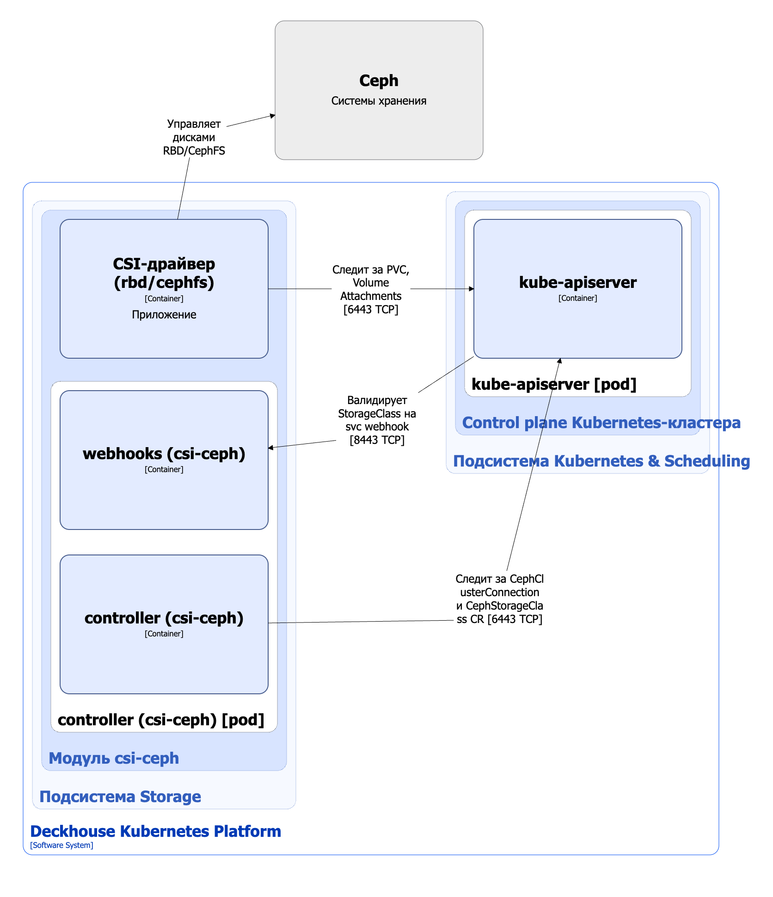

Модуль `csi-ceph` предназначен для  интеграции DKP с Ceph-кластерами и обеспечивает управление хранилищем на основе [RBD (RADOS Block Device)](https://docs.ceph.com/en/reef/rbd/) или [CephFS](https://docs.ceph.com/en/reef/cephfs/). Он позволяет создавать StorageClass в Kubernetes с помощью ресурса CephStorageClass.

Подробнее с описанием модуля можно ознакомиться [в разделе документации модуля](/modules/csi-ceph/).

## Архитектура модуля


Для упрощения схемы приняты следующие допущения:

* На схеме показано, что контейнеры разных подов взаимодействуют друг с другом напрямую. Фактически они взаимодействуют через соответствующие сервисы Kubernetes (внутренние балансировщики). Названия сервисов не указываются, если они очевидны из контекста. В остальных случаях название сервиса указано над стрелкой.
* Поды могут быть запущены в нескольких репликах, однако на схеме все поды изображены в одной реплике.


Архитектура модуля [`csi-ceph`](/modules/csi-ceph/) на уровне 2 модели C4 и его взаимодействия с другими компонентами Deckhouse Kubernetes Platform (DKP) изображены на следующей диаграмме:

<!--- Source: structurizr code from https://fox.flant.com/team/d8-system-design/doc/-/tree/main/architecture/diagrams/C4_RU --->

## Компоненты модуля

Модуль состоит из следующих компонентов:

1. **Controller** — контроллер, обслуживающий следующие [кастомные ресурсы](/modules/csi-ceph/stable/cr.html):

    * CephClusterConnection — параметры подключения к кластеру Ceph;
    * CephStorageClass —  определяет конфигурацию для создаваемого Kubernetes StorageClass.

    В CephStorageClass задается тип storage-класса (`CephFS`, `RBD`), reclaim policy, параметры подключения к кластеру Ceph, а также специфичные для каждого storage-класса дополнительные параметры. В зависимости от типа storage-класса эти параметры используются provisioner’ом CSI-драйвера `rbd.csi.ceph.com` или `cephfs.csi.ceph.com` при управлении томами.

    Кастомный ресурс `CephMetadataBackup` используется в сценариях миграции и восстановления, реализованных hook-ами модуля, а не основным runtime-контроллером.

   Состоит из следующих контейнеров:

   * **controller** — основной контейнер;
   * **webhook** — сайдкар-контейнер, реализующий вебхук-сервер для проверки стандартных ресурсов StorageClass.

1. **CSI-драйвер (`rbd/cephfs`)** — реализация CSI-драйвера для `rbd.csi.ceph.com` или `cephfs.csi.ceph.com` provisioner. Выбор CSI-драйвера выполняется путём задания storage-класса в кастомном ресурсе CephStorageClass.

  CSI-драйвер `csi-cephfs` реализован по типовой архитектуре CSI-драйвера, используемого в DKP, можно ознакомиться [на странице описания типового CSI-драйвера](../../cluster-and-infrastructure/infrastructure/csi-driver.html).

  CSI-драйвер `csi-rbd` реализован по отличной от типового CSI-драйвера архитектуре, которая приведена [на странице описания CSI-драйвера](../../storage/csi-drivers/csi-driver-ceph-rbd.html).

## Взаимодействия модуля

Модуль взаимодействует со следующими компонентами:

* **Kube-apiserver**:

  * мониторинг стандартных ресурсов PersistentVolume, PersistentVolumeClaim, VolumeAttachment и StorageClass;
  * работа с кастомными ресурсами CephClusterConnection и CephStorageClass;
  * создание ресурса StorageClass.

С модулем взаимодействуют следующие внешние компоненты:

* **Kube-apiserver** — валидация стандартных ресурсов StorageClass.
