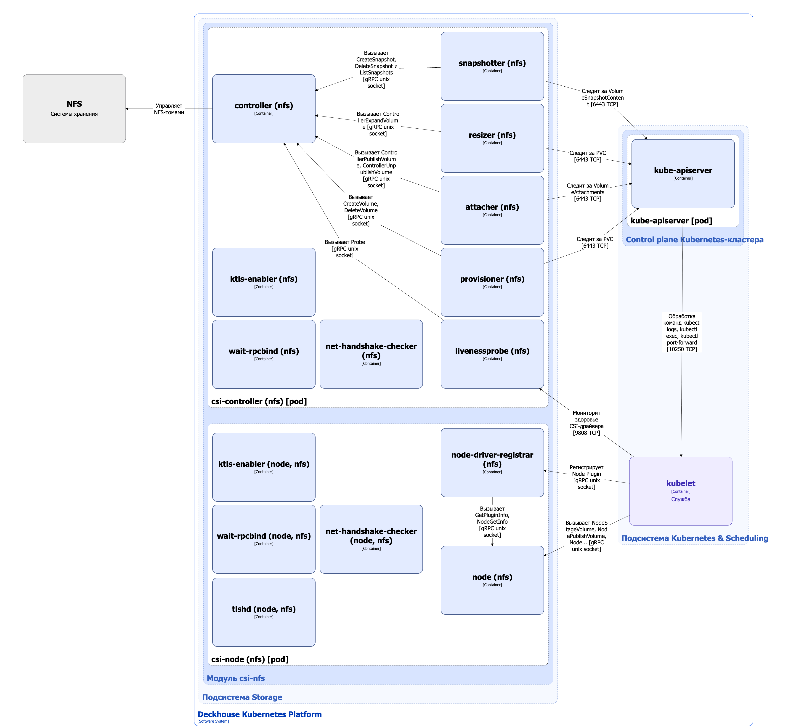

CSI-драйвер `csi-nfs` — это реализация стандарта [Container Storage Interface (CSI)](https://github.com/container-storage-interface/spec/blob/master/spec.md) для управления NFS-томами в Deckhouse Kubernetes Platform (DKP).

## Архитектура драйвера


Для упрощения схемы приняты следующие допущения:

* На схеме показано, что контейнеры разных подов взаимодействуют друг с другом напрямую. Фактически они взаимодействуют через соответствующие сервисы Kubernetes (внутренние балансировщики). Названия сервисов не указываются, если они очевидны из контекста. В остальных случаях название сервиса указано над стрелкой.
* Поды могут быть запущены в нескольких репликах, однако на схеме все поды изображены в одной реплике.


Архитектура CSI-драйвера `csi-nfs` на уровне 2 модели C4 и его взаимодействия с другими компонентами Deckhouse Kubernetes Platform (DKP) изображены на следующей диаграмме:

<!--- Source: structurizr code from https://fox.flant.com/team/d8-system-design/doc/-/tree/main/architecture/diagrams/C4_RU --->

## Компоненты драйвера

CSI-драйвер `csi-nfs` состоит из следующих компонентов:

1. **Csi-controller** (Deployment) — Controller Plugin, отвечающий за глобальные операции с томами: создание и удаление, подключение и отключение от узлов, а также управление снимками.

   Состоит из следующих контейнеров:

   * **wait-rpcbind** — init-контейнер, ожидающий доступности Unix-сокета службы `rpcbind`;

   * **ktls-enabler** — init-контейнер, выполняющий загрузку и проверку модулей ядра Linux на узле для работы в режиме RPC-with-TLS;

   * **net-handshake-checker** — init-контейнер, выполняющий однократный запуск [`tlshd`](https://github.com/oracle/ktls-utils) для проверки работоспособности процедуры TLS handshake на уровне ядра ОС;

   * **controller** — основной контейнер, реализующий функциональность CSI-драйвера (capabilities) в виде gRPC-сервисов Identity Service и Controller Service согласно [спецификации CSI](https://github.com/container-storage-interface/spec/blob/master/spec.md#rpc-interface);

   * **сайдкар-контейнеры контроллера** — поддерживаемые сообществом Kubernetes внешние контроллеры (external controllers).

     Они необходимы, поскольку persistent volume controller, запущенный в kube-controller-manager (компонент [control plane кластера DKP](../../kubernetes-and-scheduling/control-plane.html)), не имеет интерфейса взаимодействия с CSI-драйверами. Внешние контроллеры следят за ресурсами PersistentVolumeClaim и вызывают соответствующие функции CSI-драйвера в контейнере controller. Они также выполняют служебные функции, такие как получение информации о плагине и его capabilities или проверка состояния драйвера (liveness probe).

     Внешние контроллеры взаимодействуют c контейнером controller по gRPC через Unix-сокеты.

     В csi-controller входят следующие внешние контроллеры:

      * **provisioner** ([external-provisioner](https://github.com/kubernetes-csi/external-provisioner)) — отслеживает ресурсы PersistentVolumeClaim и вызывает RPC `CreateVolume` или `DeleteVolume`. Также использует RPC `ValidateVolumeCapabilities` для проверки совместимости;

      * **attacher** ([external-attacher](https://github.com/kubernetes-csi/external-attacher)) — отслеживает ресурсы VolumeAttachment после того, как под запланирован на узел, а также подключает и отключает тома через RPC `ControllerPublishVolume` и `ControllerUnpublishVolume`;

      * **resizer** ([external-resizer](https://github.com/kubernetes-csi/external-resizer)) — отслеживает обновления ресурсов PersistentVolumeClaim, расширяет тома с помощью RPC `ControllerExpandVolume`, если пользователь запросил больше дискового пространства для PVC и драйвер поддерживает capability `EXPAND_VOLUME`;

      * **snapshotter** ([external-snapshotter](https://github.com/kubernetes-csi/external-snapshotter)) — работает совместно с модулем [`snapshot-controller`](/modules/snapshot-controller/), следит за ресурсами VolumeSnapshotContent, а также управляет снимками томов через RPC `CreateSnapshot`, `DeleteSnapshot` и `ListSnapshots` (если драйвер это поддерживает);

      * [**livenessprobe**](https://github.com/kubernetes-csi/livenessprobe) — отслеживает состояние CSI-драйвера через RPC `Probe` из Identity Service и предоставляет HTTP-эндпоинт `/healthz`, за которым следит [kubelet](../../kubernetes-and-scheduling/kubelet.html). При неуспешной *livenessProbe* kubelet перезапускает под csi-controller.

1. **Csi-node** (DaemonSet) — Node Plugin, работающий на всех узлах кластера и отвечающий за локальное монтирование и размонтирование томов.

   > **Внимание.** У плагина есть привилегированный доступ к файловой системе каждого узла. В Linux для этого требуется capability `CAP_SYS_ADMIN`. Это необходимо для выполнения операций монтирования и работы с блочными устройствами.

   Состоит из следующих контейнеров:

   * **wait-rpcbind** — init-контейнер, ожидающий доступности Unix-сокета службы `rpcbind`;

   * **ktls-enabler** — init-контейнер, выполняющий загрузку и проверку модулей ядра Linux на узле для работы в режиме RPC-with-TLS;

   * **net-handshake-checker** — init-контейнер, выполняющий однократный запуск [`tlshd`](https://github.com/oracle/ktls-utils) для проверки работоспособности процедуры TLS handshake на уровне ядра ОС;

   * **node** — основной контейнер, реализующий функции CSI-драйвера в виде gRPC-сервисов Identity Service и Node Service согласно [спецификации CSI](https://github.com/container-storage-interface/spec/blob/master/spec.md#rpc-interface);

   * **tlshd** — сайдкар-контейнер, обеспечивающий работу в режиме RPC-with-TLS;

   * **node-driver-registrar** — сайдкар-контейнер, регистрирующий Node Plugin в [kubelet](../../kubernetes-and-scheduling/kubelet.html). Вызывает в контейнере node RPC `GetPluginInfo` и `NodeGetInfo`, чтобы получить информацию о плагине и узле. Взаимодействуют c контейнером **node** по gRPC через Unix-сокет.

## Взаимодействия драйвера

Драйвер взаимодействует со следующими компонентами:

1. **Kube-apiserver** — мониторинг ресурсов PersistentVolumeClaim, VolumeAttachment и VolumeSnapshotContent.

1. **Сетевое файловое хранилище NFS**:

   * подключение и отключение NFS-томов от узлов;
   * управление снимками.

С драйвером взаимодействуют следующие внешние компоненты:

* [Kubelet](../../kubernetes-and-scheduling/kubelet.html):

  * проверяет livenessProbe CSI-драйвера;
  * регистрирует Node Plugin;
  * вызывает RPC `NodeStageVolume`, `NodeUnstageVolume`, `NodePublishVolume`, `NodeUnpublishVolume` и `NodeExpandVolume` в Node Plugin.

   [Kubelet](../../kubernetes-and-scheduling/kubelet.html) взаимодействует с Node Plugin по gRPC через Unix-сокет.
