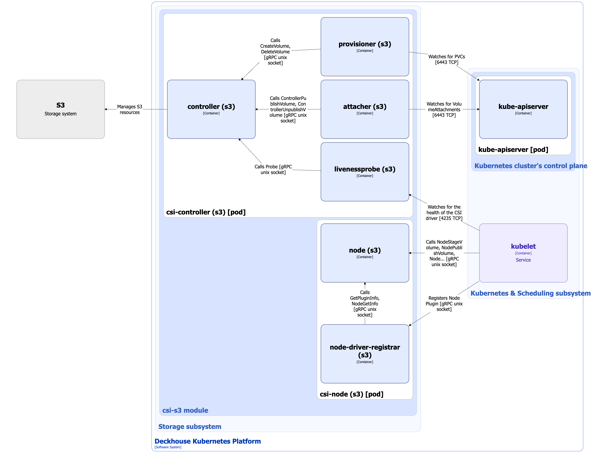

The [`csi-s3`](https://github.com/yandex-cloud/k8s-csi-s3) CSI driver is the implementation of the [Container Storage Interface (CSI)](https://github.com/container-storage-interface/spec/blob/master/spec.md) standard to manage S3-based volumes in Deckhouse Kubernetes Platform (DKP).

## Driver architecture


The following simplifications are made in the diagram:

* The diagram shows containers in different pods interacting directly with each other. In reality, they communicate via the corresponding Kubernetes Services (internal load balancers). Service names are omitted if they are obvious from the diagram context. Otherwise, the Service name is shown above the arrow.
* Pods may run multiple replicas. However, each pod is shown as a single replica in the diagram.


The Level 2 C4 architecture of the `csi-s3` CSI driver and its interactions with other components of Deckhouse Kubernetes Platform (DKP) are shown in the following diagram:

<!--- Source: structurizr code from https://fox.flant.com/team/d8-system-design/doc/-/tree/main/architecture/diagrams/C4_EN --->

## Driver components

The `csi-s3` CSI driver consists of the following components:

1. **Csi-controller** (Deployment): Controller Plugin responsible for global volume operations such as creating and deleting volumes, and attaching and detaching volumes from nodes.

   It consists of the following containers:

   * **controller**: Main container implementing CSI driver functionality (capabilities) through the gRPC services Identity Service and Controller Service according to the [CSI specification](https://github.com/container-storage-interface/spec/blob/master/spec.md#rpc-interface).

   * **controller sidecar containers**: Kubernetes community-maintained external controllers.

     These controllers are required because the persistent volume controller running in kube-controller-manager (a component of the [DKP control plane](../../kubernetes-and-scheduling/control-plane.html)) does not provide an interface for direct interaction with CSI drivers. External controllers monitor PersistentVolumeClaim resources and call the corresponding CSI driver functions in the controller container. They also perform auxiliary tasks such as retrieving plugin information and capabilities or checking driver health (liveness probe).

     External controllers interact with the controller container over gRPC via Unix sockets.

     The csi-controller includes the following external controllers:

     * **Provisioner** ([external-provisioner](https://github.com/kubernetes-csi/external-provisioner)): Watches PersistentVolumeClaim resources and calls the RPC methods `CreateVolume` or `DeleteVolume`. It also uses `ValidateVolumeCapabilities` to verify compatibility.

     * **Attacher** ([external-attacher](https://github.com/kubernetes-csi/external-attacher)): Monitors VolumeAttachment resources after a pod is scheduled to a node and attaches or detaches volumes using the RPC methods `ControllerPublishVolume` and `ControllerUnpublishVolume`.

     * [**Livenessprobe**](https://github.com/kubernetes-csi/livenessprobe): Monitors the health of the CSI driver through the `Probe` RPC from the Identity Service and exposes the HTTP endpoint `/healthz`, which is checked by [kubelet](../../kubernetes-and-scheduling/kubelet.html). If *livenessProbe* fails, kubelet restarts the csi-controller pod.

1. **Csi-node** (DaemonSet): Node Plugin running on all cluster nodes and responsible for local volume mount and unmount operations.

   > **Warning.** The plugin has privileged access to the filesystem of each node. On Linux, this requires the `CAP_SYS_ADMIN` capability. This is necessary to perform mount operations and interact with block devices.

   It consists of the following containers:

   * **node**: Main container implementing CSI driver functionality through the gRPC services Identity Service and Node Service according to the [CSI specification](https://github.com/container-storage-interface/spec/blob/master/spec.md#rpc-interface).

   * **node-driver-registrar**: Sidecar container that registers the Node Plugin with [kubelet](../../kubernetes-and-scheduling/kubelet.html). It calls the RPC methods `GetPluginInfo` and `NodeGetInfo` in the node container to retrieve plugin and node information. Communication with the node container occurs over gRPC via a Unix socket.

## Driver interactions

The driver interacts with the following components:

1. **Kube-apiserver**: Watches PersistentVolumeClaim and VolumeAttachment resources.

1. **S3 storage**: Creates and deletes volumes, and attaches/detaches volumes to/from nodes.

The following external components interact with the driver:

1. [Kubelet](../../kubernetes-and-scheduling/kubelet.html):

* Checks CSI driver livenessProbe.
* Registers the Node Plugin.
* Calls `NodeStageVolume`, `NodeUnstageVolume`, `NodePublishVolume`, and `NodeUnpublishVolume` RPCs in the Node Plugin.

   [Kubelet](../../kubernetes-and-scheduling/kubelet.html) interacts with the Node Plugin over gRPC via a Unix socket.
