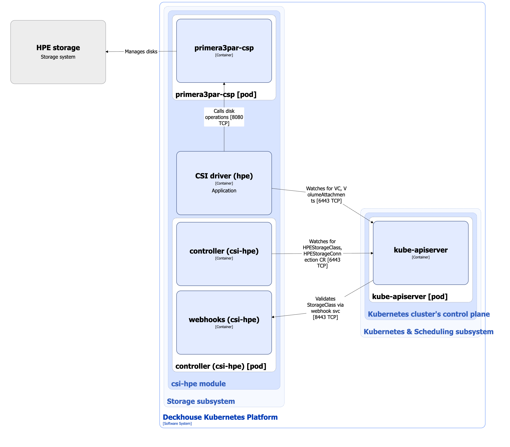

The [`csi-hpe`](/modules/csi-hpe/) module is designed to manage volumes using HPE storage systems. It enables creating StorageClass resources in Kubernetes using the HPEStorageClass custom resource.

For more details about the module, refer to [the module documentation](/modules/csi-hpe/).

## Module architecture


The following simplifications are made in the diagram:

* The diagram shows containers in different pods interacting directly with each other. In reality, they communicate via the corresponding Kubernetes Services (internal load balancers). Service names are omitted if they are obvious from the diagram context. Otherwise, the Service name is shown above the arrow.
* Pods may run multiple replicas. However, each pod is shown as a single replica in the diagram.


The Level 2 C4 architecture of the [`csi-hpe`](/modules/csi-hpe/) module and its interactions with other components of Deckhouse Kubernetes Platform (DKP) are shown in the following diagram:

<!--- Source: structurizr code from https://fox.flant.com/team/d8-system-design/doc/-/tree/main/architecture/diagrams/C4_EN --->

## Module components

The module consists of the following components:

1. **Controller**: A controller that reconciles the following [custom resources](/modules/csi-hpe/stable/cr.html):

* HPEStorageConnection: Parameters for connecting to HPE storage systems.
* HPEStorageClass: Defines configuration for Kubernetes StorageClass.

  HPEStorageClass defines the connection protocol, resource pool name, filesystem type, and reclaim policy.

  The controller also synchronizes the `storage.deckhouse.io/csi-hpe-node` label on cluster nodes according to the [`spec.settings.nodeSelector`](/modules/csi-hpe/configuration.html) value in the ModuleConfig custom resource.

  It consists of the following containers:

* **controller**: Main container.
* **webhooks**: Sidecar container implementing a webhook server for StorageClass validation.

1. **CSI driver (hpe)**: CSI driver implementation for the `csi.hpe.com` provisioner. To study the typical CSI driver architecture used in DKP, refer to [the CSI driver documentation page](../cluster-and-infrastructure/infrastructure/csi-driver.html).

1. **Primera3par-csp**: A service container provider (Container Storage Provider, CSP) required for the CSI driver to work with HPE Primera and 3PAR storage systems. It is responsible for communication between Kubernetes and storage arrays, session management, path replication, and provides multipath access to storage for reliability and fault tolerance.

## Module interactions

The module interacts with the following components:

1. **Kube-apiserver**:

  * Watches PersistentVolume, PersistentVolumeClaim, VolumeAttachment, and StorageClass resources.
  * Reconciles HPEStorageConnection and HPEStorageClass custom resources.
  * Creates and updates VolumeSnapshotClass, Secret, and StorageClass resources.

1. **HPE storage system**: Creates, deletes, and manages volumes, and provides multipath data access.

The following external components interact with the module:

1. **Kube-apiserver**: Validates StorageClass resources.
