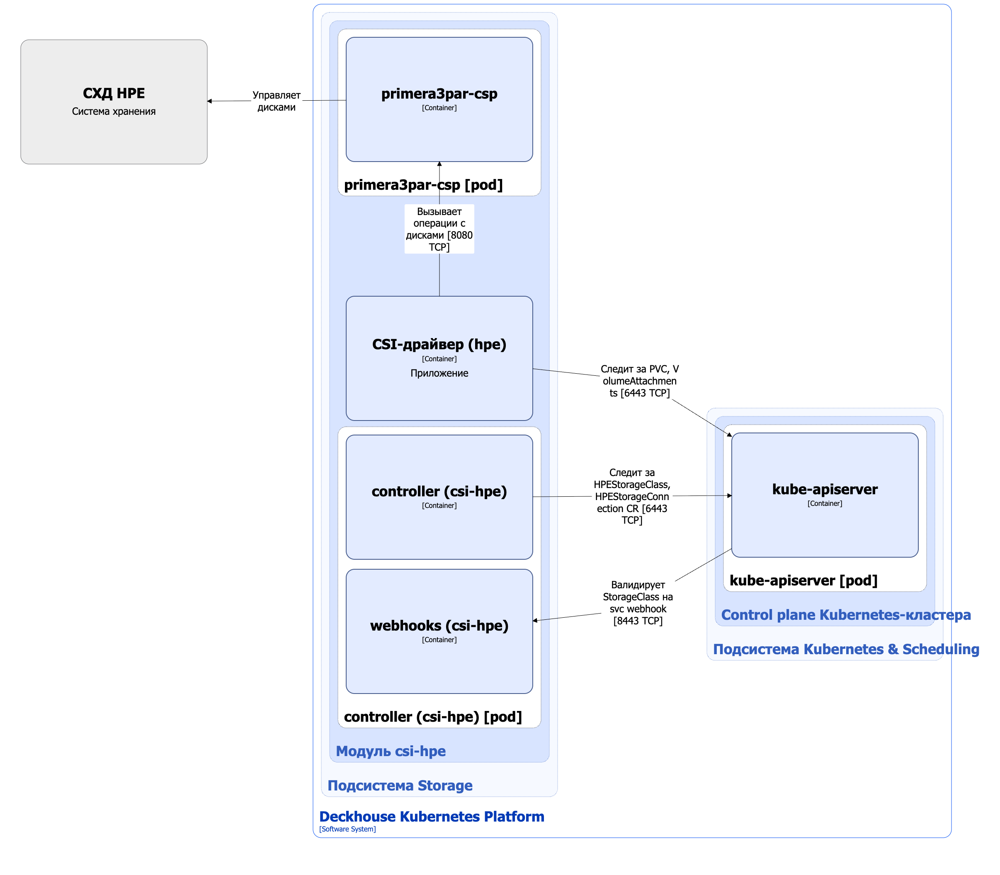

Модуль [`csi-hpe`](/modules/csi-hpe/) предназначен для управления томами c использованием систем хранения данных HPE. Он позволяет создавать StorageClass в Kubernetes с помощью ресурса HPEStorageClass.

Подробнее с описанием модуля можно ознакомиться [в разделе документации модуля](/modules/csi-hpe/).

## Архитектура модуля


Для упрощения схемы приняты следующие допущения:

* На схеме показано, что контейнеры разных подов взаимодействуют друг с другом напрямую. Фактически они взаимодействуют через соответствующие сервисы Kubernetes (внутренние балансировщики). Названия сервисов не указываются, если они очевидны из контекста. В остальных случаях название сервиса указано над стрелкой.
* Поды могут быть запущены в нескольких репликах, однако на схеме все поды изображены в одной реплике.


Архитектура модуля [`csi-hpe`](/modules/csi-hpe/) на уровне 2 модели C4 и его взаимодействия с другими компонентами Deckhouse Kubernetes Platform (DKP) изображены на следующей диаграмме:

<!--- Source: structurizr code from https://fox.flant.com/team/d8-system-design/doc/-/tree/main/architecture/diagrams/C4_RU --->

## Компоненты модуля

Модуль состоит из следующих компонентов:

1. **Controller** — контроллер, обслуживающий следующие [кастомные ресурсы](/modules/csi-hpe/stable/cr.html):

* HPEStorageConnection — параметры подключения к СХД HPE;
* HPEStorageClass — определяет конфигурацию для Kubernetes StorageClass.

  В HPEStorageClass задается протокол подключения, название пула ресурсов, тип файловой системы и reclaim policy.

  Также controller синхронизирует метку `storage.deckhouse.io/csi-hpe-node` для узлов кластера в соответствии со значением селектора узлов [`spec.settings.nodeSelector`](/modules/csi-hpe/configuration.html) кастомного ресурса ModuleConfig.

  Состоит из следующих контейнеров:

* **controller** — основной контейнер;
* **webhooks** — сайдкар-контейнер, реализующий вебхук-сервер для проверки StorageClass.

1. **CSI-драйвер (hpe)** — реализация CSI-драйвера для `csi.hpe.com` provisioner. С типовой архитектурой CSI-драйвера, используемого в DKP, можно ознакомиться [в разделе документации архитектуры CSI-драйвера](../cluster-and-infrastructure/infrastructure/csi-driver.html).

1. **Primera3par-csp** — сервисный контейнер-провайдер (Container Storage Provider, CSP), необходимый для работы CSI-драйвера с системами хранения HPE Primera и 3PAR. Отвечает за взаимодействие между Kubernetes и массивами хранения данных, управление сессиями, репликацией путей, а также обеспечивает работу с мульти-путевым доступом к СХД для надежности и отказоустойчивости.

## Взаимодействия модуля

Модуль взаимодействует со следующими компонентами:

1. **Kube-apiserver**:

  * мониторинг ресурсов PersistentVolume, PersistentVolumeClaim, VolumeAttachment и StorageClass;
  * работа с кастомными ресурсами HPEStorageConnection и HPEStorageClass;
  * создание и обновление ресурсов VolumeSnapshotClass, Secret и StorageClass.

1. **Система хранения HPE** — создание, удаление и управление томами, а также организация мультипутевого доступа к данным.

С модулем взаимодействуют следующие внешние компоненты:

* **Kube-apiserver** — валидация ресурсов StorageClass.
