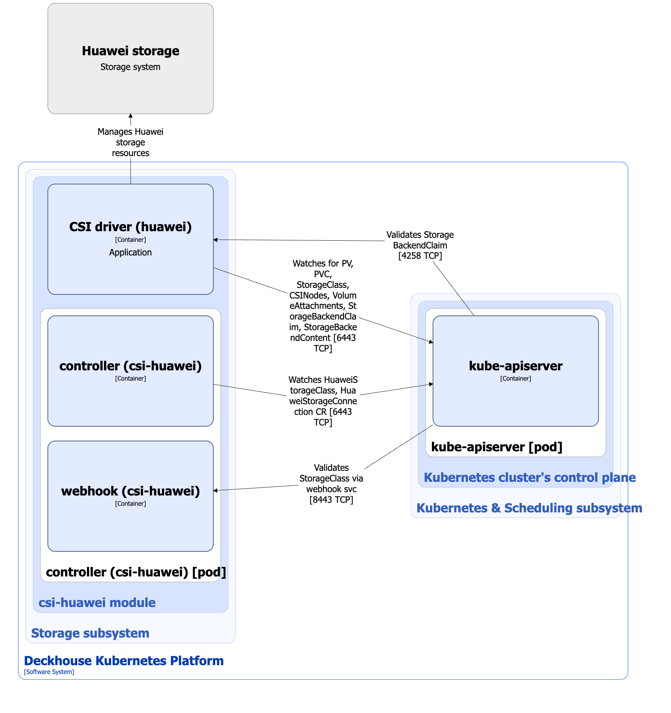

The [`csi-huawei`](/modules/csi-huawei/) module is designed to manage volumes using Huawei storage systems. It enables creating StorageClass resources in Kubernetes using the HuaweiStorageClass custom resource.

For more details about the module, refer to [the module documentation](/modules/csi-huawei/).

## Module architecture


The following simplifications are made in the diagram:

* The diagram shows containers in different pods interacting directly with each other. In reality, they communicate via the corresponding Kubernetes Services (internal load balancers). Service names are omitted if they are obvious from the diagram context. Otherwise, the Service name is shown above the arrow.
* Pods may run multiple replicas. However, each pod is shown as a single replica in the diagram.


The Level 2 C4 architecture of the [`csi-huawei`](/modules/csi-huawei/) module and its interactions with other components of Deckhouse Kubernetes Platform (DKP) are shown in the following diagram:

<!--- Source: structurizr code from https://fox.flant.com/team/d8-system-design/doc/-/tree/main/architecture/diagrams/C4_EN --->

## Module components

The module consists of the following components:

1. **Controller**: A controller that reconciles the following [custom resources](/modules/csi-huawei/stable/cr.html):

* HuaweiStorageConnection: Parameters for connecting to Huawei storage systems.
* HuaweiStorageClass: Defines configuration for Kubernetes StorageClass.

  HuaweiStorageClass defines the resource pool name, filesystem type, and reclaim policy.

  It consists of the following containers:

* **controller**: Main container.
* **webhooks**: Sidecar container implementing a webhook server for StorageClass validation.

1. **CSI driver (huawei)**: CSI driver implementation for the `csi.huawei.com` provisioner. To study the architecture of the `csi-huawei` CSI driver, refer to [the CSI driver documentation page](../../storage/csi-drivers/csi-driver-huawei.html).

  The `csi-huawei` CSI driver reconciles the following [custom resources](https://github.com/Huawei/eSDK_K8S_Plugin/blob/master/helm/esdk/crds/backend/):

* StorageBackendClaim: A request to connect to Huawei storage.
* StorageBackendContent: Description of the actual connection to Huawei storage.

## Module interactions

The module interacts with the following components:

1. **Kube-apiserver**:

  * Watches PersistentVolume, PersistentVolumeClaim, VolumeAttachment, and StorageClass resources.
  * Reconciles HuaweiStorageConnection, HuaweiStorageClass, StorageBackendClaim, and StorageBackendContent custom resources.
  * Creates StorageClass resources.

1. **Huawei storage system**: Creates and deletes volumes, and attaches/detaches volumes to/from nodes.

The following external components interact with the module:

1. **Kube-apiserver**: Validates StorageBackendClaim custom resources and standard StorageClass resources.
