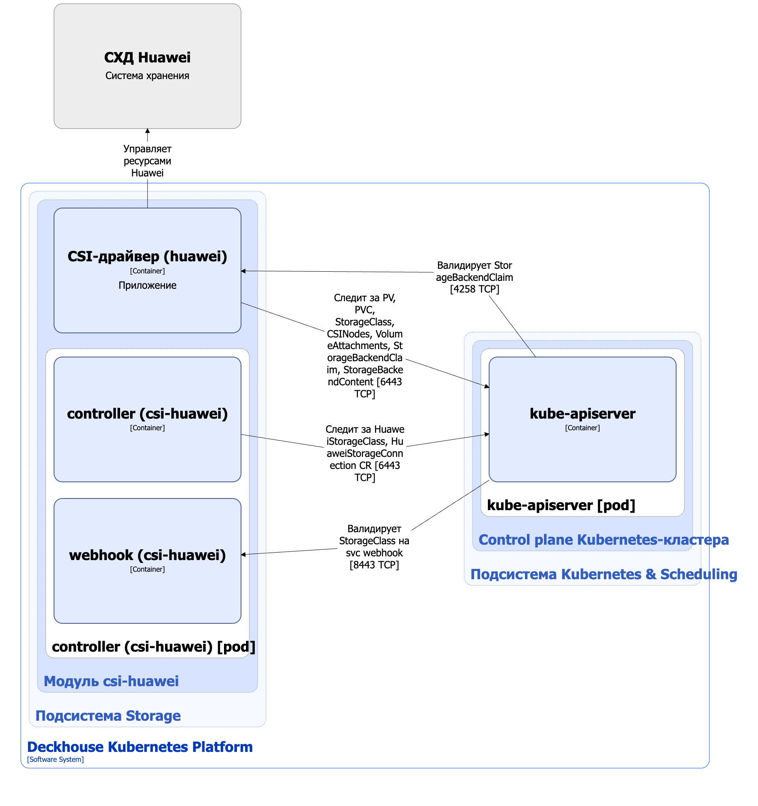

Модуль [`csi-huawei`](/modules/csi-huawei/) предназначен для управления томами c использованием систем хранения данных Huawei. Он позволяет создавать StorageClass в Kubernetes с помощью ресурса HuaweiStorageClass.

Подробнее с описанием модуля можно ознакомиться [в разделе документации модуля](/modules/csi-huawei/).

## Архитектура модуля


Для упрощения схемы приняты следующие допущения:

* На схеме показано, что контейнеры разных подов взаимодействуют друг с другом напрямую. Фактически они взаимодействуют через соответствующие сервисы Kubernetes (внутренние балансировщики). Названия сервисов не указываются, если они очевидны из контекста. В остальных случаях название сервиса указано над стрелкой.
* Поды могут быть запущены в нескольких репликах, однако на схеме все поды изображены в одной реплике.


Архитектура модуля [`csi-huawei`](/modules/csi-huawei/) на уровне 2 модели C4 и его взаимодействия с другими компонентами Deckhouse Kubernetes Platform (DKP) изображены на следующей диаграмме:

<!--- Source: structurizr code from https://fox.flant.com/team/d8-system-design/doc/-/tree/main/architecture/diagrams/C4_RU --->

## Компоненты модуля

Модуль состоит из следующих компонентов:

1. **Controller** — контроллер, обслуживающий следующие [кастомные ресурсы](/modules/csi-huawei/stable/cr.html):

* HuaweiStorageConnection — параметры подключения к СХД Huawei;
* HuaweiStorageClass — определяет конфигурацию для Kubernetes StorageClass.

  В HuaweiStorageClass задается название пула ресурсов, тип файловой системы и reclaim policy.

  Состоит из следующих контейнеров:

* **controller** — основной контейнер;
* **webhook** — сайдкар-контейнер, реализующий вебхук-сервер для проверки кастомных ресурсов HPEStorageConnection и HPEStorageClass.

1. **CSI-драйвер (huawei)** — реализация CSI-драйвера для `csi.huawei.com` provisioner. С архитектурой CSI-драйвера `csi-huawei` можно ознакомиться [в соответствующем разделе документации](../storage/csi-drivers/csi-driver-huawei.html).

  CSI-драйвер `csi-huawei` обслуживает следующие [кастомные ресурсы](https://github.com/Huawei/eSDK_K8S_Plugin/blob/master/helm/esdk/crds/backend/):

* StorageBackendClaim — запрос на подключение к СХД Huawei;
* StorageBackendContent — описание фактического подключения к СХД Huawei.

## Взаимодействия модуля

Модуль взаимодействует со следующими компонентами:

* **Kube-apiserver**:

  * мониторинг ресурсов PersistentVolume, PersistentVolumeClaim, VolumeAttachment, StorageClass;
  * работа с кастомными ресурсами HuaweiStorageConnection, HuaweiStorageClass, StorageBackendClaim, StorageBackendContent;
  * создание ресурса StorageClass.

С модулем взаимодействуют следующие внешние компоненты:

* **Kube-apiserver** — валидация кастомных ресурсов HuaweiStorageConnection, HuaweiStorageClass, StorageBackendClaim, StorageBackendContent.
