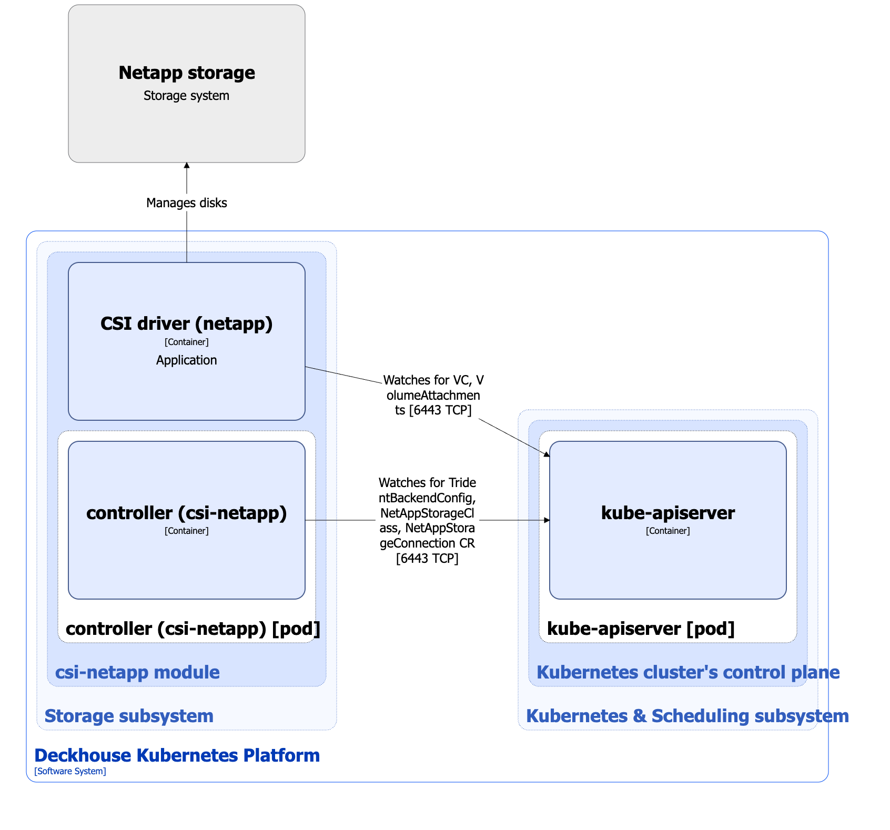

The [`csi-netapp`](/modules/csi-netapp/) module is designed to manage volumes using NetApp storage systems. It enables creating StorageClass resources in Kubernetes using the NetappStorageClass custom resource.

For more details about the module, refer to [the module documentation](/modules/csi-netapp/).

## Module architecture


The following simplifications are made in the diagram:

* The diagram shows containers in different pods interacting directly with each other. In reality, they communicate via the corresponding Kubernetes Services (internal load balancers). Service names are omitted if they are obvious from the diagram context. Otherwise, the Service name is shown above the arrow.
* Pods may run multiple replicas. However, each pod is shown as a single replica in the diagram.


The Level 2 C4 architecture of the [`csi-netapp`](/modules/csi-netapp/) module and its interactions with other components of Deckhouse Kubernetes Platform (DKP) are shown in the following diagram:

<!--- Source: structurizr code from https://fox.flant.com/team/d8-system-design/doc/-/tree/main/architecture/diagrams/C4_EN --->

## Module components

The module consists of the following components:

1. **Controller**: A controller that reconciles the following [custom resources](/modules/csi-netapp/stable/cr.html):

* NetappStorageConnection: Parameters for connecting to NetApp storage systems.
* NetappStorageClass: Defines configuration for creating Kubernetes StorageClass that uses the `csi.trident.netapp.io` provisioner.

  The controller also synchronizes the `storage.deckhouse.io/csi-netapp-node` label on cluster nodes according to the [`spec.settings.nodeSelector`](/modules/csi-netapp/configuration.html) value in the ModuleConfig custom resource.

   It consists of a single container, **controller**.

1. **CSI driver (netapp)**: CSI driver implementation for the `csi.trident.netapp.io` provisioner. To study the typical CSI driver architecture used in DKP, refer to [the CSI driver documentation page](../cluster-and-infrastructure/infrastructure/csi-driver.html).

## Module interactions

The module interacts with the following components:

1. **Kube-apiserver**:

  * Watches PersistentVolume, PersistentVolumeClaim, VolumeAttachment, and StorageClass resources.
  * Reconciles TridentBackendConfig, NetappStorageConnection, and NetappStorageClass custom resources.
  * Creates VolumeSnapshotClass, Secret, and StorageClass resources.

1. **NetApp storage system**: Creates, deletes, and manages volumes, and attaches/detaches volumes to/from nodes.
