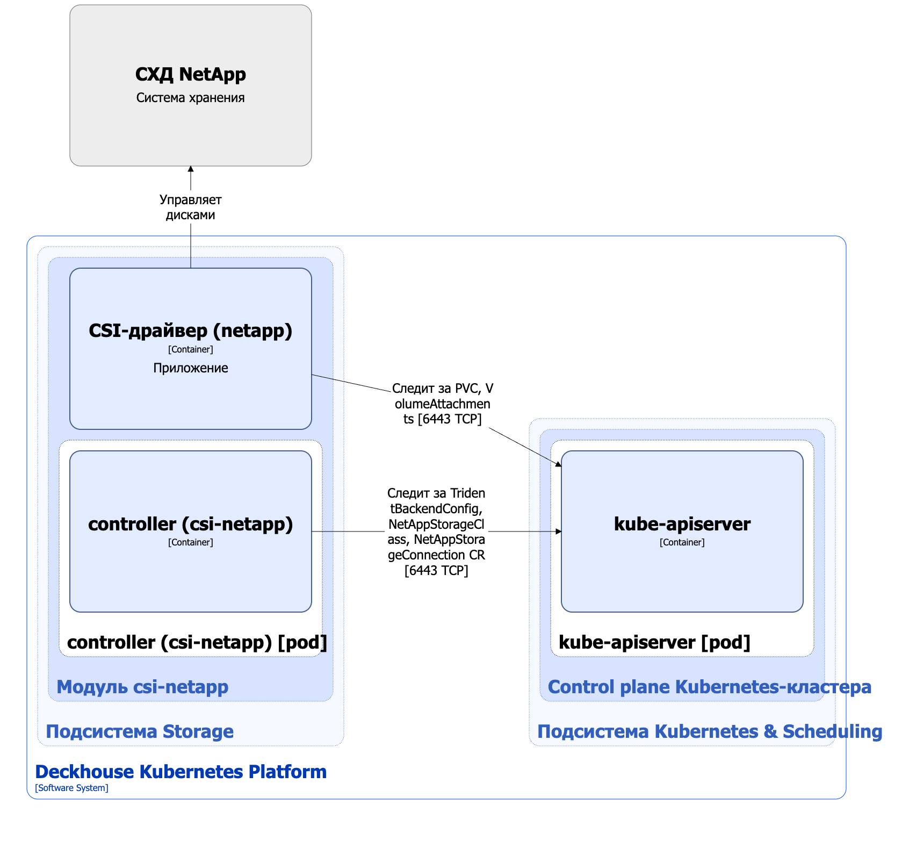

Модуль [`csi-netapp`](/modules/csi-netapp/) предназначен для управления томами c использованием систем хранения данных NetApp. Он позволяет создавать StorageClass в Kubernetes с помощью ресурса NetappStorageClass.

Подробнее с описанием модуля можно ознакомиться [в разделе документации модуля](/modules/csi-netapp/).

## Архитектура модуля


Для упрощения схемы приняты следующие допущения:

* На схеме показано, что контейнеры разных подов взаимодействуют друг с другом напрямую. Фактически они взаимодействуют через соответствующие сервисы Kubernetes (внутренние балансировщики). Названия сервисов не указываются, если они очевидны из контекста. В остальных случаях название сервиса указано над стрелкой.
* Поды могут быть запущены в нескольких репликах, однако на схеме все поды изображены в одной реплике.


Архитектура модуля [`csi-netapp`](/modules/csi-netapp/) на уровне 2 модели C4 и его взаимодействия с другими компонентами Deckhouse Kubernetes Platform (DKP) изображены на следующей диаграмме:

<!--- Source: structurizr code from https://fox.flant.com/team/d8-system-design/doc/-/tree/main/architecture/diagrams/C4_RU --->

## Компоненты модуля

Модуль состоит из следующих компонентов:

1. **Controller** — контроллер, обслуживающий следующие [кастомные ресурсы](/modules/csi-netapp/stable/cr.html):

* NetappStorageConnection — параметры подключения к СХД NetApp;
* NetappStorageClass — определяет конфигурацию для Kubernetes StorageClass.

  В NetappStorageClass задается протокол подключения, название пула ресурсов, тип файловой системы и reclaim policy.

   Состоит из одного основногого контейнера **controller**.

1. **CSI-драйвер (netapp)** — реализация CSI-драйвера для `csi.trident.netapp.io` provisioner. С типовой архитектурой CSI-драйвера, используемого в DKP, можно ознакомиться [в разделе документации архитектуры CSI-драйвера](../cluster-and-infrastructure/infrastructure/csi-driver.html).

## Взаимодействия модуля

Модуль взаимодействует со следующими компонентами:

* **Kube-apiserver**:

  * мониторинг ресурсов PersistentVolume, PersistentVolumeClaim, VolumeAttachment, StorageClass;
  * работа с кастомными ресурсами NetappStorageConnection, NetappStorageClass;
  * создание ресурса StorageClass.
