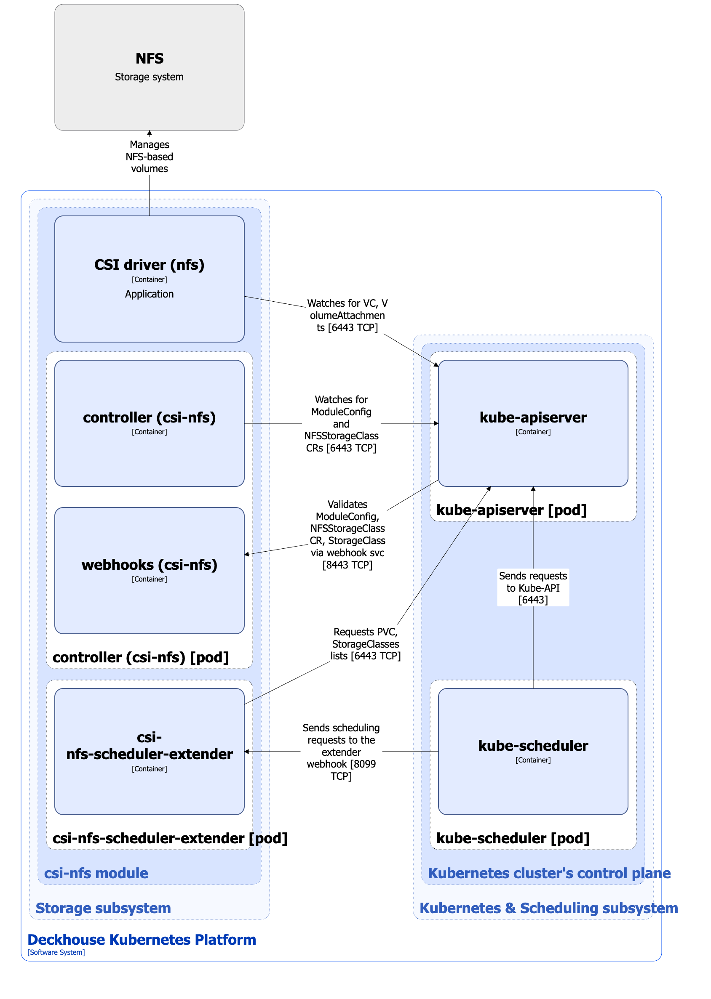

The `csi-nfs` module is designed to manage NFS-based volumes. It enables creating StorageClasses in Kubernetes using the NFSStorageClass resource.

For more details about the module, refer to [the module documentation section](/modules/csi-nfs/).

## Module architecture


The following simplifications are made in the diagram:

* The diagram shows containers in different pods interacting directly with each other. In reality, they communicate via the corresponding Kubernetes Services (internal load balancers). Service names are omitted if they are obvious from the diagram context. Otherwise, the Service name is shown above the arrow.
* Pods may run multiple replicas. However, each pod is shown as a single replica in the diagram.


The Level 2 C4 architecture of the [`csi-nfs`](/modules/csi-nfs/) module and its interactions with other components of Deckhouse Kubernetes Platform (DKP) are shown in the following diagrams:

<!--- Source: structurizr code from https://fox.flant.com/team/d8-system-design/doc/-/tree/main/architecture/diagrams/C4_RU --->

## Module components

The module consists of the following components:

1. **Controller**: It reconciles [NFSStorageClass](/modules/csi-nfs/cr.html#nfsstorageclass) custom resources. NFSStorageClass defines the configuration for the created Kubernetes StorageClass, which uses the `nfs.csi.k8s.io` provisioner.

   The created StorageClass configures the NFS server connection settings, a reclaim policy, the volume binding mode, etc. These settings are used by the provisioner of the `csi-nfs` CSI driver when managing NFS-based volumes.

   Also the controller sets the `storage.deckhouse.io/csi-nfs-node` label on the cluster nodes according to the [`spec.workloadNodes.nodeSelector`](/modules/csi-nfs/cr.html#nfsstorageclass-v1alpha1-spec-workloadnodes-nodeselector) parameter value of the NFSStorageClass custom resource.

   It consists of the following containers:

   * **controller**: Main container.
   * **webhooks**: A sidecar container that implements a webhook server for validating ModuleConfig and NFSStorageClass custom resources, as well as StorageClass resources.

2. **Csi-nfs-scheduler-extender**: It consists of a single container. It is a kube-scheduler extender, which implements a scheduling logic specific for pods using NFS-based volumes. When scheduling pods, it relies on the node selectors set in the NFSStorageClass custom resource.

   The **csi-nfs-scheduler-extender** may be absent if node selectors are not set in the NFSStorageClass custom resource.

3. **CSI driver (`csi-nfs`)**: It is an implementation of the CSI driver for `nfs.csi.k8s.io` ([NFS CSI driver](https://github.com/kubernetes-csi/csi-driver-nfs)). To study the `csi-nfs` CSI driver architecture, refer to [the CSI driver documentation page](../../storage/csi-drivers/csi-driver-nfs.html).

## Module interactions

The module interacts with the following components:

1. **Kube-apiserver**:

   * Watches for PersistentVolume, PersistentVolumeClaim, VolumeAttachment, and StorageClass resources.
   * Reconciles NFSStorageClass custom resources.
   * Creates StorageClass resources.

The following external components interact with the module:

1. **Kube-apiserver**: Validates ModuleConfig and NFSStorageClass custom resources, as well as StorageClass resources.

2. **Kube-scheduler**: Sends scheduling requests to the `csi-nfs-scheduler-extender` webhook for the pods using NFS-based volumes.
