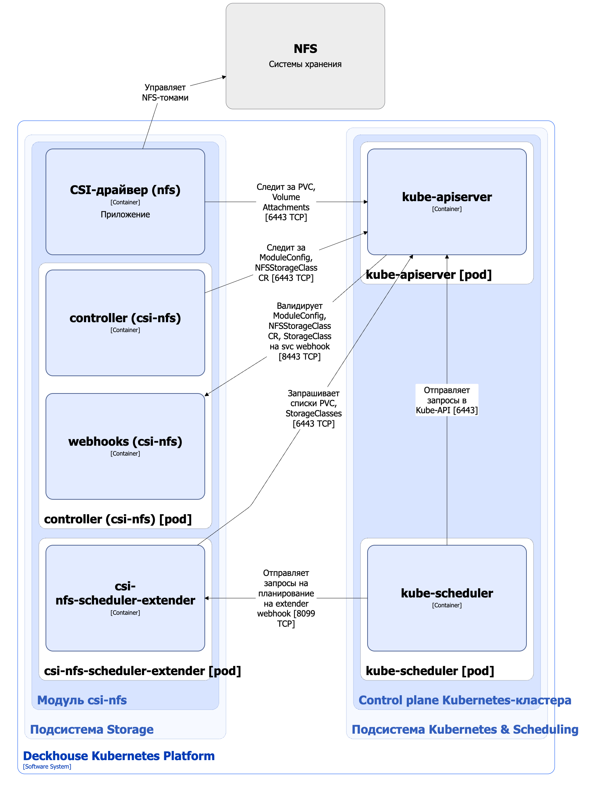

Модуль `csi-nfs` предназначен для управления NFS-томами. Он позволяет создавать StorageClass в Kubernetes с помощью ресурса NFSStorageClass.

Подробнее с описанием модуля можно ознакомиться [в разделе документации модуля](/modules/csi-nfs/).

## Архитектура модуля


Для упрощения схемы приняты следующие допущения:

* На схеме показано, что контейнеры разных подов взаимодействуют друг с другом напрямую. Фактически они взаимодействуют через соответствующие сервисы Kubernetes (внутренние балансировщики). Названия сервисов не указываются, если они очевидны из контекста. В остальных случаях название сервиса указано над стрелкой.
* Поды могут быть запущены в нескольких репликах, однако на схеме все поды изображены в одной реплике.


Архитектура модуля [`csi-nfs`](/modules/csi-nfs/) на уровне 2 модели C4 и его взаимодействия с другими компонентами Deckhouse Kubernetes Platform (DKP) изображены на следующей диаграмме:

<!--- Source: structurizr code from https://fox.flant.com/team/d8-system-design/doc/-/tree/main/architecture/diagrams/C4_RU --->

## Компоненты модуля

Модуль состоит из следующих компонентов:

1. **Controller** — контроллер, обслуживающий кастомные ресурсы [NFSStorageClass](/modules/csi-nfs/cr.html#nfsstorageclass). Ресурс NFSStorageClass определяет конфигурацию для создаваемого Kubernetes StorageClass, который использует provisioner `nfs.csi.k8s.io`.

   В создаваемом StorageClass задаются параметры подключения к NFS-серверу, reclaim policy, volume binding mode и другие параметры. Эти параметры затем использует provisioner CSI-драйвера `csi-nfs` при управлении NFS-томами.

   Также controller синхронизирует лейблы на узлах со значением параметра [`spec.workloadNodes.nodeSelector`](/modules/csi-nfs/cr.html#nfsstorageclass-v1alpha1-spec-workloadnodes-nodeselector) кастомного ресурса NFSStorageClass.

   Состоит из следующих контейнеров:

   * **controller** — основной контейнер;
   * **webhooks** — сайдкар-контейнер, реализующий вебхук-сервер для проверки кастомных ресурсов ModuleConfig, NFSStorageClass и стандартных ресурсов StorageClass.

2. **Сsi-nfs-scheduler-extender** — состоит из одного контейнера и представляет собой расширение (extender) для kube-scheduler. Реализует специфичную для подов логику размещения при использовании NFS-томов. При планировании подов учитываются селекторы узлов, заданные в кастомном ресурсе NFSStorageClass.

3. **CSI-драйвер (`csi-nfs`)** — реализация CSI-драйвера для provisioner `nfs.csi.k8s.io` ([NFS CSI driver](https://github.com/kubernetes-csi/csi-driver-nfs)). С архитектурой CSI-драйвера `csi-nfs` можно ознакомиться [на странице описания CSI-драйвера](../../storage/csi-drivers/csi-driver-nfs.html).

## Взаимодействия модуля

Модуль взаимодействует со следующими компонентами:

1. **Kube-apiserver**:

   * мониторинг ресурсов PersistentVolume, PersistentVolumeClaim, VolumeAttachment, StorageClass;
   * работа с кастомными ресурсами NFSStorageClass;
   * создание ресурса StorageClass.

С модулем взаимодействуют следующие внешние компоненты:

1. **Kube-apiserver** — валидация кастомных ресурсов ModuleConfig и NFSStorageClass, а также стандартных ресурсов StorageClass.

2. **Kube-scheduler** — отправка на вебхук `csi-nfs-scheduler-extender` запросов на планирование подов, использующих NFS-тома.
