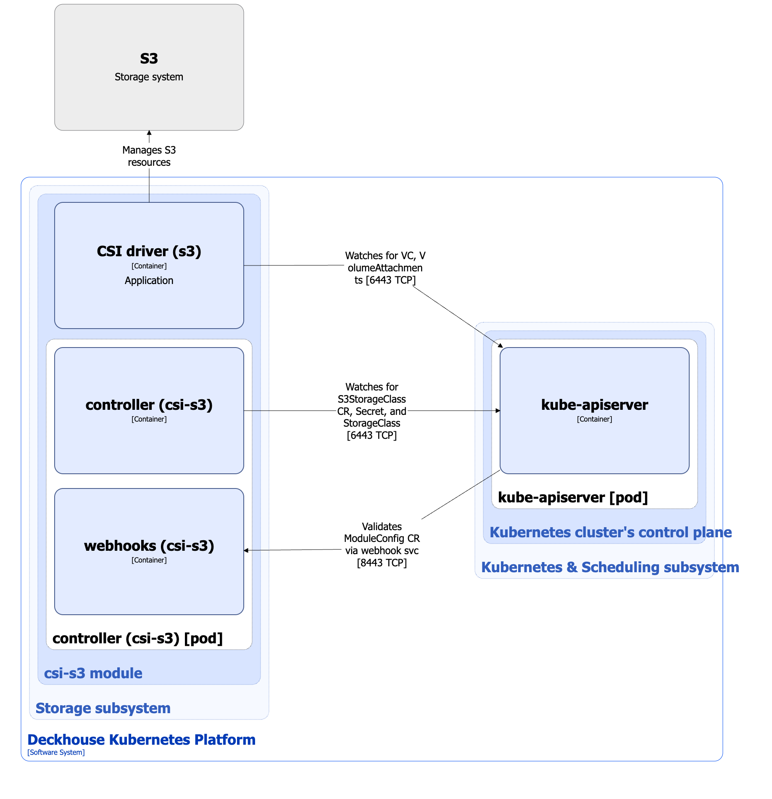

The [`csi-s3`](/modules/csi-s3/) module is designed to manage volumes based on S3 storage. It uses [geeseFS](https://github.com/yandex-cloud/geesefs), an S3-backed FUSE filesystem. The module enables creating StorageClass resources in Kubernetes using the S3StorageClass custom resource.

For more details about the module, refer to [the module documentation](/modules/csi-s3/).

## Module architecture


The following simplifications are made in the diagram:

* The diagram shows containers in different pods interacting directly with each other. In reality, they communicate via the corresponding Kubernetes Services (internal load balancers). Service names are omitted if they are obvious from the diagram context. Otherwise, the Service name is shown above the arrow.
* Pods may run multiple replicas. However, each pod is shown as a single replica in the diagram.


The Level 2 C4 architecture of the [`csi-s3`](/modules/csi-s3/) module and its interactions with other components of Deckhouse Kubernetes Platform (DKP) are shown in the following diagram:

<!--- Source: structurizr code from https://fox.flant.com/team/d8-system-design/doc/-/tree/main/architecture/diagrams/C4_EN --->

## Module components

The module consists of the following components:

1. **Controller**: A controller that reconciles the [S3StorageClass](/modules/csi-s3/cr.html) custom resource. The S3StorageClass resource defines configuration for a Kubernetes StorageClass that uses the `ru.yandex.s3.csi` provisioner.

   It consists of the following containers:

   * **controller**: Main container.
   * **webhooks**: Sidecar container implementing a webhook server for ModuleConfig custom resource validation.

1. **CSI driver (s3)**: CSI driver implementation for the `ru.yandex.s3.csi` provisioner. To study the architecture of the `csi-s3` CSI driver, refer to [the CSI driver documentation page](../../storage/csi-drivers/csi-driver-s3.html).

## Module interactions

The module interacts with the following components:

1. **Kube-apiserver**:

   * Watches PersistentVolume, PersistentVolumeClaim, VolumeAttachment, Secret, and StorageClass resources.
   * Reconciles S3StorageClass and ModuleConfig custom resources.
   * Creates StorageClass and Secret resources.

1. **S3 storage**: Creates and deletes volumes, and attaches/detaches volumes to/from nodes.

The following external components interact with the module:

1. **Kube-apiserver**: Validates ModuleConfig custom resources.
