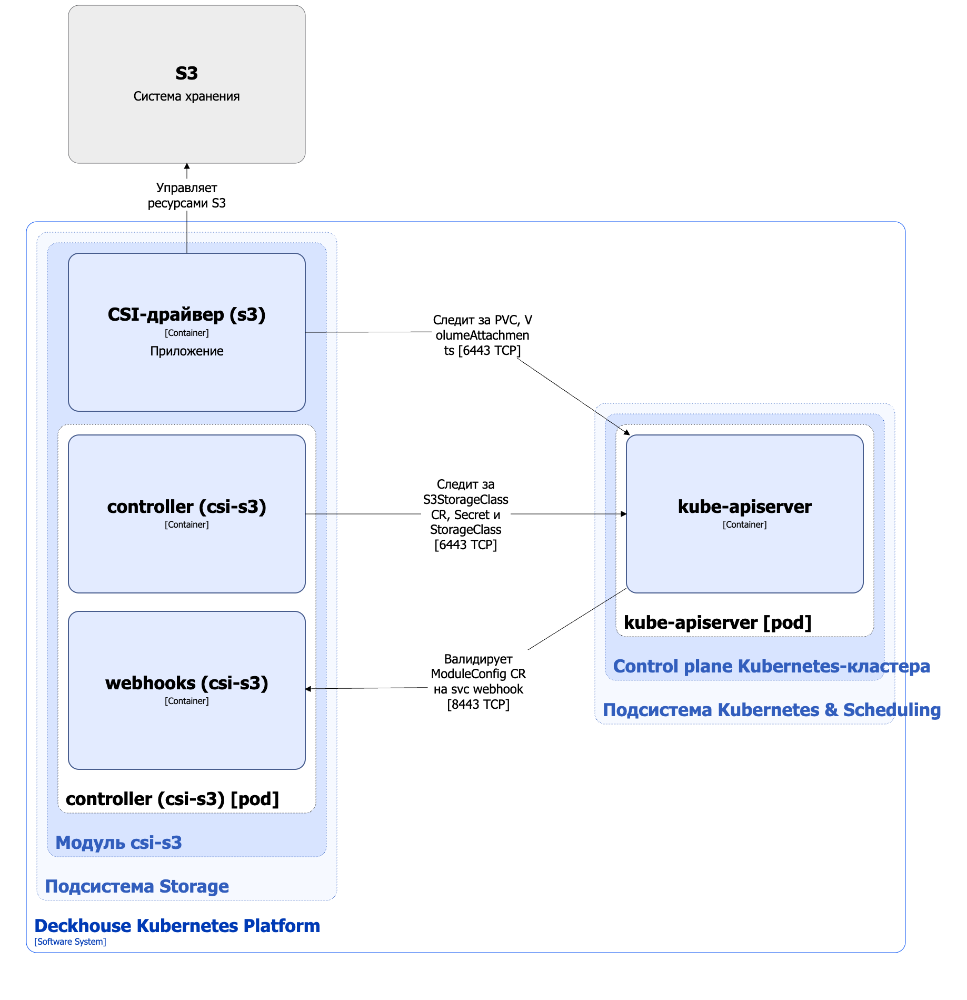

Модуль [`csi-s3`](/modules/csi-s3/) предназначен для управления томами на основе `S3-хранилищ`. Он использует [geeseFS](https://github.com/yandex-cloud/geesefs) — файловую систему FUSE на основе S3. Модуль позволяет создавать StorageClass в Kubernetes с помощью ресурса S3StorageClass.

Подробнее с описанием модуля можно ознакомиться [в разделе документации модуля](/modules/csi-s3/).

## Архитектура модуля


Для упрощения схемы приняты следующие допущения:

* На схеме показано, что контейнеры разных подов взаимодействуют друг с другом напрямую. Фактически они взаимодействуют через соответствующие сервисы Kubernetes (внутренние балансировщики). Названия сервисов не указываются, если они очевидны из контекста. В остальных случаях название сервиса указано над стрелкой.
* Поды могут быть запущены в нескольких репликах, однако на схеме все поды изображены в одной реплике.


Архитектура модуля [`csi-s3`](/modules/csi-s3/) на уровне 2 модели C4 и его взаимодействия с другими компонентами Deckhouse Kubernetes Platform (DKP) изображены на следующей диаграмме:

<!--- Source: structurizr code from https://fox.flant.com/team/d8-system-design/doc/-/tree/main/architecture/diagrams/C4_RU --->

## Компоненты модуля

Модуль состоит из следующих компонентов:

1. **Controller** — контроллер, обслуживающий кастомный ресурс [S3StorageClass](/modules/csi-s3/stable/cr.html). Ресурс S3StorageClass определяет  конфигурацию для создаваемого Kubernetes StorageClass, который использует provisioner `ru.yandex.s3.csi`.

   Состоит из следующих контейнеров:

   * **controller** — основной контейнер;
   * **webhooks** — сайдкар-контейнер, реализующий вебхук-сервер для проверки кастомного ресурса ModuleConfig.

1. **CSI-драйвер (s3)** — реализация CSI-драйвера для provisioner `ru.yandex.s3.csi`. С архитектурой CSI-драйвера `csi-s3` можно ознакомиться [на странице описания CSI-драйвера](../../storage/csi-drivers/csi-driver-s3.html).

## Взаимодействия модуля

Модуль взаимодействует со следующими компонентами:

1. **Kube-apiserver**:

  * мониторинг ресурсов PersistentVolume, PersistentVolumeClaim, VolumeAttachment, Secret и StorageClass;
  * работа с кастомными ресурсами S3StorageClass и ModuleConfig;
  * создание ресурсов StorageClass и Secret.

1. **S3-хранилище** — создание и удаление томов, подключение и отключение томов от узлов.

С модулем взаимодействуют следующие внешние компоненты:

* **Kube-apiserver** — валидация кастомных ресурсов ModuleConfig.
