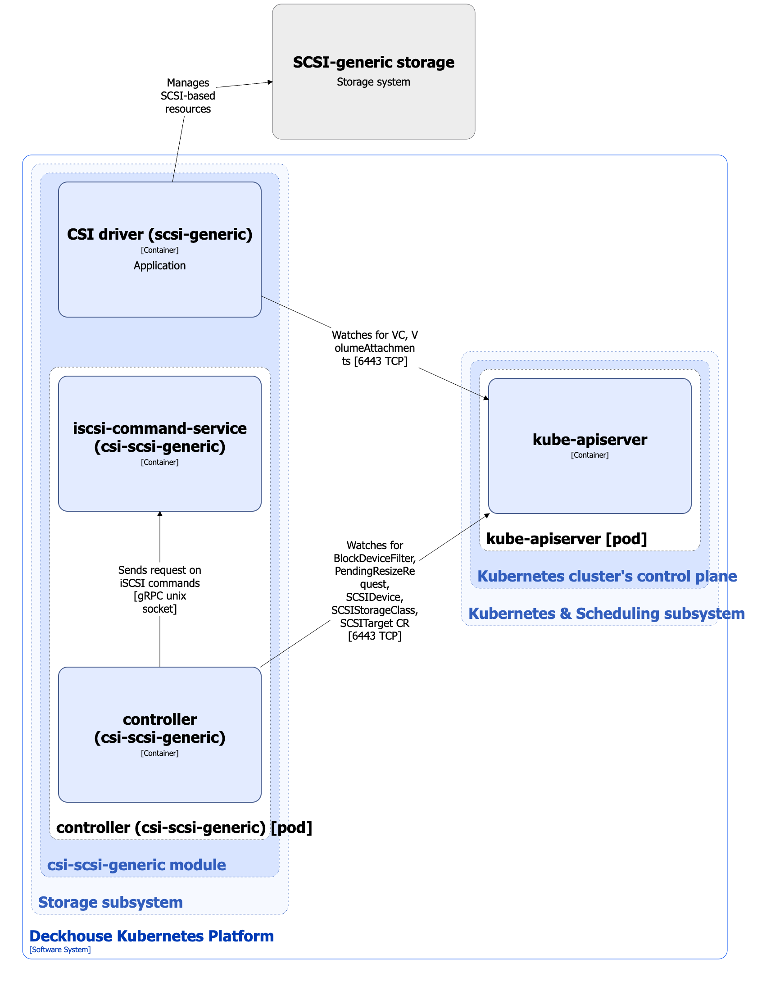

The [`csi-scsi-generic`](/modules/csi-scsi-generic/) module is designed to manage volumes on storage systems connected over SCSI. It enables creating StorageClass resources in Kubernetes using the SCSIStorageClass custom resource.

For more details about the module, refer to [the module documentation](/modules/csi-scsi-generic/).

## Module architecture


The following simplifications are made in the diagram:

* The diagram shows containers in different pods interacting directly with each other. In reality, they communicate via the corresponding Kubernetes Services (internal load balancers). Service names are omitted if they are obvious from the diagram context. Otherwise, the Service name is shown above the arrow.
* Pods may run multiple replicas. However, each pod is shown as a single replica in the diagram.


The Level 2 C4 architecture of the [`csi-scsi-generic`](/modules/csi-scsi-generic/) module and its interactions with other components of Deckhouse Kubernetes Platform (DKP) are shown in the following diagram:

<!--- Source: structurizr code from https://fox.flant.com/team/d8-system-design/doc/-/tree/main/architecture/diagrams/C4_EN --->

## Module components

The module consists of the following components:

1. **Controller**: A controller that reconciles the following [custom resources](/modules/csi-scsi-generic/stable/cr.html):

* SCSITarget: Description of a storage connection endpoint (iSCSI/FC).
* SCSIDevice: Description of a discovered SCSI device.
* PendingResizeRequest: A request for deferred PVC expansion when the requested size is larger than the current device size.
* SCSIStorageClass: Defines configuration for Kubernetes StorageClass.

  SCSIStorageClass defines the device selector (`scsiDeviceSelector`), reclaim policy, and volume cleanup parameters.

  It consists of the following containers:

* **controller**: Main container.
* **iscsi-command-service**: Sidecar container implementing SCSI device discovery.

1. **CSI driver (`csi-scsi-generic`)**: CSI driver implementation for the `scsi-generic.csi.storage.deckhouse.io` provisioner. To study the architecture of the `csi-scsi-generic` CSI driver, refer to [the CSI driver documentation page](../../storage/csi-drivers/csi-driver-scsi-generic.html).

## Module interactions

The module interacts with the following components:

1. **Kube-apiserver**:

  * Watches PersistentVolume, PersistentVolumeClaim, VolumeAttachment, and StorageClass resources.
  * Reconciles BlockDeviceFilter, SCSITarget, SCSIDevice, PendingResizeRequest, and SCSIStorageClass custom resources.
  * Creates StorageClass resources.

1. **SCSI-connected storage systems**: Orchestrates the use of available SCSI devices, including their binding and cleanup, as well as node attachment.
