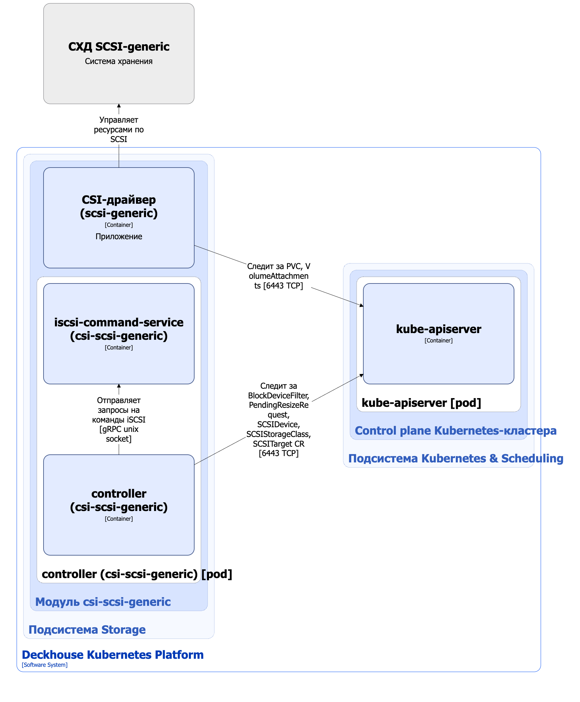

Модуль [`csi-scsi-generic`](/modules/csi-scsi-generic/) предназначен для управления томами на СХД с подключением по SCSI. Он позволяет создавать StorageClass в Kubernetes с помощью ресурса SCSIStorageClass.

Подробнее с описанием модуля можно ознакомиться [в разделе документации модуля](/modules/csi-scsi-generic/).

## Архитектура модуля


Для упрощения схемы приняты следующие допущения:

* На схеме показано, что контейнеры разных подов взаимодействуют друг с другом напрямую. Фактически они взаимодействуют через соответствующие сервисы Kubernetes (внутренние балансировщики). Названия сервисов не указываются, если они очевидны из контекста. В остальных случаях название сервиса указано над стрелкой.
* Поды могут быть запущены в нескольких репликах, однако на схеме все поды изображены в одной реплике.


Архитектура модуля [`csi-scsi-generic`](/modules/csi-scsi-generic/) на уровне 2 модели C4 и его взаимодействия с другими компонентами Deckhouse Kubernetes Platform (DKP) изображены на следующей диаграмме:

<!--- Source: structurizr code from https://fox.flant.com/team/d8-system-design/doc/-/tree/main/architecture/diagrams/C4_RU --->

## Компоненты модуля

Модуль состоит из следующих компонентов:

1. **Controller** — контроллер, обслуживающий следующие кастомные ресурсы:

    * [SCSITarget](/modules/csi-scsi-generic/cr.html#scsitarget) — описание точки подключения к СХД (iSCSI/FC);
    * [SCSIDevice](/modules/csi-scsi-generic/cr.html#scsidevice) — описание обнаруженного SCSI-устройства;
    * [PendingResizeRequest](/modules/csi-scsi-generic/cr.html#pendingresizerequest) — заявка на отложенное расширение PVC, если запрошенный размер больше текущего размера устройства;
    * [SCSIStorageClass](/modules/csi-scsi-generic/cr.html#scsistorageclass) — определяет конфигурацию для Kubernetes StorageClass;
    * BlockDeviceFilter — определяет фильтры для выбора физических SCSI-устройств, которые можно использовать для создания томов системой. Позволяет гибко управлять пулом доступных устройств путем задания правил по атрибутам устройств и исключения/разрешения отдельных устройств.

    В SCSIStorageClass задаются селектор устройств (`scsiDeviceSelector`), политика обработки тома при удалении PVC (reclaim policy) и параметры очистки тома.

    Состоит из следующих контейнеров:

    * **controller** — основной контейнер;
    * **iscsi-command-service** — сайдкар-контейнер, реализующий обнаружение SCSI-устройств.

1. **CSI-драйвер (`csi-scsi-generic`)** — реализация CSI-драйвера, использующего provisioner `scsi-generic.csi.storage.deckhouse.io`. С архитектурой CSI-драйвера `csi-scsi-generic` можно ознакомиться [в соответствующем разделе документации](../../storage/csi-drivers/csi-driver-scsi-generic.html).

## Взаимодействия модуля

Модуль взаимодействует со следующими компонентами:

1. **Kube-apiserver**:

    * мониторинг ресурсов PersistentVolume, PersistentVolumeClaim, VolumeAttachment, StorageClass;
    * работа с кастомными ресурсами BlockDeviceFilter, SCSITarget, SCSIDevice, PendingResizeRequest и SCSIStorageClass;
    * создание ресурса StorageClass.

1. **СХД с подключением по SCSI** — координация использования уже доступных SCSI-устройств, их привязка, очистка и подключение на узлах.
