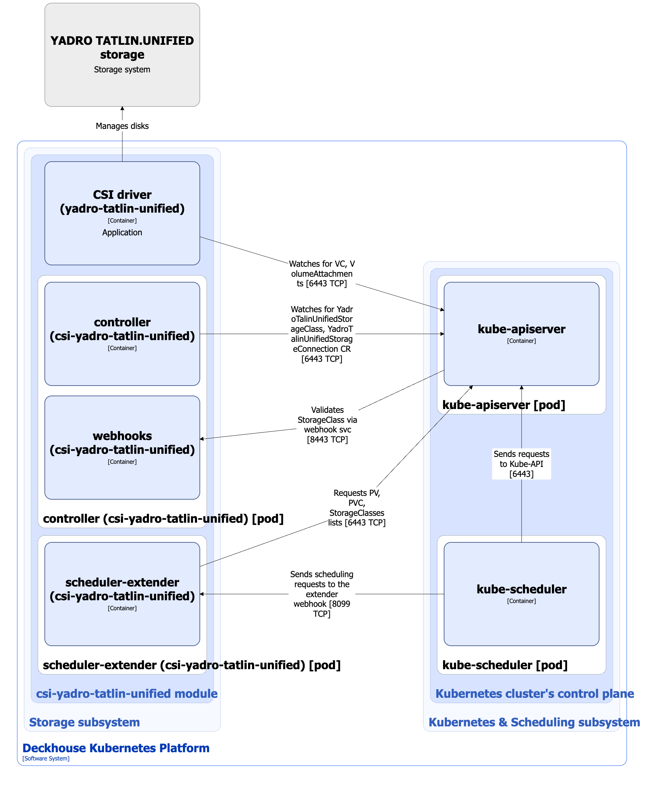

The [`csi-yadro-tatlin-unified`](/modules/csi-yadro-tatlin-unified/) module is designed to manage volumes using TATLIN.UNIFIED storage systems. It enables creating StorageClass resources in Kubernetes using the YadroTatlinUnifiedStorageClass custom resource.

For more details about the module, refer to [the module documentation](/modules/csi-yadro-tatlin-unified/).

## Module architecture


The following simplifications are made in the diagram:

* The diagram shows containers in different pods interacting directly with each other. In reality, they communicate via the corresponding Kubernetes Services (internal load balancers). Service names are omitted if they are obvious from the diagram context. Otherwise, the Service name is shown above the arrow.
* Pods may run multiple replicas. However, each pod is shown as a single replica in the diagram.


The Level 2 C4 architecture of the [`csi-yadro-tatlin-unified`](/modules/csi-yadro-tatlin-unified/) module and its interactions with other components of Deckhouse Kubernetes Platform (DKP) are shown in the following diagram:

<!--- Source: structurizr code from https://fox.flant.com/team/d8-system-design/doc/-/tree/main/architecture/diagrams/C4_EN --->

## Module components

The module consists of the following components:

1. **Controller**: A controller that reconciles the following [custom resources](/modules/csi-yadro-tatlin-unified/cr.html):

    * YadroTatlinUnifiedStorageConnection: Parameters for connecting to YADRO TATLIN.UNIFIED storage systems.
    * YadroTatlinUnifiedStorageClass: Defines configuration for creating Kubernetes StorageClass that uses the `csi-tatlinunified.yadro.com` provisioner.

    YadroTatlinUnifiedStorageClass defines connection parameters (YadroTatlinUnifiedStorageConnection), as well as resource pool name, filesystem type, and reclaim policy.

    It consists of the following containers:

    * **controller**: Main container.
    * **webhook**: Sidecar container implementing a webhook server for StorageClass resource validation.

1. **CSI driver (yadro-tatlin-unified)**: CSI driver implementation for the `csi-tatlinunified.yadro.com` provisioner. To study the typical CSI driver architecture used in DKP, refer to [the CSI driver documentation page](../../storage/csi-drivers/csi-driver-nfs.html).

1. **Scheduler-extender**: A single-container component that acts as an extender for kube-scheduler. It implements scheduling logic specific to pods using volumes from YADRO TATLIN.UNIFIED storage systems. During scheduling, node selectors defined in the YadroTatlinUnifiedStorageConnection custom resource under the `controlPlane` and `dataPlane` parameters are taken into account.

    The component may be absent if node selectors are not set in the YadroTatlinUnifiedStorageConnection custom resource.

## Module interactions

The module interacts with the following components:

1. **Kube-apiserver**:

    * Watches PersistentVolume, PersistentVolumeClaim, VolumeAttachment, and StorageClass resources.
    * Reconciles YadroTatlinUnifiedStorageConnection and YadroTatlinUnifiedStorageClass custom resources.
    * Creates StorageClass resources.

1. **YADRO TATLIN.UNIFIED storage system**: Creates and deletes volumes, and attaches/detaches volumes to/from nodes.

The following external components interact with the module:

1. **Kube-apiserver**: Validates standard StorageClass resources.
