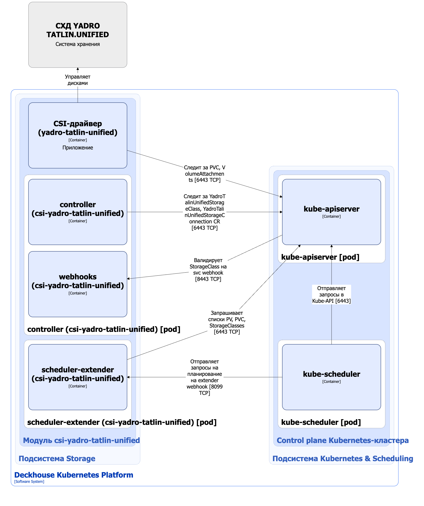

Модуль [`csi-yadro-tatlin-unified`](/modules/csi-yadro-tatlin-unified/) предназначен для управления томами c использованием систем хранения данных TATLIN.UNIFIED. Он позволяет создавать StorageClass в Kubernetes с помощью ресурса YadroTatlinUnifiedStorageClass.

Подробнее с описанием модуля можно ознакомиться [в разделе документации модуля](/modules/csi-yadro-tatlin-unified/).

## Архитектура модуля


Для упрощения схемы приняты следующие допущения:

* На схеме показано, что контейнеры разных подов взаимодействуют друг с другом напрямую. Фактически они взаимодействуют через соответствующие сервисы Kubernetes (внутренние балансировщики). Названия сервисов не указываются, если они очевидны из контекста. В остальных случаях название сервиса указано над стрелкой.
* Поды могут быть запущены в нескольких репликах, однако на схеме все поды изображены в одной реплике.


Архитектура модуля [`csi-yadro-tatlin-unified`](/modules/csi-yadro-tatlin-unified/) на уровне 2 модели C4 и его взаимодействия с другими компонентами Deckhouse Kubernetes Platform (DKP) изображены на следующей диаграмме:

<!--- Source: structurizr code from https://fox.flant.com/team/d8-system-design/doc/-/tree/main/architecture/diagrams/C4_RU --->

## Компоненты модуля

Модуль состоит из следующих компонентов:

1. **Controller** — контроллер, обслуживающий следующие [кастомные ресурсы](/modules/csi-yadro-tatlin-unified/cr.html):

    * YadroTatlinUnifiedStorageConnection — параметры подключения к СХД Yadro.Tatlin;
    * YadroTatlinUnifiedStorageClass — определяет конфигурацию для создаваемого Kubernetes StorageClass, который использует provisioner `csi-tatlinunified.yadro.com`.

    В YadroTatlinUnifiedStorageClass задаются параметры подключения (YadroTatlinUnifiedStorageConnection), а так же название пула ресурсов, тип файловой системы и reclaim policy.

    Состоит из следующих контейнеров:

    * **controller** — основной контейнер;
    * **webhook** — сайдкар-контейнер, реализующий вебхук-сервер для проверки ресурсов StorageClass.

1. **CSI-драйвер (yadro-tatlin-unified)** — реализация CSI-драйвера для provisioner `csi-tatlinunified.yadro.com`. С типовой архитектурой CSI-драйвера, используемого в DKP, можно ознакомиться [на странице описания CSI-драйвера](../../cluster-and-infrastructure/infrastructure/csi-driver.html).

1. **Scheduler-extender** — состоит из одного контейнера, представляет собой расширение (extender) для kube-scheduler. Реализует специфичную для подов логику размещения при использовании томов СХД Yadro.Tatlin. При планировании подов учитываются селекторы узлов, заданные в кастомном ресурсе YadroTatlinUnifiedStorageConnection в параметрах `controlPlane` и `dataPlane`.

    Компонент может отсутствовать если селекторы узлов в кастомном ресурсе YadroTatlinUnifiedStorageConnection не заданы.

## Взаимодействия модуля

Модуль взаимодействует со следующими компонентами:

1. **Kube-apiserver**:

    * мониторинг ресурсов PersistentVolume, PersistentVolumeClaim, VolumeAttachment, StorageClass;
    * работа с кастомными ресурсами YadroTatlinUnifiedStorageConnection, YadroTatlinUnifiedStorageClass;
    * создание ресурса StorageClass.

1. **СХД YADRO TATLIN.UNIFIED** — создание и удаление томов, подключение и отключение томов от узлов.

С модулем взаимодействуют следующие внешние компоненты:

* **Kube-apiserver** — валидация стандартных ресурсов StorageClass.
