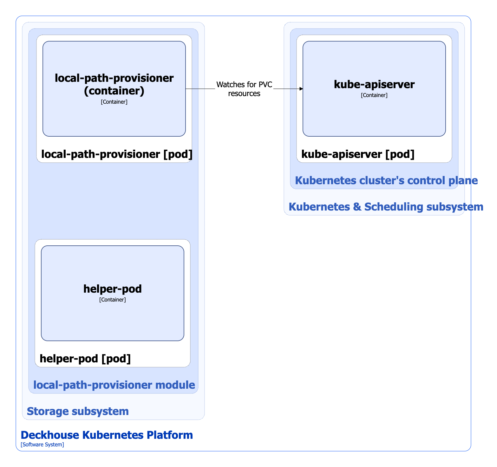

The `local-path-provisioner` module provides the local storage on Kubernetes nodes using `HostPath` volumes and creates StorageClass resources to manage the allocation of local storage.

For more details about module, refer to the [corresponding documentation section](/modules/local-path-provisioner/).

## Module architecture


The following simplifications are made in the diagram:

* The diagram shows containers in different pods interacting directly with each other. In reality, they communicate via the corresponding Kubernetes Services (internal load balancers). Service names are omitted if they are obvious from the diagram context. Otherwise, the Service name is shown above the arrow.
* Pods may run multiple replicas. However, each pod is shown as a single replica in the diagram.


The Level 2 C4 architecture of the [`local-path-provisioner`](/modules/local-path-provisioner/) module and its interactions with other components of Deckhouse Kubernetes Platform (DKP) are shown in the following diagrams:

<!--- Source: structurizr code from https://fox.flant.com/team/d8-system-design/doc/-/tree/main/architecture/diagrams/C4_EN --->

## Module components

The module consists of the following components:

1. **Local-path-provisioner**: It performs the following actions when a pod orders a disk:

   * Creates a PersistentVolume of the `HostPath` volume type.
   * Creates a local disk directory for the volume on the target node. The directory path is based on the [`path`](/modules/local-path-provisioner/cr.html#localpathprovisioner-v1alpha1-spec-path) parameter of the LocalPathProvisioner custom resource, as well as the PersistentVolume and PersistentVolumeClaim names.

   It consists of a single container:

   * **local-path-provisioner**: It is an [open source project](https://github.com/rancher/local-path-provisioner).

2. **Helper-pod**: It runs an installation script (`SETUP`) on the node before creating the volume to prepare the volume directory on the node and a cleanup script (`TEARDOWN`) after deleting the volume to clear the volume directory on the node.

   It consists of a single container:

   * **helper-pod**

## Module interactions

The module interacts with the following components:

1. **Kube-apiserver**:

   * Manages PersistentVolumeClaim resources.
