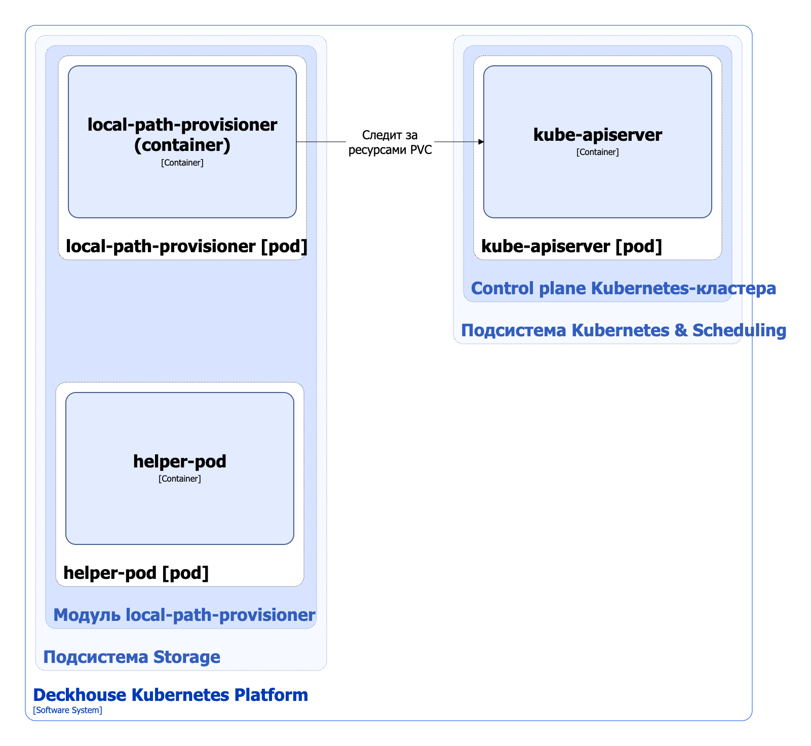

Модуль `local-path-provisioner` предоставляет локальное хранилище на узлах Kubernetes с использованием томов `HostPath` и создает ресурсы StorageClass для управления выделением локального хранилища.

Подробнее с описанием модуля можно ознакомиться в [соответствующем разделе документации](/modules/local-path-provisioner/).

## Архитектура модуля


Для упрощения схемы приняты следующие допущения:

* На схеме показано, что контейнеры разных подов взаимодействуют друг с другом напрямую. Фактически они взаимодействуют через соответствующие сервисы Kubernetes (внутренние балансировщики). Названия сервисов не указываются, если они очевидны из контекста. В остальных случаях название сервиса указано над стрелкой.
* Поды могут быть запущены в нескольких репликах, однако на схеме все поды изображены в одной реплике.


Архитектура модуля [`local-path-provisioner`](/modules/local-path-provisioner/) на уровне 2 модели C4 и его взаимодействия с другими компонентами Deckhouse Kubernetes Platform (DKP) изображены на следующей диаграмме:

<!--- Source: structurizr code from https://fox.flant.com/team/d8-system-design/doc/-/tree/main/architecture/diagrams/C4_RU --->

## Компоненты модуля

Модуль состоит из следующих компонентов:

1. **Local-path-provisioner** — выполняет следующие действия, когда под заказывает диск:

   * создает PersistentVolume с типом тома `HostPath`;
   * создает на нужном узле локальный каталог для тома. Путь к каталогу формируется на основе [параметра `path`](/modules/local-path-provisioner/cr.html#localpathprovisioner-v1alpha1-spec-path) кастомного ресурса LocalPathProvisioner, а также имени PersistentVolume и PersistentVolumeClaim.

   Состоит из одного контейнера:

   * **local-path-provisioner** — является [Open Source-проектом](https://github.com/rancher/local-path-provisioner).

2. **Helper-pod** — запускает на узле скрипт установки (`SETUP`) перед созданием тома, чтобы подготовить каталог тома на узле, и скрипт очистки (`TEARDOWN`) после удаления тома, чтобы очистить каталог тома на узле.

   Состоит из одного контейнера:

   * **helper-pod**.

## Взаимодействия модуля

Модуль взаимодействует со следующими компонентами:

1. **Kube-apiserver**:

   * мониторинг ресурсов PersistentVolumeClaim.
