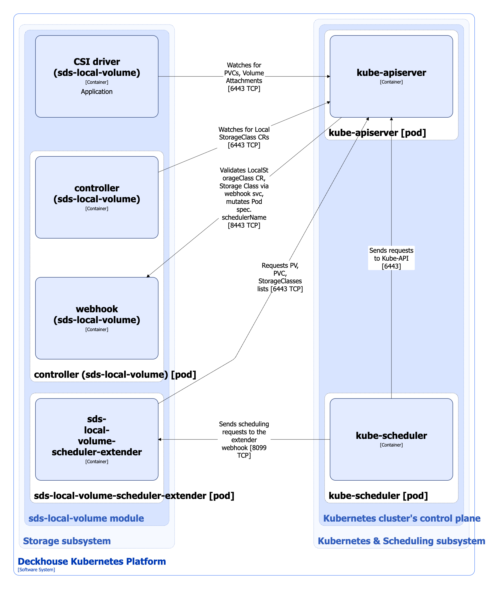

The `sds-local-volume` module is designed to manage local block storage based on LVM. It enables creating StorageClasses in Kubernetes using the LocalStorageClass resource.

For more details about module, refer to [the module documentation section](/modules/sds-local-volume/).

## Module architecture


The following simplifications are made in the diagram:

* The diagram shows containers in different pods interacting directly with each other. In reality, they communicate via the corresponding Kubernetes Services (internal load balancers). Service names are omitted if they are obvious from the diagram context. Otherwise, the Service name is shown above the arrow.
* Pods may run multiple replicas. However, each pod is shown as a single replica in the diagram.


The Level 2 C4 architecture of the [`sds-local-volume`](/modules/sds-local-volume/) module and its interactions with other components of Deckhouse Kubernetes Platform (DKP) are shown in the following diagrams:

<!--- Source: structurizr code from https://fox.flant.com/team/d8-system-design/doc/-/tree/main/architecture/diagrams/C4_RU --->

## Module components

The module consists of the following components:

1. **Controller**: It reconciles [LocalStorageClass](/modules/sds-local-volume/cr.html#localstorageclass) custom resources. LocalStorageClass is a Kubernetes custom resource that defines the configuration for Kubernetes StorageClass. The StorageClass being created uses `local.csi.storage.deckhouse.io` provisioner. StorageClass configures LVM logical volume types, VolumeGroups settings, reclaim policy, volume binding mode, etc. These settings are used by the provisioner of CSI driver (`sds-local-volume`) when managing LVM-based local volumes.

   It consists of the following containers:

   * **controller**: Main container.
   * **webhook**: A sidecar container that implements a webhook server for validating LocalStorageClass custom resources, StorageClass resources, as well as for mutating the `spec.schedulerName` attribute of pods using volumes created by `local.csi.storage.deckhouse.io` provisioner. As a result of the mutation, `sds-local-volume` is filled in the name of the scheduler (`spec.schedulerName`) in the pod specification, so that the placement of the pod is determined not by the standard Kubernetes scheduler (kube-scheduler), but by the `sds-local-volume-scheduler-extender` component from this module.

1. **Sds-local-volume-scheduler-extender**: It consists of a single container. It is a kube-scheduler extender, which implements a scheduling logic specific for pods using local volumes. When planning, the free space on the nodes used to place local volumes on them is taken into account, as well as the size of the disk space that needs to be reserved for these volumes.

1. **CSI driver (`sds-local-volume`)**: It is an implementation of the CSI driver for `local.csi.storage.deckhouse.io`. To study the CSI driver typical architecture used in DKP, refer to [the CSI-driver architecture documentation section](../cluster-and-infrastructure/infrastructure/csi-driver.html). CSI driver (`sds-local-volume`) is developed by Flant.

## Module interactions

The module interacts with the following components:

1. **Kube-apiserver**:

   * Watches for PersistentVolume, PersistentVolumeClaim, VolumeAttachment and StorageClass resources.
   * Reconciles LocalStorageClass custom resources.
   * Creates StorageClass resources.

The following external components interact with the module:

1. **Kube-apiserver**:

   * Validates LocalStorageClass custom resources and StorageClass resources.
   * Mutates `spec.schedulerName` attribute for pods which use volumes created by `local.csi.storage.deckhouse.io` provisioner.

1. **Kube-scheduler**: Sends scheduling requests to the `sds-local-volume-scheduler-extender` webhook for the pods with `sds-local-volume` value specified in the `spec.schedulerName` attribute.
