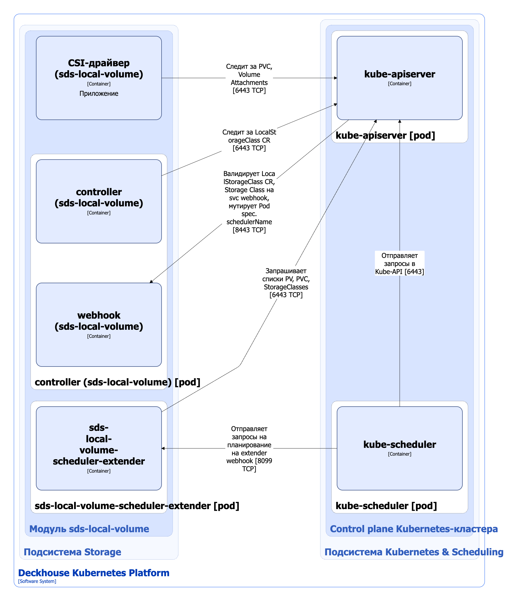

Модуль `sds-local-volume` предназначен для управления локальным блочным хранилищем на базе LVM. Он позволяет создавать StorageClass в Kubernetes с помощью ресурса LocalStorageClass.

Подробнее с описанием модуля можно ознакомиться [в разделе документации модуля](/modules/sds-local-volume/).

## Архитектура модуля


Для упрощения схемы приняты следующие допущения:

* На схеме показано, что контейнеры разных подов взаимодействуют друг с другом напрямую. Фактически они взаимодействуют через соответствующие сервисы Kubernetes (внутренние балансировщики). Названия сервисов не указываются, если они очевидны из контекста. В остальных случаях название сервиса указано над стрелкой.
* Поды могут быть запущены в нескольких репликах, однако на схеме все поды изображены в одной реплике.


Архитектура модуля [`sds-local-volume`](/modules/sds-local-volume/) на уровне 2 модели C4 и его взаимодействия с другими компонентами Deckhouse Kubernetes Platform (DKP) изображены на следующей диаграмме:

<!--- Source: structurizr code from https://fox.flant.com/team/d8-system-design/doc/-/tree/main/architecture/diagrams/C4_RU --->

## Компоненты модуля

Модуль состоит из следующих компонентов:

1. **Controller** — контроллер, обслуживающий кастомные ресурсы [LocalStorageClass](/modules/sds-local-volume/cr.html#localstorageclass). LocalStorageClass — пользовательский ресурс Kubernetes, определяющий конфигурацию для Kubernetes StorageClass. Создаваемый StorageClass использует `local.csi.storage.deckhouse.io` provisioner. В StorageClass задаются типы логических томов LVM, параметры VolumeGroups, reclaim policy, volume binding mode и другие настройки. Эти параметры используются provisioner’ом CSI-драйвера `sds-local-volume` при управлении локальными томами на базе LVM.

   Состоит из следующих контейнеров:

   * **controller** — основной контейнер;
   * **webhook** — сайдкар-контейнер, реализующий вебхук-сервер для проверки кастомных ресурсов LocalStorageClass и ресурсов StorageClass, а также для изменения значения поля `spec.schedulerName` у подов, использующих тома, созданные provisioner’ом `local.csi.storage.deckhouse.io`. После изменения значением поля `spec.schedulerName` становится `sds-local-volume`, что позволяет передать планирование таких подов компоненту `sds-local-volume-scheduler-extender` вместо стандартного планировщика Kubernetes (kube-scheduler).

1. **Sds-local-volume-scheduler-extender** — состоит из одного контейнера, представляет собой расширение (extender) для kube-scheduler, реализует специфичную для подов, использующих локальные тома логику размещения. При планировании учитывается свободное место на узлах, используемых для размещения на них локальных томов, а также размер дискового пространства, которое надо зарезервировать под эти тома.

1. **CSI-драйвер (`sds-local-volume`)** — реализация CSI-драйвера для `local.csi.storage.deckhouse.io` provisioner. С типовой архитектурой CSI-драйвера, используемого в DKP, можно ознакомиться [в разделе документации архитектуры CSI-драйвера](../cluster-and-infrastructure/infrastructure/csi-driver.html). CSI-драйвер (`sds-local-volume`) — разработка компании Флант.

## Взаимодействия модуля

Модуль взаимодействует со следующими компонентами:

1. **Kube-apiserver**:

   * мониторинг ресурсов PersistentVolume, PersistentVolumeClaim, VolumeAttachment, StorageClass;
   * работа с кастомными ресурсами LocalStorageClass;
   * создание ресурса StorageClass.

С модулем взаимодействуют следующие внешние компоненты:

1. **Kube-apiserver**:

   * валидация кастомных ресурсов LocalStorageClass, ресурсов StorageClass;
   * изменение поля `spec.schedulerName` подов, использующих тома, созданные при помощи `local.csi.storage.deckhouse.io` provisioner.

1. **Kube-scheduler** — отправка на вебхук `sds-local-volume-scheduler-extender` запросов на планирование подов, в поле `spec.schedulerName` которых указано значение `sds-local-volume`.
