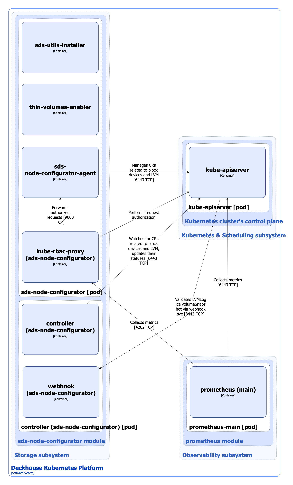

The [`sds-node-configurator`](/modules/sds-node-configurator/) manages block devices and LVM on Kubernetes cluster nodes through Kubernetes custom resources, performing following operations:

- Automatic discovery of block devices and creation/update/deletion of corresponding [BlockDevice](/modules/sds-node-configurator/cr.html#blockdevice) custom resources.
- Automatic discovery of LVM Volume Groups with `storage.deckhouse.io/enabled=true` LVM tag and thin pools on them on nodes, as well as management of corresponding [LVMVolumeGroup](/modules/sds-node-configurator/cr.html#lvmvolumegroup) resources. The module automatically creates a [LVMVolumeGroup](/modules/sds-node-configurator/cr.html#lvmvolumegroup) resource if it doesn't exist yet for the discovered LVM Volume Group.
- Scanning LVM Physical Volumes on nodes that are part of managed LVM Volume Groups. When underlying block devices are expanded, corresponding LVM Physical Volumes are automatically increased (performs pvresize).
- Creation/expansion/deletion of LVM Volume Groups on the node according to [LVMVolumeGroup](/modules/sds-node-configurator/cr.html#lvmvolumegroup) resource settings.

For more details about the module, refer to [the module documentation](/modules/sds-node-configurator/) section.

## Module architecture


The following simplifications are made in the diagram:

- The diagram shows containers in different pods interacting directly with each other. In reality, they communicate via the corresponding Kubernetes Services (internal load balancers). Service names are omitted if they are obvious from the diagram context. Otherwise, the Service name is shown above the arrow.
- Pods may run multiple replicas. However, each pod is shown as a single replica in the diagram.


The Level 2 C4 architecture of the [`sds-node-configurator`](/modules/sds-node-configurator/) module and its interactions with other components of DKP are shown in the following diagrams:

<!--- Source: structurizr code from https://fox.flant.com/team/d8-system-design/doc/-/tree/main/architecture/diagrams/C4_EN --->

## Module components

The module consists of the following components:

1. **Sds-node-configurator** (DaemonSet): A controller running on cluster nodes and performing mentioned above operations  with BlockDevice, LVMVolumeGroup, LVMLogicalVolume, LVMLogicalVolumeSnapshot custom resources, etc. The full list of resources managed by the module is provided in [the module documentation](/modules/sds-node-configurator/cr.html).

   It consists of the following containers:

   - **sds-utils-installer**: Init container that installs a set of utilities necessary for managing block devices and LVM volumes.
   - **thin-volumes-enabler**: Init container that enables thin volumes.
   - **sds-node-configurator-agent**: Main container.
   - **kube-rbac-proxy**: Sidecar container with an authorization proxy based on Kubernetes RBAC that provides secure access to the controller metrics. It is an [open-source project](https://github.com/brancz/kube-rbac-proxy).

1. **Controller** (Deployment): A controller that monitors custom resources related to block devices and LVM. The controller works with the metadata of resources and updates their statuses.

   It consists of the following containers:

   - **controller**: Main container.
   - **webhook**: Sidecar container that implements a webhook server for [LVMLogicalVolumeSnapshot](/modules/sds-node-configurator/cr.html#lvmlogicalvolumesnapshot) custom resources validation. If used edition of DKP does not support LVM logical volume snapshots functionality, [LVMLogicalVolumeSnapshot](/modules/sds-node-configurator/cr.html#lvmlogicalvolumesnapshot) custom resource does not pass validation.

## Module interactions

The module interacts with the following components:

1. **Kube-apiserver**:
   - Reconciles custom resources related to block devices and LVM.
   - Authorizes requests for metrics.

The following external components interact with the module:

1. **Kube-apiserver**: Validates [LVMLogicalVolumeSnapshot](/modules/sds-node-configurator/cr.html#lvmlogicalvolumesnapshot) custom resources.
1. **Prometheus-main**: Collects `sds-node-configurator` metrics.
