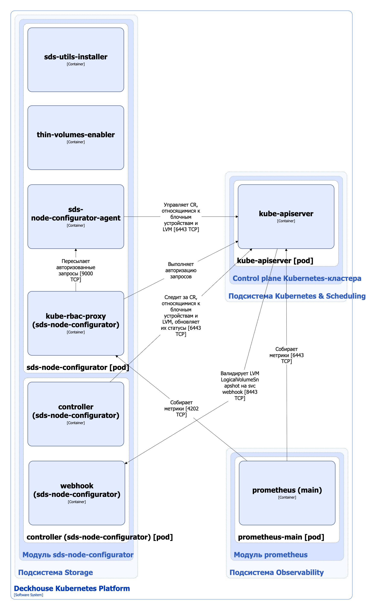

Модуль [`sds-node-configurator`](/modules/sds-node-configurator/) управляет LVM на узлах кластера с помощью кастомных ресурсов Kubernetes и выполняет следующие операции:

- Автоматически обнаруживает блочные устройства и создает, обновляет или удаляет соответствующие ресурсы [BlockDevice](/modules/sds-node-configurator/cr.html#blockdevice).
- Автоматически обнаруживает на узлах группы томов LVM с тегом `storage.deckhouse.io/enabled=true`, а также thin pool в их составе, и управляет соответствующими ресурсами [LVMVolumeGroup](/modules/sds-node-configurator/cr.html#lvmvolumegroup). Если для обнаруженной группы томов ресурс [LVMVolumeGroup](/modules/sds-node-configurator/cr.html#lvmvolumegroup) отсутствует, модуль создает его автоматически.
- Сканирует физические тома LVM, входящие в управляемые группы томов. При увеличении базовых блочных устройств автоматически расширяет соответствующие физические тома LVM с помощью `pvresize`.
- Создает, расширяет и удаляет группы томов LVM на узле в соответствии с настройками ресурсов [LVMVolumeGroup](/modules/sds-node-configurator/cr.html#lvmvolumegroup).

Подробнее с описанием модуля можно ознакомиться [в разделе документации модуля](/modules/sds-node-configurator/).

## Архитектура модуля


Для упрощения схемы приняты следующие допущения:

- На схеме контейнеры разных подов показаны как взаимодействующие напрямую. Фактически обмен выполняется через соответствующие сервисы Kubernetes (внутренние балансировщики). Названия сервисов не указываются, если они очевидны из контекста. В остальных случаях название сервиса приводится над стрелкой.
- Поды могут быть запущены в нескольких репликах, однако на схеме каждый под показан в единственном экземпляре.


Архитектура модуля [`sds-node-configurator`](/modules/sds-node-configurator/) на уровне 2 модели C4 и его взаимодействия с другими компонентами DKP изображены на следующей диаграмме:

<!--- Source: structurizr code from https://fox.flant.com/team/d8-system-design/doc/-/tree/main/architecture/diagrams/C4_RU --->

## Компоненты модуля

Модуль состоит из следующих компонентов:

1. **Sds-node-configurator** (DaemonSet) — контроллер, запущенный на узлах кластера и выполняющий перечисленные выше операции с кастомными ресурсами BlockDevice, LVMVolumeGroup, LVMLogicalVolume, LVMLogicalVolumeSnapshot и т.д. Полный список ресурсов, которыми управляет модуль, приведён [в документации модуля](/modules/sds-node-configurator/cr.html).

   Компонент содержит следующие контейнеры:

   - **sds-utils-installer** — init-контейнер, устанавливающий набор утилит, необходимых для управления блочными устройствами и LVM-томами;
   - **thin-volumes-enabler** — init-контейнер, включающий поддержку thin томов;
   - **sds-node-configurator-agent** — основной контейнер;
   - **kube-rbac-proxy** — сайдкар-контейнер с авторизующим прокси на основе Kubernetes RBAC для организации защищенного доступа к метрикам контроллера. Является [Open Source-проектом](https://github.com/brancz/kube-rbac-proxy).

1. **Controller** (Deployment) — контроллер, следящий за кастомными ресурсами, относящимися к блочным устройствам и LVM. Controller работает с метаданными ресурсов и обновляет их статусы.

   Компонент содержит следующие контейнеры:

   - **controller** — основной контейнер;
   - **webhook** — сайдкар-контейнер, реализующий вебхук-сервер для проверки кастомных ресурсов [LVMLogicalVolumeSnapshot](/modules/sds-node-configurator/cr.html#lvmlogicalvolumesnapshot). Если используемая редакция DKP не поддерживает функционал снимков логических томов LVM, кастомный ресурс [LVMLogicalVolumeSnapshot](/modules/sds-node-configurator/cr.html#lvmlogicalvolumesnapshot) не проходит валидацию.

## Взаимодействия модуля

Модуль взаимодействует со следующими компонентами:

1. **Kube-apiserver**:
   - для работы с кастомными ресурсами, относящимися к блочным устройствам и LVM;
   - для авторизации запросов к метрикам.

С модулем взаимодействуют следующие внешние компоненты:

1. **Kube-apiserver** — выполняет валидацию кастомных ресурсов [LVMLogicalVolumeSnapshot](/modules/sds-node-configurator/cr.html#lvmlogicalvolumesnapshot).
1. **Kube-scheduler** — собирает метрики компонента `sds-node-configurator`.
