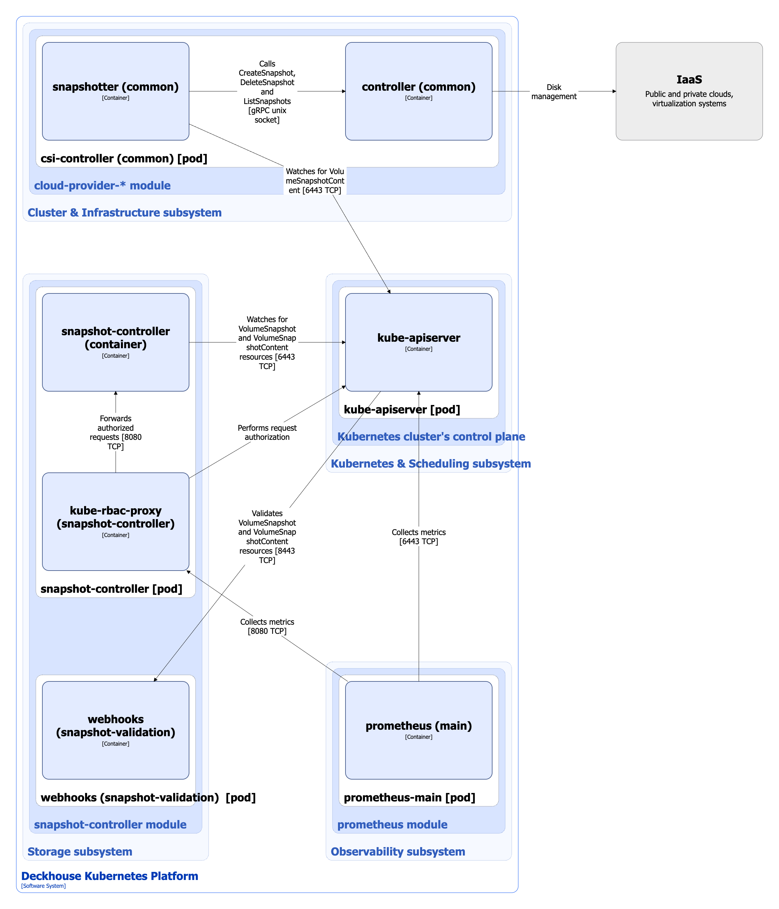

The `snapshot-controller` enables snapshot support for compatible CSI-drivers in Deckhouse Kubernetes Platform (DKP).

For more details about the module, refer to the [corresponding documentation section](/modules/snapshot-controller/).

## Module architecture


The following simplifications are made in the diagram:

* The diagram shows containers in different pods interacting directly with each other. In reality, they communicate via the corresponding Kubernetes Services (internal load balancers). Service names are omitted if they are obvious from the diagram context. Otherwise, the Service name is shown above the arrow.
* Pods may run multiple replicas. However, each pod is shown as a single replica in the diagram.


The Level 2 C4 architecture of the [`snapshot-controller`](/modules/snapshot-controller/) module and its interactions with other components of DKP are shown in the following diagrams:

<!--- Source: structurizr code from https://fox.flant.com/team/d8-system-design/doc/-/tree/main/architecture/diagrams/C4_EN --->

## Module components

The module consists of the following components:

1. **Snapshot-controller**: Works in conjunction with the snapshotter ([external-snapshotter](https://github.com/kubernetes-csi/external-snapshotter)) sidecar container of the csi-controller Pod of the `cloud-provider-*` module (as long as the provider's CSI driver supports snapshot creation).

   A single snapshot-controller is used for all installed CSI drivers. It watches for VolumeSnapshot and VolumeSnapshotContent resources. When a new VolumeSnapshot resource is created, the controller creates a VolumeSnapshotContent resource and binds them together. As a result, VolumeSnapshot points to a respective VolumeSnapshotContent, and that VolumeSnapshotContent points to the original VolumeSnapshot.

   Snapshot creation is multi-step process:

   1. Snapshot-controller creates a VolumeSnapshotContent resource.

   1. The snapshotter sidecar triggers snapshot creation through csi-controller on the corresponding node and updates the VolumeSnapshotContent status (`snapshotHandle`, `creationTime`, `restoreSize`, `readyToUse`, and `error` fields).

   1. Snapshot-controller watches for the VolumeSnapshotContent status and keeps updating the VolumeSnapshot status until the bi-directional binding is complete and the `readyToUse` field is set to `true`. If any error occurs, the `error` field is updated accordingly.

   It consists of the following containers:

   * **snapshot-controller**: It is an [open-source project](https://github.com/kubernetes-csi/external-snapshotter/tree/master/pkg/common-controller).
   * **kube-rbac-proxy**: Sidecar container with an authorization proxy based on Kubernetes RBAC that provides secure access to the controller metrics. It is an [open-source project](https://github.com/brancz/kube-rbac-proxy).

2. **Webhooks**: Component implementing a webhook server used for validating the VolumeSnapshot and VolumeSnapshotContent resources through [Validating Admission Controllers](https://kubernetes.io/docs/reference/access-authn-authz/admission-controllers/). It consists of a single container.

## Module interactions

The module interacts with the following components:

1. **Kube-apiserver**:

   * Watches for VolumeSnapshot and VolumeSnapshotContent resources.
   * Authorizes requests for controller metrics.

The following external components interact with the module:

1. **Kube-apiserver**: Uses the validation webhook to verify the created VolumeSnapshot and VolumeSnapshotContent resources.
2. **Prometheus-main**: Collects metrics from the controller.
