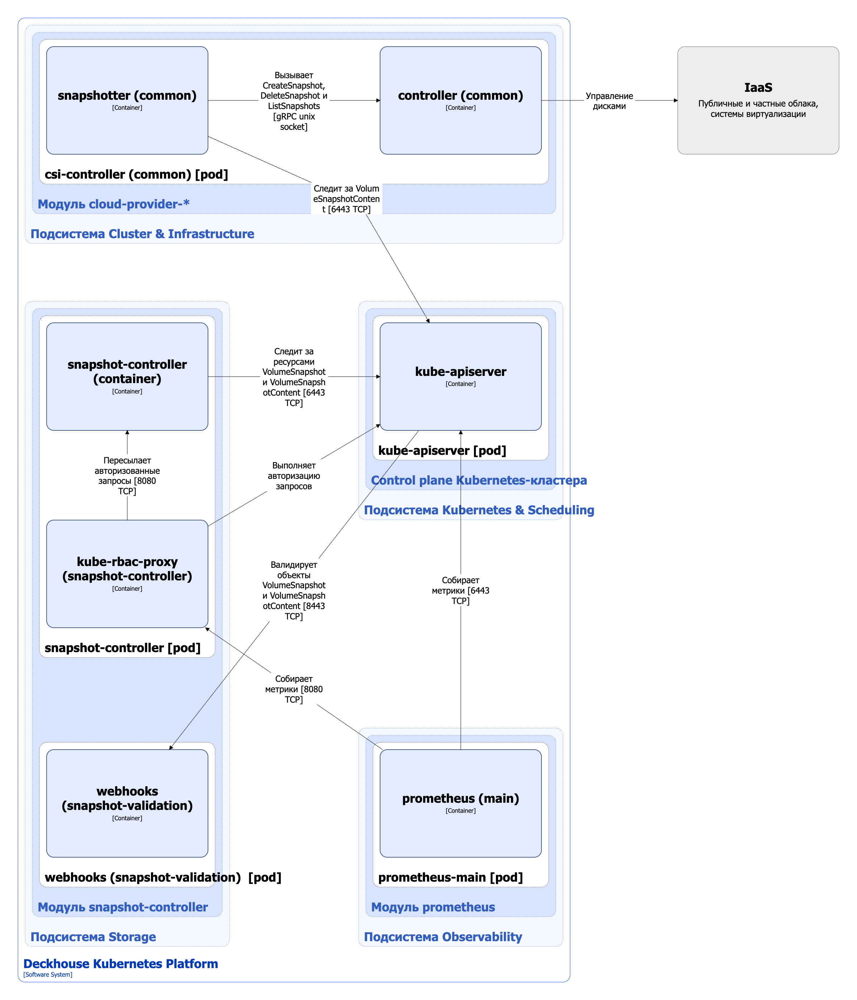

Модуль `snapshot-controller` включает поддержку снимков томов для совместимых CSI-драйверов в Deckhouse Kubernetes Platform (DKP).

Подробнее с описанием модуля можно ознакомиться в [соответствующем разделе документации](/modules/snapshot-controller/).

## Архитектура модуля


Для упрощения схемы приняты следующие допущения:

* На схеме показано, что контейнеры разных подов взаимодействуют друг с другом напрямую. Фактически они взаимодействуют через соответствующие сервисы Kubernetes (внутренние балансировщики). Названия сервисов не указываются, если они очевидны из контекста. В остальных случаях название сервиса указано над стрелкой.
* Поды могут быть запущены в нескольких репликах, однако на схеме все поды изображены в одной реплике.


Архитектура модуля [`snapshot-controller`](/modules/snapshot-controller/) на уровне 2 модели C4 и его взаимодействия с другими компонентами DKP изображены на следующей диаграмме:

<!--- Source: structurizr code from https://fox.flant.com/team/d8-system-design/doc/-/tree/main/architecture/diagrams/C4_RU --->

## Компоненты модуля

Модуль состоит из следующих компонентов:

1. **Snapshot-controller** — контроллер снимков, работающий совместно с сайдкар-контейнером snapshotter ([external-snapshotter](https://github.com/kubernetes-csi/external-snapshotter)) пода csi-controller модуля `cloud-provider-*` (при условии, что CSI-драйвер провайдера поддерживает создание снимков).

   Для всех установленных CSI-драйверов используется один snapshot-controller, который следит за ресурсами VolumeSnapshot и VolumeSnapshotContent. При появлении нового ресурса VolumeSnapshot контроллер создает ресурс VolumeSnapshotContent и связывает их между собой. В результате VolumeSnapshot ссылается на соответствующий VolumeSnapshotContent, а тот — на исходный VolumeSnapshot.

   Создание снимка — это многоступенчатый процесс:

   1. Snapshot-controller создает ресурс VolumeSnapshotContent.

   1. Сайдкар snapshotter запускает создание снимка с помощью csi-controller на соответствующем узле и обновляет статус VolumeSnapshotContent (поля `snapshotHandle`, `creationTime`, `restoreSize`, `readyToUse` и `error`).

   1. Snapshot-controller отслеживает статус VolumeSnapshotContent и обновляет статус ресурса VolumeSnapshot до завершения двунаправленной привязки и установки поля `readyToUse` в значение `true`. При возникновении ошибки аналогичным образом обновляется поле `error`.

   Состоит из следующих контейнеров:

   * **snapshot-controller** — является [Open Source-проектом](https://github.com/kubernetes-csi/external-snapshotter/tree/master/pkg/common-controller);
   * **kube-rbac-proxy** — сайдкар-контейнер с авторизующим прокси на основе Kubernetes RBAC для организации защищенного доступа к метрикам контроллера. Является [Open Source-проектом](https://github.com/brancz/kube-rbac-proxy).

2. **Webhooks** — компонент, реализующий вебхук-сервер для валидации ресурсов VolumeSnapshot и VolumeSnapshotContent с помощью механизма [Validating Admission Controllers](https://kubernetes.io/docs/reference/access-authn-authz/admission-controllers/). Состоит из одного контейнера.

## Взаимодействия модуля

Модуль взаимодействует со следующими компонентами:

1. **Kube-apiserver**:

   * мониторинг ресурсов VolumeSnapshot и VolumeSnapshotContent;
   * авторизация запросов на получение метрик контроллера.

С модулем взаимодействуют следующие внешние компоненты:

1. **Kube-apiserver** — использование вебхука валидации для проверки создаваемых ресурсов VolumeSnapshot и VolumeSnapshotContent.
2. **Prometheus-main** — сбор метрик контроллера.
