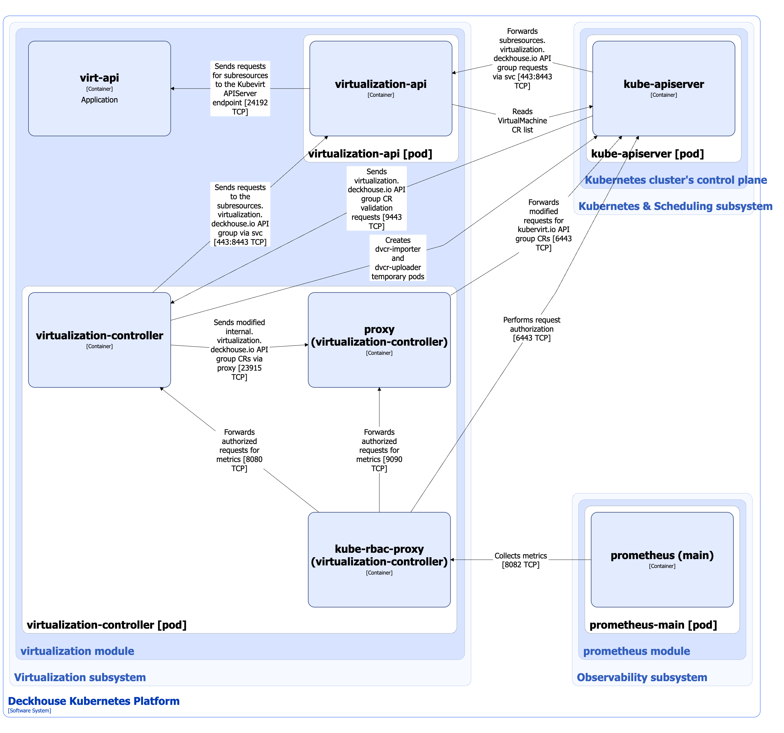

The Virtualization API component of the [`virtualization`](/modules/virtualization/) module manages custom resources of the following API groups:

1. `virtualization.deckhouse.io`: The main group, it includes the following custom resources:

   - [VirtualMachine](/modules/virtualization/cr.html#virtualmachine): A resource that describes the virtual machine (VM) configuration and status.
   - [VirtualMachineClass](/modules/virtualization/cr.html#virtualmachineclass): A resource that describes a set of parameters for [VirtualMachine](/modules/virtualization/cr.html#virtualmachine) resources, such as CPU and RAM specification, `NodeSelector`, and `Tolerations`.
   - [VirtualDisk](/modules/virtualization/cr.html#virtualdisk): A resource that describes desired VM disk configuration.
   - [VirtualImage](/modules/virtualization/cr.html#virtualimage): A resource that describes:
     - a VM disk image that can be used as a data source for new [VirtualDisk](/modules/virtualization/cr.html#virtualdisk) resources.
     - an ISO installation image that can be mounted directly into a [VirtualMachine](/modules/virtualization/cr.html#virtualmachine) resource.

   The full list of the main API group resources is given [in the module documentation](/modules/virtualization/cr.html).

   Virtualization-controller manages the resources of the main group.

1. `subresources.virtualization.deckhouse.io`: Subresources group.
   Subresources are additional operations or actions that can be performed on core resources (for example, [VirtualMachine](/modules/virtualization/cr.html#virtualmachine)) via the Kubernetes API.
   They provide interfaces for managing specific aspects of resources without affecting the entire object.
   Instead of the declarative resource familiar to Kubernetes, they are endpoints for imperative operations.

   The group includes the following subresources:

   - `virtualmachines/console`;
   - `virtualmachines/vnc`;
   - `virtualmachines/portforward`;
   - `virtualmachines/addvolume`;
   - `virtualmachines/removevolume`;
   - `virtualmachines/freeze`;
   - `virtualmachines/unfreeze`;
   - `virtualmachines/addresourceclaim`;
   - `virtualmachines/removeresourceclaim`.

   Virtualization-api manages subresources.

The Virtualization API component of the module uses KubeVirt custom resources as a backend to manage VMs, VM disks, and images. [KubeVirt](https://github.com/kubevirt/kubevirt) is an open-source project that allows you to launch, deploy, and manage VMs using Kubernetes as an orchestration platform. It enables cooperation between traditional VMs and container workloads in the same Kubernetes cluster, providing a single control plane.

## Virtualization API architecture


The following simplifications are made in the diagram:

- The diagram shows containers in different pods interacting directly with each other. In reality, they communicate via the corresponding Kubernetes Services (internal load balancers). Service names are omitted if they are obvious from the diagram context. Otherwise, the Service name is shown above the arrow.
- Pods may run multiple replicas. However, each pod is shown as a single replica in the diagram.


The Level 2 C4 architecture of the Virtualization API component of the [`virtualization`](/modules/virtualization/) module and its interactions with other components of Deckhouse Kubernetes Platform (DKP) are shown in the following diagram:

<!--- Source: structurizr code from https://fox.flant.com/team/d8-system-design/doc/-/tree/main/architecture/diagrams/C4_RU --->

## Virtualization API components

Virtualization API consists of the following components:

1. **Virtualization-api**: A [Kubernetes Extension API Server](https://kubernetes.io/docs/tasks/extend-kubernetes/setup-extension-api-server/) that serves requests to the `subresources.virtualization.deckhouse.io` API group. Virtualization-api uses `subresources.kubevirt.io` API group subresources as a backend. Virtualization-api accesses the virt-api endpoint directly, which is a [Kubernetes Extension API Server](https://kubernetes.io/docs/tasks/extend-kubernetes/setup-extension-api-server/) that handles requests to similar `subresources.kubevirt.io` API group subresources. It consists of the **virtualization-api** container.

1. **Virtualization-controller**: A controller that performs the following operations:

   - Manages custom resources of the main `virtualization.deckhouse.io` API group. Virtualization-controller will not change the main portion of these custom resources: `labels`, `annotations`, and `spec`. Virtualization-controller can make the following changes to custom resources:

     - Adding and removing finalizers in the `metadata.finalizers` attribute.
     - Adding and removing entries in the `metadata.ownerReferences` attribute.
     - Modifying the `status` subresource.

     Virtualization-controller uses `kubevirt.io` API group custom resources as a backend.

   - Validation of `virtualization.deckhouse.io` API group resources using the [Validating Admission Controllers](https://kubernetes.io/docs/reference/access-authn-authz/admission-controllers/) mechanism.
   - Launching `dvcr-importer` and `dvcr-uploader` pods to import and upload VM disk and image data to the DVCR registry.
     [DVCR (or Deckhouse Virtualization Container Registry)](dvcr.html) is a specialized container registry for storing and caching VM images.
   - Performing operations on VMs by making requests to some subresources of the `subresources.virtualization.deckhouse.io` API group, for example `virtualmachines/freeze` and `virtualmachines/unfreeze`.

   The component consists of the following containers:

   - **virtualization-controller**: Main container that implements the controller and webhook server.
   - **proxy** (aka **kube-api-rewriter**): Sidecar container that performs modification of API requests passing through it, namely renaming the metadata of custom resources. This is necessary because KubeVirt components use API groups like `*.kubevirt.io`, and other components of the [`virtualization`](/modules/virtualization/) module use similar resources, but with API groups like `*.virtualization.deckhouse.io`. Kube-api-rewriter is a gateway that proxies requests between controllers that manage resources from different API groups and is an [open-source project](https://github.com/deckhouse/kube-api-rewriter).
   - **kube-rbac-proxy**: Sidecar container with an authorization proxy based on Kubernetes RBAC that provides secure access to the metrics of the controller and the proxy sidecar container. It is an [open-source project](https://github.com/brancz/kube-rbac-proxy).

## Virtualization API interactions

Virtualization-api interacts with the following components:

1. **Kube-apiserver**: Lists [VirtualMachine](/modules/virtualization/cr.html#virtualmachine) custom resources, which are needed to process requests to subresources.
1. **Virt-api**: Sends requests to the KubeVirt subresources.
   Requests pass through a similar proxy sidecar container that renames metadata from the `subresources.virtualization.deckhouse.io` API group to the `subresources.kubevirt.io` API group and proxies them to the virt-api endpoint (Kubernetes Extension API Server KubeVirt).

Virtualization-controller interacts with the following components:

1. **Kube-apiserver**:

   - Sends modified [virtualization module custom resources](/modules/virtualization/cr.html) via a proxy sidecar container that renames `internal.virtualization.deckhouse.io` API group resource metadata to `kubevirt.io` API group resource metadata.
   - Authorizes requests for metrics.

The following external components interact with the Virtualization API component:

1. **Kube-apiserver**:

   - Forwards requests to `subresources.virtualization.deckhouse.io` API group subresources.
   - Sends `virtualization.deckhouse.io` API group resource validation requests.

1. **Prometheus-main**: Collects component metrics.
