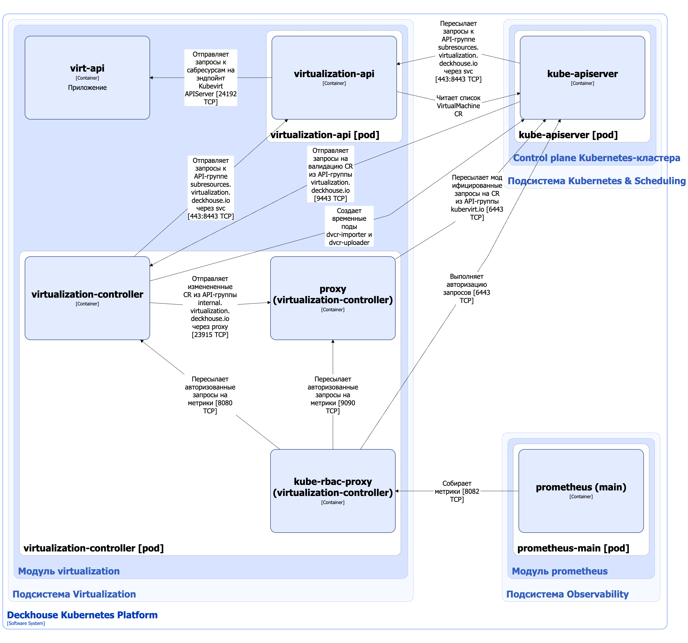

Компонент Virtualization API модуля [`virtualization`](/modules/virtualization/) управляет кастомными ресурсами следующих API-групп:

1. `virtualization.deckhouse.io` — основная группа, включает в себя следующие кастомные ресурсы:

   - [VirtualMachine](/modules/virtualization/cr.html#virtualmachine) — ресурс, описывающий конфигурацию и статус виртуальной машины (ВМ);
   - [VirtualMachineClass](/modules/virtualization/cr.html#virtualmachineclass) — ресурс, описывающий набор параметров для ресурсов [VirtualMachine](/modules/virtualization/cr.html#virtualmachine), таких, как спецификации CPU и RAM, `NodeSelector` и `Tolerations`;
   - [VirtualDisk](/modules/virtualization/cr.html#virtualdisk) — ресурс, описывающий желаемую конфигурацию диска ВМ;
   - [VirtualImage](/modules/virtualization/cr.html#virtualimage) — ресурс, описывающий: 
     - образ диска ВМ, который может использоваться в качестве источника данных для новых ресурсов [VirtualDisk](/modules/virtualization/cr.html#virtualdisk);
     - установочный образ ISO, который может быть смонтирован в ресурс [VirtualMachine](/modules/virtualization/cr.html#virtualmachine) напрямую.

   Полный список ресурсов основной API-группы приведён [в документации модуля](/modules/virtualization/cr.html).

   Ресурсами основной группы управляет компонент virtualization-controller.

1. `subresources.virtualization.deckhouse.io` — группа субресурсов.
   Субресурсы — это дополнительные операции или действия, которые можно выполнять над основными ресурсами (например, [VirtualMachine](/modules/virtualization/cr.html#virtualmachine)) через API Kubernetes. Они предоставляют интерфейсы для управления конкретными аспектами ресурсов, не затрагивая весь объект. Вместо привычного для Kubernetes декларативного ресурса они представляют собой эндпоинт для императивных операций.

   Группа включает в себя следующие субресурсы:

   - `virtualmachines/console`;
   - `virtualmachines/vnc`;
   - `virtualmachines/portforward`;
   - `virtualmachines/addvolume`;
   - `virtualmachines/removevolume`;
   - `virtualmachines/freeze`;
   - `virtualmachines/unfreeze`;
   - `virtualmachines/addresourceclaim`;
   - `virtualmachines/removeresourceclaim`.

   Субресурсами управляет компонент virtualization-api.

Компонент Virtualization API модуля для управления ВМ, дисками и образами ВМ использует в качестве бэкенда кастомные ресурсы KubeVirt.
[KubeVirt](https://github.com/kubevirt/kubevirt) — это Open Source-проект, который позволяет запускать, развёртывать и управлять ВМ с использованием Kubernetes в качестве платформы оркестрации. Он обеспечивает совместную работу традиционных ВМ и контейнерных рабочих нагрузок в одном кластере Kubernetes, предоставляя единую плоскость управления.

## Архитектура Virtualization API


Для упрощения схемы приняты следующие допущения:

- На схеме контейнеры разных подов показаны как взаимодействующие напрямую. Фактически обмен выполняется через соответствующие сервисы Kubernetes (внутренние балансировщики). Названия сервисов не указываются, если они очевидны из контекста. В остальных случаях название сервиса приводится над стрелкой.
- Поды могут быть запущены в нескольких репликах, однако на схеме каждый под показан в единственном экземпляре.


Архитектура компонента Virtualization API модуля [`virtualization`](/modules/virtualization/) на уровне 2 модели C4 и его взаимодействия с другими компонентами Deckhouse Kubernetes Platform (DKP) изображены на следующей диаграмме:

<!--- Source: structurizr code from https://fox.flant.com/team/d8-system-design/doc/-/tree/main/architecture/diagrams/C4_RU --->

## Компоненты Virtualization API

Virtualization API состоит из следующих компонентов:

1. **Virtualization-api** — [Kubernetes Extension API Server](https://kubernetes.io/docs/tasks/extend-kubernetes/setup-extension-api-server/), обслуживающий запросы к API-группе `subresources.virtualization.deckhouse.io`. В качестве бэкенда virtualization-api использует субресурсы из API-группы `subresources.kubevirt.io`. Virtualization-api обращается напрямую к эндпоинту компонента virt-api, который является [Kubernetes Extension API Server](https://kubernetes.io/docs/tasks/extend-kubernetes/setup-extension-api-server/) и обслуживает запросы к аналогичным субресурсам из API-группы `subresources.kubevirt.io`. Состоит из контейнера **virtualization-api**.

1. **Virtualization-controller** — контроллер, выполняющий следующие операции:

   - Управляет кастомными ресурсами основной API-группы `virtualization.deckhouse.io`. Virtualization-controller не изменяет основную часть этих кастомных ресурсов: `labels`, `annotations` и `spec`. Virtualization-controller может вносить следующие изменения в кастомные ресурсы:

     - добавление и удаление finalizers в атрибуте `metadata.finalizers`;
     - добавление и удаление записей в атрибуте `metadata.ownerReferences`;
     - изменение субресурса `status`.

     В качестве бэкенда virtualization-controller использует кастомные ресурсы из API-группы `kubevirt.io`.

   - валидация ресурсов из API-группы `virtualization.deckhouse.io` с помощью механизма [Validating Admission Controllers](https://kubernetes.io/docs/reference/access-authn-authz/admission-controllers/);
   - запуск подов`dvcr-importer` и `dvcr-uploader` для выполнения сценариев импорта и загрузки дисков и образов ВМ в хранилище образов DVCR.
     [DVCR (или Deckhouse Virtualization Container Registry)](dvcr.html) — специализированный реестр для хранения и кеширования образов ВМ.
   - выполнение операций над ВМ посредством запросов к некоторым субресурсам API-группы `subresources.virtualization.deckhouse.io`, например `virtualmachines/freeze` и `virtualmachines/unfreeze`.

   Компонент содержит следующие контейнеры:

   - **virtualization-controller** — основной контейнер, реализующий контроллер и вебхук-сервер;
   - **proxy** (он же **kube-api-rewriter**) — сайдкар-контейнер, выполняющий модификацию проходящих через него запросов API, а именно переименование метаданных кастомных ресурсов. Это необходимо, поскольку компоненты KubeVirt используют API-группы вида `*.kubevirt.io`, а другие компоненты модуля [`virtualization`](/modules/virtualization/) используют аналогичные ресурсы, но с API-группой вида `*.virtualization.deckhouse.io`. Kube-api-rewriter является шлюзом, проксирующим запросы между контроллерами, управляющими ресурсами из разных API-групп, и [Open Source-проектом](https://github.com/deckhouse/kube-api-rewriter);
   - **kube-rbac-proxy** — сайдкар-контейнер с авторизующим прокси на основе Kubernetes RBAC для организации защищённого доступа к метрикам контроллера и сайдкар-контейнера proxy. Является [Open Source-проектом](https://github.com/brancz/kube-rbac-proxy).

## Взаимодействия компонента Virtualization API

Virtualization-api взаимодействует со следующими компонентами:

1. **Kube-apiserver** — читает список кастомных ресурсов [VirtualMachine](/modules/virtualization/cr.html#virtualmachine), которые нужны для обработки запросов к субресурсам.
1. **Virt-api** — отправляет запросы к субресурсам KubeVirt. Запросы проходят через аналогичный сайдкар-контейнер proxy, который переименовывает метаданные ресурсов из API-группы `subresources.virtualization.deckhouse.io` в метаданные API-группы `subresources.kubevirt.io` и проксирует их на эндпоинт virt-api (Kubernetes Extension API Server KubeVirt).

Virtualization-controller взаимодействует со следующими компонентами:

1. **Kube-apiserver**:

   - отправляет изменённые [кастомные ресурсы модуля virtualization](/modules/virtualization/cr.html) через сайдкар-контейнер proxy, который переименовывает метаданные из API-группы `internal.virtualization.deckhouse.io` в API-группу `kubevirt.io`;
   - выполняет авторизацию запросов на получение метрик.

С Virtualization API взаимодействуют следующие внешние компоненты:

1. **Kube-apiserver**:

   - пересылает запросы к субресурсам API-группы `subresources.virtualization.deckhouse.io`;
   - отправляет запросы на валидацию ресурсов API-группы `virtualization.deckhouse.io`.

1. **Prometheus-main** — собирает метрики компонентов.
