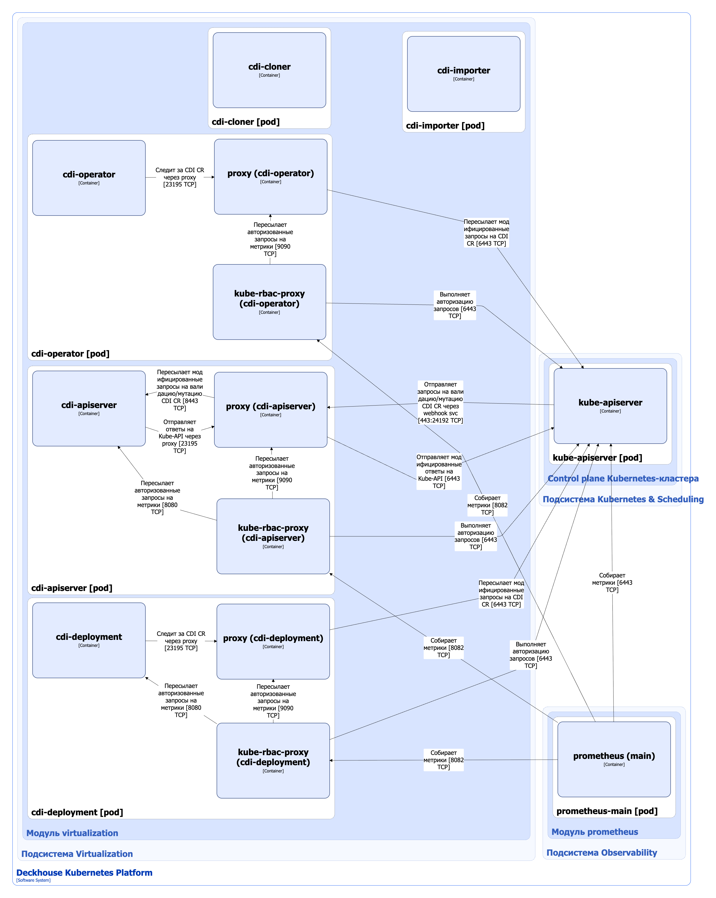


В  модуле [`virtualization`](/modules/virtualization/) используется [форк CDI](https://github.com/deckhouse/3p-containerized-data-importer). [Оригинальный CDI](https://github.com/kubevirt/containerized-data-importer) является подпроектом KubeVirt. [Kubevirt](https://github.com/kubevirt/kubevirt) — это открытый проект, который позволяет запускать, развёртывать и управлять ВМ с использованием Kubernetes в качестве платформы оркестрации.


Компонент Containerized-Data-Importer (CDI) модуля [`virtualization`](/modules/virtualization/) — это дополнение для управления постоянным хранилищем в Kubernetes. Его основная цель — предоставить декларативный способ создания дисков виртуальных машин на основе ресурсов PVC Kubernetes. CDI предоставляет возможность импортировать образы и диски виртуальных машин в PVC тома для использования их в виртуальных машинах, управляемых Kubevirt. Данные могут поступать из разных источников:

- URL-адреса;
- хранилища образов;
- другой PVC (клонирование);
- снимок;
- загружаться пользователем.

CDI поддерживает импорт данных двух типов:

- Данные Kubevirt — импортируемый файл следует рассматривать как диск виртуальной машины Kubevirt. При необходимости CDI автоматически распакует и преобразует файл из поддерживаемых форматов в формат `raw` или `qcow2` (в зависимости от типа volumeMode). Также будет изменен размер диска, чтобы использовать все доступное пространство.
- Архивные данные — этот тип означает, что данные хранятся в архиве tar. Сжатие архивов пока не поддерживается. CDI извлекает содержимое архива в том, который затем можно использовать либо с обычным подом, либо с виртуальной машиной, используя функцию файловой системы Kubevirt.

CDI использует кастомные ресурсы для управления дисками. Кастомный ресурс InternalVirtualizationDataVolume является абстракцией поверх стандартного PVC для Kubernetes и может использоваться для автоматизации создания и заполнения PVC данными.

## Архитектура CDI


Для упрощения схемы приняты следующие допущения:

- На схеме контейнеры разных подов показаны как взаимодействующие напрямую. Фактически обмен выполняется через соответствующие сервисы Kubernetes (внутренние балансировщики). Названия сервисов не указываются, если они очевидны из контекста. В остальных случаях название сервиса приводится над стрелкой.
- Поды могут быть запущены в нескольких репликах, однако на схеме каждый под показан в единственном экземпляре.


Архитектура компонента CDI модуля [`virtualization`](/modules/virtualization/) на уровне 2 модели C4 и его взаимодействия с другими компонентами DKP изображены на следующей диаграмме:

<!--- Source: structurizr code from https://fox.flant.com/team/d8-system-design/doc/-/tree/main/architecture/diagrams/C4_RU --->

## Компоненты CDI

CDI состоит из следующих компонентов:

1. **Cdi-operator** — оператор Kubernetes, управляющий жизненным циклом компонентов CDI при помощи кастомного ресурса InternalVirtualizationCDI. Cdi-operator устанавливает в кластере cdi-apiserver и cdi-deployment, а также выполняет их настройку.

   Компонент содержит следующие контейнеры:

   - **cdi-operator** — основной контейнер;
   - **proxy** (он же **kube-api-rewriter**) —  сайдкар-контейнер, выполняющий модификацию проходящих через него запросов API, а именно переименование метаданных кастомных ресурсов. Это необходимо, поскольку компоненты Kubevirt используют API-группы вида `*.kubervirt.io`, а другие компоненты модуля [`virtualization`](/modules/virtualization/) используют аналогичные ресурсы, но с API-группами вида `*.virtualization.deckhouse.io`. Kube-api-rewriter является шлюзом, проксирующим запросы между контроллерами, управляющими ресурсами из разных API-групп;
   - **kube-rbac-proxy** — сайдкар-контейнер с авторизующим прокси на основе Kubernetes RBAC для организации защищенного доступа к метрикам контейнера proxy. Является [Open Source-проектом](https://github.com/brancz/kube-rbac-proxy).

1. **Cdi-apiserver** — [Kubernetes Extension API Server](https://kubernetes.io/docs/tasks/extend-kubernetes/setup-extension-api-server/), который используется для проверки и изменения ресурсов Kubernetes API через механизмы [Validating/Mutating Admission Controllers](https://kubernetes.io/docs/reference/access-authn-authz/admission-controllers/). Cdi-apiserver реализует validating и mutating вебхуки для следующих типов ресурсов:

   - PersistentVolumeClaim — стандартный ресурс Kubernetes API;
   - InternalVirtualizationDataVolume — абстракция поверх стандартных PVC для создания на их основе дисков виртуальных машин;
   - InternalVirtualizationCDI — кастомный ресурс, используемый cdi-operator, для установки и настройки компонентов CDI;
   - InternalVirtualizationDataImportCron — определяет задание cron для импорта образов дисков в виде PVC-файлов;
   - VolumeImportSource — определяет источники для импорта дисков.

   Компонент содержит следующие контейнеры:

   - **cdi-apiserver** — основной контейнер;
   - **proxy** (он же kube-api-rewriter) — подробно описан выше;
   - **kube-rbac-proxy** — сайдкар-контейнер, обеспечивающий авторизованный доступа к метрикам контейнеров cdi-apiserver и proxy. Подробно описан выше.

1. **Cdi-deployment** (он же **cdi-controller**) — контроллер, выполняющий следующие операции с кастомными ресурсами InternalVirtualizationDataVolumes:

   - импорт образов и дисков виртуальных машин в PVC тома для использования их в виртуальных машинах, управляемых Kubevirt;
   - клонирование дисков (импорт в PVC из других PVC томов или снимков);
   - синхронизация PVC с соответствующими кастомными ресурсами InternalVirtualizationDataVolumes.

   Для выполнения некоторых из перечисленных выше операций контроллер создает и запускает временные поды:

   - **cdi-importer** — для импорта образов и дисков виртуальных машин. Cdi-importer также конвертирует образы в зависимости от типа целевого PVC:

     - в формат `raw`, если PVC volumeMode = Block;
     - в формат `qcow2`, если PVC volumeMode = Filesystem.

   - **cdi-cloner** — для клонирования дисков и снимков.

   Компонент содержит следующие контейнеры:

   - **cdi-deployment** — основной контейнер, собранный на основе [cdi-controller](https://github.com/deckhouse/3p-containerized-data-importer/blob/main/cmd/cdi-controller/controller.go);
   - **proxy** (он же **kube-api-rewriter**) — подробно описан выше;
   - **kube-rbac-proxy** — сайдкар-контейнер, обеспечивающий авторизованный доступа к метрикам контейнеров cdi-deployment и proxy. Подробно описан выше.

## Взаимодействия CDI

CDI взаимодействует со следующими компонентами:

1. **Kube-apiserver**:

   - следит за кастомными ресурсами InternalVirtualizationCDI и стандартными ресурсами PersistentVolumeClaim;
   - выполняет авторизацию запросов к метрикам.

1. **Kubevirt** — предоставляет возможность импортировать образы и диски виртуальных машин в PVC тома для использования их в виртуальных машинах, управляемых Kubevirt.

1. **DVCR (Deckhouse Virtualization Container Registry)** — использует хранилище образов в качестве источника для импорта образов и дисков виртуальных машин.

С модулем взаимодействуют следующие внешние компоненты:

1. **Kube-apiserver** — выполняет валидацию/мутацию кастомных ресурсов компонента CDI и стандартных ресурсов PersistentVolumeClaim.

1. **Prometheus-main** — собирает метрики компонентов CDI.
